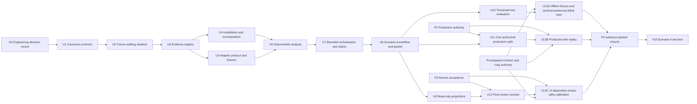
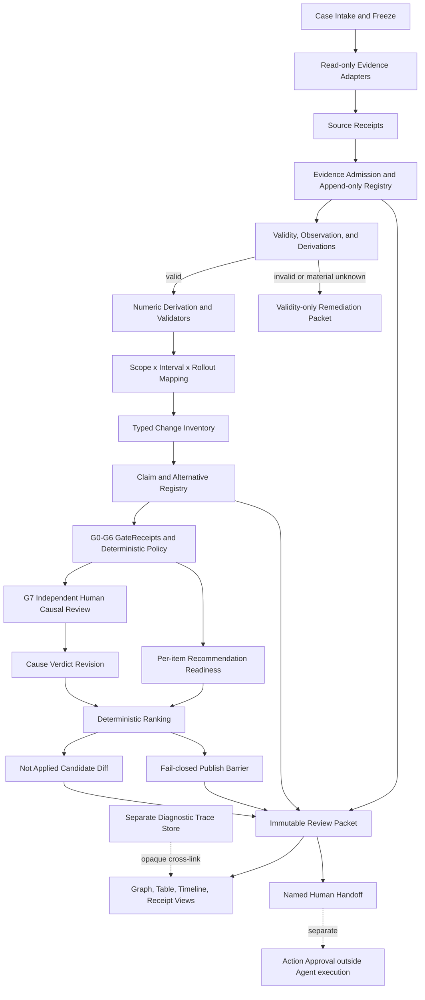
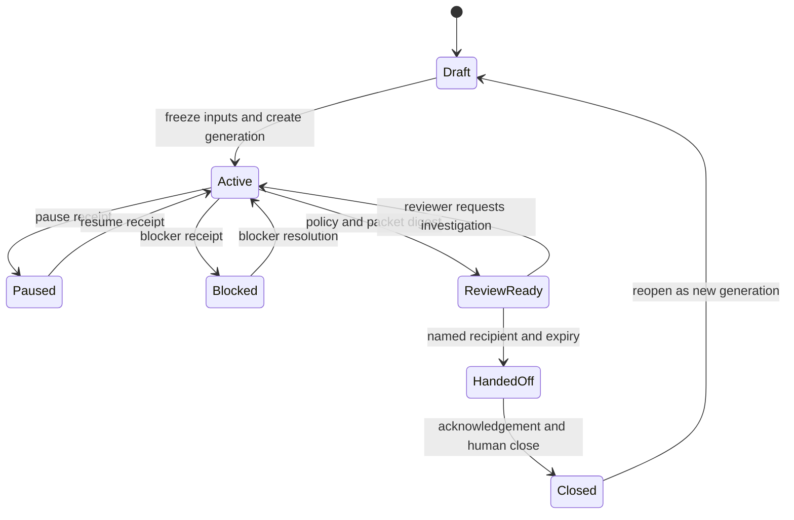
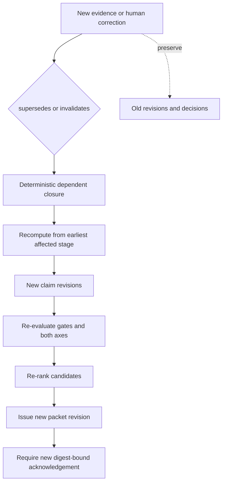
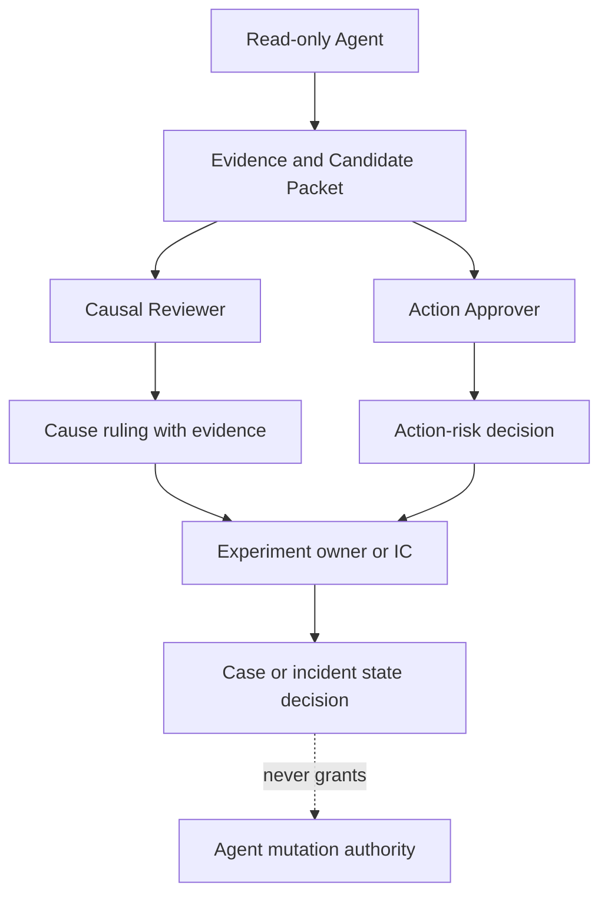

# feat: Build the Fixture-Backed M0 MVP and Sequence the M0-M2 Validation Slice

## Goal Capsule

- **Planned objective:** After a new exact-digest Owner start receipt exists, complete the local fixture-backed M0 Flight Readiness MVP: freeze an `ExperimentReadContract`, verify whether the Experiment setup and decision-metric read are trustworthy, and seal an immutable `FlightReadinessPacket` with blockers, disagreements, Coverage Gaps, and the next safe action. Preserve the dependency-ordered path for the same authorized Flight to continue through M1 and M2. This objective is not current execution authority.
- **Program boundary:** M0 is the first gate and main deliverable within one Owner-aligned M0-M2 Validation Slice for one real authorized Flight. The first planned implementation scope is local fixture-backed M0, but no current start receipt exists. Production access, M1/M2 implementation, and Scenario B are not authorized by this plan.
- **Authority order:** Owner decisions in `docs/research/kdd-data-agent-workshop/reviews/2026-08-16-opus5-m0-alignment/owner-alignment-record.md`; the digest-bound M0 alignment packet once frozen; closed Wayfinder resolutions; source facts in the research audits; engineering proposals in this plan; explicit unknown owner gates.
- **Execution authority:** The agent may use bounded, allowlisted read-only tools. It may never mutate production, apply a diff, commit, deploy, roll back, send a message, or publish a document.
- **Readiness:** The prior `m0-codex-continuation-20260817` authorization is exhausted. `M0-F1`-`M0-F5` require a new exact-digest Owner authorization and bounded start receipt binding the accepted packet path, revision, SHA-256, active-time cap, run/read/tool cap, expiry, and halt owner. This plan does not authorize implementation, production access, or M1/M2 work. P2-P4 remain open; production reads, live review acceptance, and blind/pilot exits must stop at their named gates.
- **Stop conditions:** Any future M0 start receipt must name an implementation lead, active-time cap, run/read/tool cap, and expiry. No receipt is currently live. After authorization, halt immediately if a fail-closed default is bypassed; a file appears under `adapters/production/` before P2; a test needs network, a secret, a production credential, or an undeclared external path; identical clean runs produce different packet bytes/digests; fixtures cannot fail SRM, CUPED-mode mismatch, decision-metric mismatch, and pre-runtime cases; or the cap/expiry is missing or exceeded without a green hermetic command and reviewable partial packet. Later promotion also stops when production identity or source authority is missing, mapping is unresolved, evidence is stale or contradictory without resolution, ACL/security checks fail, a human gate is unacknowledged, or a hard evaluation veto fires.

---

## Planned M0 Work Plan Awaiting a New Start Receipt

This section defines the next bounded M0 implementation plan but is not currently executable. The later R1-R37 and U1-U13 material is the dependency-ordered M1/M2 continuation of the same Owner-aligned validation program, but it cannot be treated as executable backlog without its named gates and a separate implementation-start receipt.

| Unit | Build | Verification |
| --- | --- | --- |
| `M0-F0` | Select the isolated package/test/schema seam; expose no production, network, legacy runtime, arbitrary execution, or write capability. | One hermetic enum/schema test and an import/capability receipt. |
| `M0-F1` | Encode `ExperimentReadContract`, decision-metric policy, `M0CheckResult`, source/read/derivation receipts, Coverage Gaps, immutable revision rules, typed `NextSafeAction`, `InvalidExperimentRemediation`, and `FlightReadinessPacket`. Store only `analysis_use = decision_grade | directional_only | not_permitted`; derive `post_analysis_eligibility = eligible | blocked` at render time. Encode `sufficiency_rule.kind = runtime_only | runtime_and_sample`, preregistered thresholds/inputs, and no post-hoc or achieved-power computation. Encode `material | non_material | unknown`; stored unknown/unclassified materiality applies a material ceiling without rewriting the stored value, while `non_material` and `NOT_APPLICABLE` require versioned rules. | Missing identity, assignment/analysis unit, estimator, source, authorization, named Experiment Owner, Independent DS Consultant, Committee route, digest, materiality rule, or required `runtime_and_sample` input fails closed. The eligibility projection is never independently settable. Failure of declared runtime or sample/unit sufficiency is directional when no other blocker applies; missing declared sample inputs is `not_permitted` with `contract_correction`. |
| `M0-F2` | Add fixture-only read adapters, append-only Evidence admission, and D4/D6 recomputation receipts with `independence_class`, same immutable snapshot, independently versioned transform, input/transform/output digests, comparison-rule ID, and `shared_source_snapshot`; keep authorization and redaction failure independent. | `same_pipeline` is `UNKNOWN`; at least `independent_transform` is conformant. Typed read/redaction/authority failures leak no raw body and no production or mutation capability exists. |
| `M0-F3` | Add the deterministic check inventory, Query Success union/component integrity, D7 core-floor validation, sufficiency, parity, CUPED, source/lineage, D4/D6 recomputation, authorization/isolation, redaction, and versioned Coverage Gap registry checks. | Core `MISSING`/`UNKNOWN` leaves capability unproven; fixture evidence cannot demonstrate production capability; hidden component guardrails and unversioned gap kinds are rejected. |
| `M0-F4` | Seal a fixture-class packet with stored `analysis_use`, derived eligibility, program `m0_capability_state`, blockers, disagreements, versioned Coverage Gaps, receipts, typed next safe action, `human_state`, and orthogonal authorization/redaction state. | Program capability and Flight readiness cannot be conflated. A correctly blocked real-Flight shape remains non-decision-grade and carries `positive_production_path_unverified`; fixture output proves no production or Committee gate. |
| `M0-F5` | Add threshold-free M0 fixtures and review checks for trusted, pre-runtime directional, invalid, materially unknown, conflicting, stale, partial, unauthorized, superseded, and reviewer-conflict cases. Preregister always-ready and always-blocked evaluators, adversarial metric-version/CUPED/source decoys, and fixture-author/evaluator independence or conflicts. | False readiness and security/ACL leakage are hard NO-GO. Reject the suite before Agent scoring unless planted truth contradicts both trivial evaluators and all required decoys are caught. Only the sealed packet digest may be reviewed or accepted. |

Every packet and receipt carries `evidence_class = fixture | production_authorized`. Query Success is `TraditionalResultSuccess OR AIAnswerSuccess`; production definitions, schemas, sources, owners, thresholds, overlap rules, and timer values remain `PRODUCTION_BINDING_REQUIRED`, and diagnostic components cannot acquire hidden post-hoc guardrails. The versioned sealed core floor is CHK-01, CHK-03, CHK-05 core assignment/exposure, CHK-06, CHK-08, CHK-12, CHK-14, CHK-19, and CHK-16; CHK-05 parity and CHK-11 join only when declared available before the production read.

Future M1 work must append `FlightAdvisoryRevision` separately from Cause Verdict, Recommendation Readiness, Action Approval, and Incident State; enforce operational evidence lineage and post-unblinding independent confirmation; and evaluate `candidate_diff_eligibility` separately from advisory publication. HIGH risk/large blast radius fails closed, M2 is mandatory for user-visible search semantics, and versioned N/A is limited to deterministic technical corrections. No future-unit contract creates current implementation authority.

Even a future local fixture-backed M0 receipt would explicitly exclude production-cause Claims, production change discovery or ranking, deployed symbol attribution, product-logic candidate diffs, query-level Win/Loss evidence, production adapters without P2, a final UI without P3, numeric GO thresholds without P4, Scenario B, and every mutation or publication path. No M0 implementation authority is currently live. A separately typed invalid-Experiment remediation contract may expose guidance only within a duly authorized slice and may later attach a correct syntactically valid `not_applied` validity/instrumentation/data-quality diff only after the frozen exact-target and safety gates pass.

```mermaid
flowchart LR
  F0["M0-F0 Isolated seam"] --> F1["M0-F1 M0 contracts"]
  F1 --> F2["M0-F2 Fixture reads"]
  F2 --> F3["M0-F3 Validators"]
  F3 --> F4["M0-F4 FlightReadinessPacket"]
  F4 --> F5["M0-F5 Fixtures and review"]
  F5 --> M0["M0 local acceptance evidence"]
  M0 -. "M0 permission plus gates and start receipt" .-> M1["M1 planned slice"]
  M1 -. "review-ready plus M2 authority" .-> M2["M2 planned slice"]
```



### Validation-Slice Checkpoints

| Checkpoint | Outcome | Exit evidence |
| --- | --- | --- |
| `V0` | Continuity-ready fixture foundation | Provisional toolchain receipt, deterministic fixture/read substrate, capability-isolation evidence, one hermetic command, and a successful fresh-context rehearsal |
| `V1` | Local fixture-backed M0 Flight Readiness MVP | `M0-F0`-`M0-F5` pass against the frozen packet digest; false readiness and security/ACL leakage fail hard |
| `V2` | One authorized production-grounding path | P2-bound source, deployed identity, least-privilege write-denial, scope, freshness, mapping, load, and halt receipts |
| `V3` | M1 Metric Movement and Production Grounding | Ranked falsifiable mechanisms are tied to exact production identity or remain explicitly blocked |
| `V4` | M2 Win/Loss Evidence | Query/result examples and counterexamples carry replay/SBS, ACL, corpus/index, comparability, and human-label receipts |
| `V5` | Review-ready M0/M1/M2 handoff | One Flight identity links all packets; every conclusion resolves to Evidence and remaining gaps; Committee Acceptance remains pending until the Committee rules |

The target envelope is two builders and four to six **active** engineering
weeks for V0-V5. The primary builder's leave from 2026-08-24 through
2026-09-14 is excluded. Before leave, V0 must record an exact branch/revision,
locked prerequisites, one hermetic command, fixture/source manifests,
completed/partial/blocked/next work mapped to stable IDs, current receipts and
Coverage Gaps, and a fresh-context rehearsal. If no builder continues during
leave, calendar progress pauses. On return, the recorded path must restore
effective work within half a day.

Planned M0 package boundary plus digest-gated Phase B additions, non-executable until a new exact-digest Owner start receipt. Python remains
provisional; a superseding toolchain decision must preserve these logical
ports and behavioral tests rather than silently changing product meaning:

```text
.agents/skills/kdd_data_agent/
  README.md
  ENGINEERING_DECISIONS.md
  TOOLCHAIN_RECEIPT.md
  alignment/
    seams.py                         # pending decisions + frozen-packet binding
  core/
    canonical_json.py
    digest.py
    identity.py
    coverage_gap.py
    revisions.py
    receipts.py
    capabilities.py
    unknown.py
  adapters/
    base.py
    outcomes.py
    fixture.py
    production/                     # forbidden before P2 closes
  runner/
    hermetic.py
  contracts/
    experiment_read.py               # M0-F1 after digest binding
    flight_readiness_packet.py       # M0-F1 after digest binding
    invalid_experiment_remediation.py
  checks/
    flight_readiness.py              # M0-F3 deterministic inventory
  packets/
    flight_readiness.py              # M0-F4 immutable seal
  presenters/
    flight_readiness.py              # M0-F4 synthetic read-only projection
  evals/fixtures/m0/
  tests/
    test_alignment_seams.py
    test_canonical_json.py
    test_capability_allowlist.py
    test_deterministic_replay.py
    test_fixture_adapter.py
    test_m0_contracts.py             # Phase B
    test_m0_readiness_checks.py      # Phase B
    test_m0_packet.py                # Phase B
    test_m0_review_projection.py     # Phase B
    test_m0_hard_vetoes.py           # Phase B
```

Canonical acceptance-registry entries for the planned M0 slice, executable only after a new exact-digest start receipt:

- `VAL-FLT-001`: multiple rollout/run/window observations remain under one Experiment/Flight identity.
- `VAL-MET-001`: the default one-metric policy is accepted without hard-coding singular cardinality.
- `VAL-MET-002`: an approved preregistered co-primary policy freezes combination/conflict behavior; an unapproved second metric cannot gate the decision.
- `VAL-M0-001`: a trusted complete Flight read produces a review-ready M0 packet with stable receipts and digest.
- `VAL-M0-002`: failure of the preregistered runtime threshold or, under `runtime_and_sample`, the preregistered sample/unit threshold with no other material blocker maps exactly to `blocked + directional_only`; missing required sample inputs maps to `blocked + not_permitted` plus `contract_correction`; a material validity, source, ACL, isolation, or evidence failure maps exactly to `blocked + not_permitted`. No post-hoc or achieved-power computation is allowed, and neither state produces M1/M2 output.
- `VAL-PRE-001`: a pre-runtime valid read returns `blocked + directional_only`, cannot pass the decision metric, and cannot start M1 causal promotion.
- `VAL-CUP-001`: a CUPED-mode mismatch preserves both reads and returns `blocked + not_permitted`; no silent substitution is legal.
- `VAL-UNIT-001`: a ratio metric with inconsistent assignment/analysis units or no named valid variance estimator fails materially and the packet is `blocked + not_permitted`.
- `VAL-SRC-001`: a registered metric-definition version that differs from the computed source version is caught even when the rest of the contract is internally consistent.
- `VAL-SUP-001`: a corrected read after sealing creates a superseding packet and invalidates the prior acknowledgement without editing history.
- `VAL-CONF-001`: conflicting named materiality reviews stay visible and blocked until a versioned ruling resolves them.
- `VAL-REM-001`: an invalid Flight without an exact remediation target returns typed guidance, a Coverage Gap, and a reopen condition with no diff.
- `VAL-REM-002`: an exact bounded validity/instrumentation/data-quality remediation that passes every R20a gate is attached only as a correct syntactically valid `not_applied` diff with no automation consumer.
- `VAL-ROL-001`: a real production Flight separates Experiment Owner preparation, Independent DS challenge, and Experiment Review Committee decision.
- `VAL-OLD-001`: current production authority wins over an old SMA definition, while provenance and drift remain visible.
- `VAL-CON-001`: a fresh context runs the implementation and starts the next bounded task without oral context.
- `VAL-APR-001`: review-ready technical packets remain distinct from pending Committee Acceptance.
- `VAL-SEC-001`: any write, cross-tenant, secret, unsafe-redaction, or unauthorized delivery reachability is hard NO-GO.
- `VAL-UI-001`: a pre-P3 synthetic projection reaches exact source and D4/D6 recomputation receipts without implying production capability, cause, or P3 closure.
- `VAL-UI-101`: a named live-review receipt binds the accepted first-screen interaction only after P3.
- `VAL-BASE-001`: always-ready and always-blocked evaluators are each contradicted by sealed planted truth, or the suite is rejected before Agent scoring.
- `VAL-DECOY-001`: adversarial metric-version, CUPED-mode, and source-identity decoys are caught by their exact validators.

Fine-grained unit test identifiers may use unit-specific prefixes, but they must
map to exactly one acceptance-registry entry and must never reuse a `VAL-*`
identifier with a different meaning.

---

## Product Contract

### Summary

The planned local M0 slice would start from a frozen Metric Question and `ExperimentReadContract`, validate the Experiment setup and decision-metric read, and return a `FlightReadinessPacket` only after a new exact-digest Owner start receipt. It stops before system-cause investigation. The same one-Flight validation program then plans to narrow the miss across enterprise-search evidence planes in M1, tie candidate mechanisms to deployed production scope, and use M2 query-level Win/Loss evidence to make supported mechanisms concrete. Those later units require their named gates and separate implementation-start receipts.

The product is a greenfield redesign. Old SMA, KDD competition code, workshop systems, and award repositories are evidence and reference material only. They create no compatibility, migration, module, language, storage, framework, or schema obligation. Protected legacy paths are read-only references: the new package may independently validate domain assets and clean-room reimplement selected mechanisms behind new contracts, but it must not edit protected paths, import legacy runtime code, copy legacy stages/schemas/thresholds, or claim production authority. Direct reuse requires an explicit interface, provenance, tests, security, license, source, owner, and access receipts.

### Key Decisions

- **KD1. One Flight is one A/B Experiment.** `(session-settled: user-directed — chosen over treating rollout, window, or run attempts as separate Flights: the production workflow reviews one Experiment across its observations.)` Governs R1, R2, R22.
- **KD2. Model a decision-metric set and policy, with one metric as the first-M0 default.** `(session-settled: user-directed — chosen over permanently hard-coding exactly one decision metric: approved preregistered co-primary metrics must remain representable.)` Governs R1, R3, R7, R33.
- **KD3. Invalid Experiments receive bounded remediation, never product-cause output.** `(session-settled: user-approved — chosen over both an unconditional no-diff rule and unrestricted patch generation: typed guidance is the first path and a correct not_applied validity/instrumentation/data-quality diff requires exact-target and safety gates.)` Governs R4, R20, R20a.
- **KD4. Separate Experiment execution, independent challenge, and approval.** `(session-settled: user-directed — chosen over a generic reviewer or self-approval model: the Experiment Owner runs and prepares, the Independent DS Consultant challenges, and the Experiment Review Committee alone decides pass/change/block.)` Governs R23, R35.
- **KD5. Run one active-time-bounded M0-M2 validation slice, with M0 first and primary.** `(session-settled: user-directed — chosen over an M0-only program and over treating Committee Acceptance as technical completion: one Flight should reach review-ready M0, M1, and M2 packets in four to six active engineering weeks, while Committee Acceptance remains external.)` Governs R33-R37 and the V0-V5 delivery sequence.
- **KD6. Current production authority overrides every old SMA domain asset.** `(session-settled: user-directed — chosen over treating legacy metric definitions, catalogs, routing, or fixtures as an oracle: those assets may drift and must be independently validated for the current Flight scope and effective time.)` Governs R5, R7, R9, R11.

### Problem Frame

Current reference systems can validate metrics, run bounded tools, and expose traces, but they do not establish the complete production chain required by the real problem:

`metric -> surface/component -> query/result -> ACL/corpus -> pipeline/runtime -> typed change -> claim -> verification -> recommendation`

A useful answer must distinguish a valid experiment from an invalid one, production reachability from repository proximity, observed facts from causal claims, cause confidence from action readiness, and review artifacts from execution authority.

### Actors

- A1. **Experiment Owner:** Designs and runs the Flight, freezes contract inputs, prepares the evidence package, and answers review questions; cannot approve their own real production Flight.
- A2. **Independent DS Consultant:** Independently challenges methods, metric reads, evidence, uncertainty, and risk; cannot approve the Flight or replace missing Evidence.
- A3. **Experiment Review Committee:** Conducts Experimentation triage/review and alone decides pass, change, or block for a real Flight; cannot silently revise the frozen contract.
- A4. **Code/domain reviewer:** Validates code grounding, production mechanisms, alternatives, and exact patch targets.
- A5. **Production owner:** Confirms authoritative production sources, deployed identity, operational mapping, and halt behavior.
- A6. **Security/privacy reviewer:** Confirms tenant, ACL, sensitive evidence, retention, redaction, credential, and recipient boundaries.
- A7. **Causal reviewer:** Rules on causal promotion using visible admitted Evidence without replacing missing Evidence.
- A8. **Action approver:** Separately evaluates recommendation risk and readiness; cannot authorize Agent execution.
- A9. **Data Agent:** Performs bounded read-only collection, validation, analysis, and packet generation; never mutates, approves, sends, publishes, deploys, or rolls back.

### Requirements

#### Case and validity

- R1. Freeze every case as an isolated `case_id + generation` bound to one Flight, where one Flight is one A/B Experiment. Include the Metric Question, decision-metric set and `DecisionMetricPolicy`, metric definitions/versions, population, window, surface/component, tenant/role/source authorization, and source snapshot set. Rollout, exposure, analysis-window, and run-attempt observations remain revisions under that Flight.
- R2. Support multiple concurrent cases without mixing authorization, evidence, derivations, claims, ranking state, budget state, packet state, or acknowledgements.
- R3. Validate Query Success registration/version/union/component instrumentation, assignment and analysis units, estimator and ratio variance, CUPED identity, SRM, exposure, runtime/sample sufficiency, grain/join/unit, completeness/freshness, primary-source versus UI reconciliation, D4/D6 recomputation independence and shared-snapshot gap, source-change revalidation, authorization/redaction orthogonality, and metric lineage before promoting system causes. Production bindings remain typed rather than invented.
- R4. Store `analysis_use = decision_grade | directional_only | not_permitted` as the single M0 readiness state. Derive `post_analysis_eligibility = eligible | blocked` only at render time (`decision_grade -> eligible`; otherwise `blocked`) and never persist or independently set it; scenario wording may keep the three familiar pair forms. Triage uses `analysis_use` with `NextSafeAction.kind`, never eligibility alone. `DecisionMetricPolicy` declares `sufficiency_rule.kind = runtime_only | runtime_and_sample` with preregistered thresholds and inputs. Runtime and, when declared, sample/unit sufficiency compare observed values only with those inputs; post-hoc or achieved-power computation is forbidden. A failed declared threshold is directional when no other blocker applies; missing required `runtime_and_sample` inputs is contract-incomplete and `not_permitted` with `contract_correction`. Each `M0CheckResult` records `material | non_material | unknown`; identity/policy, assignment/exposure, population/scope, numerator/denominator/join/unit, estimator/CUPED, authoritative source, and authorization/isolation failures are always material. Stored unknown/unclassified materiality remains visible while applying a material ceiling; `non_material` and `NOT_APPLICABLE` require versioned rules. Missing required arm-parity evidence is `MISSING` and `not_permitted` with `evidence_collection`; a versioned applicability rule may make the check `NOT_APPLICABLE`, while divergent arms are a material `FAIL`. When an Experiment is invalid or materially unknown, emit only a typed `NextSafeAction` of `evidence_collection | contract_correction | validity_fix | instrumentation_fix | data_quality_fix` plus a reopen condition. The action carries no exact target or diff. Discovered system hypotheses may be retained only as non-ranked, non-publishable blocked leads and must be excluded from production-cause and product-logic candidate output.

#### Evidence and production grounding

- R5. Admit evidence only when it has stable identity, source locator, snapshot/time, scope, authorization, digest/receipt, freshness, and validation state.
- R6. Treat pagination failure, timeout, permission denial, unavailable source, partial result, and failed retrieval as explicit coverage gaps rather than negative evidence.
- R7. Require every numeric derivation to name its source-read set, units, time zone, deterministic transform version, and recomputation receipt.
- R8. Match evidence and changes deterministically across `scope × interval × rollout`, including gradual rollout and declared, reachable, and observed impact.
- R9. Tie exact code targets to deployed SHA plus repo/file/symbol/line. Tie non-code targets to exact artifact/version/receipt. Repository keyword proximity is never sufficient.
- R10. Normalize production candidates as typed `code | config | flag | model | data` changes, preserving source identity and supporting multi-change candidate groups.
- R11. Preserve append-only evidence and relationship history, including conflict, stale state, invalidation, `supersedes`, and human correction.
- R12. A human correction may only append a new scoped, evidence-grounded or code-grounded revision. It may not delete old records or replace evidence with a ruling, and it must trigger dependent recomputation.
- R12a. Propagate tenant, role, source authorization, retention, and redaction labels through every Derived Fact, Claim, Candidate, Diff, projection, and Packet. Combined inputs inherit the permission intersection and strictest data-handling label; missing or conflicting labels fail closed.

#### Claims, verdicts, readiness, and ranking

- R13. Represent every Cause Claim as falsifiable: change or condition, effect, scope/interval, mechanism, predictions, falsifier, material alternatives, supporting evidence, counterevidence, and failed checks.
- R14. Use Cause Verdict values `unassessed | suspected | confirmed | ruled_out | inconclusive`. `observed` belongs to evidence or claim state, not Cause Verdict.
- R15. Use Recommendation Readiness values `not_applicable | blocked | proposal_ready | action_ready | rejected`.
- R16. Evaluate Cause Verdict and Recommendation Readiness independently. Every pair must be accepted or rejected by a deterministic policy matrix and explained with evidence, counterevidence, failed checks, scope, and gate receipts.
- R17. Rank candidates deterministically from explicit features, evidence coverage, gate outcomes, and risk propagation. Equal scores use stable candidate IDs. Weights, top-k, and stability thresholds remain unset until pilot calibration.
- R18. `false confirmed`, wrong patch target, and security/ACL violation are hard NO-GO outcomes independent of aggregate score.
- R19. High-risk or large-blast-radius recommendations cannot be `action_ready`; they escalate to the incident commander and code owner.

#### Proposal, packet, and review

- R20. Generate a product-logic candidate diff only for a valid Experiment with an exact deployed target, supported mechanism, action-specific evidence, bounded risk, guardrails, proposed tests, and verification/falsification plan. Mark the artifact `not_applied` and never apply it to a worktree.
- R20a. For an invalid Experiment, typed validity/instrumentation/data-quality guidance and a reopen condition are mandatory. A later M0 increment may attach a correct syntactically valid `not_applied` remediation diff only when the exact target, target authority, validator, bounded-risk, named human recipient, capability-isolation, and no-automation-consumer gates all pass. Missing any gate returns guidance only and blocks the diff.
- R21. Bind each diff to the deployed revision and context digest. A stale target or changed dependency invalidates the diff and blocks promotion.
- R22. Emit immutable packet revisions with a named recipient, digest-bound acknowledgement, expiry, escalation, close, and reopen generation.
- R22a. Bind each packet digest to its authorization snapshot, redaction-policy version, projection manifest, recipient, scope, and case generation. Reauthorize every render, open, and acknowledgement; permission revocation or policy revision blocks access and requires a superseding packet.
- R23. Keep Experiment execution, independent DS challenge, Experiment Review Committee decision, causal review, action approval, and case closure as explicit responsibilities. The Experiment Owner, Independent DS Consultant, and Committee remain distinct for a real Flight; fixture-only overlap is time-bounded and recorded. Timeout, expiry, or non-acknowledgement never means approval.
- R24. Show a first-screen conclusion summary plus a local evidence graph for the current primary claim. Also expose coverage, competing claims, full graph, Trace, timeline, code, diff, and receipt entry points.
- R25. Keep Evidence Graph and Trace in separate, cross-linked tabs. Tool calls, narration, static architecture diagrams, and heuristic relations are not evidence.
- R26. Require typed edges and expandable trust detail for every node or edge that affects verdict or readiness. Prefer a table, timeline, diff, or receipt when it is clearer than a graph.
- R27. The review surface is a read-only projection of canonical shared objects. UI actions cannot create facts or rewrite claims, verdicts, readiness, or source state.

#### Agent autonomy and safety

- R28. Expose only allowlisted, narrow, read-only source tools. Bound worker count, concurrency, inherited scope, token/compute cost, timeout, cancellation, and evidence submission.
- R29. Run deterministic narrowing and validation before model reasoning. Escalate model strength only for complex mechanisms or conflicting evidence.
- R30. Treat all source content as untrusted data. Source text cannot expand tools, scope, authorization, human gates, or execution authority.
- R31. Record token, compute, latency, source load, and cost without pre-setting acceptance thresholds.
- R32. Never expose arbitrary execution, forced submission, fail-open human gates, automatic mutation, commit, deploy, rollback, message sending, or document publication.
- R32a. Permit the Agent to submit derived records only through a narrow, policy-enforced append-only workspace interface. This internal evidence-submission action cannot write arbitrary files, databases, source systems, or external APIs.

#### Evaluation

- R33. Evaluate one blind historical experiment miss plus de-identified fixtures covering invalid experiment, implementation/config defect, ACL/index/pipeline failure, measurement bias, product hypothesis failure, and correct abstention.
- R34. Use set-valued adjudication that distinguishes `required | acceptable | forbidden | unknown`, supports multiple causes, and does not treat an old RCA as the sole gold record.
- R35. The Experiment Owner supplies intent and evidence, the Independent DS Consultant records a separate challenge, code/domain and production reviewers verify within their authority, and the Experiment Review Committee alone records the real-Flight pass/change/block decision.
- R36. Keep historical blind evidence, fixture regression, security vetoes, human utility, stability, and efficiency as separate evaluation streams.
- R37. Calibrate case count, risk weights, top-k, repeated-run stability, latency, token, cost, source load, and shadow-read exit thresholds from a production-complexity pilot.

### Key Flows

- F1. **Valid Scenario A investigation**
  - **Trigger:** A frozen experiment miss enters intake.
  - **Steps:** Validate the experiment; collect scoped evidence; derive and map production facts; normalize changes; build and challenge claims; apply policy and ranking; produce an optional `not_applied` diff; issue an immutable packet.
  - **Outcome:** Ranked production-grounded candidates with reviewable evidence and no mutation.
- F2. **Invalid experiment hard stop**
  - **Trigger:** A material validity check fails or remains unknown.
  - **Steps:** Record the failed check and scope; block production-cause and product-logic hypotheses; produce typed validity/instrumentation/data-quality guidance and a reopen condition. Attach a correct syntactically valid `not_applied` remediation diff only when every R20a gate passes.
  - **Outcome:** No product-logic production candidate. The required fallback is guidance; any remediation diff remains bounded, human-reviewed, unapplied, and unavailable to automation consumers.
- F3. **Evidence invalidation and partial recomputation**
  - **Trigger:** New source evidence or a human correction supersedes or invalidates a current revision.
  - **Steps:** Append the new revision; retain history; compute dependency closure; recompute from the earliest affected stage; invalidate dependent ranking, diff, packet, and acknowledgement as needed.
  - **Outcome:** An active generation receives new current Claim and VerdictEvent revisions without mutating history; a closed generation or sealed packet produces a new linked generation and superseding packet.
- F4. **Human handoff and reopen**
  - **Trigger:** A packet is ready for a named recipient.
  - **Steps:** Bind acknowledgement, expiry, and decision to the packet digest; separate causal ruling from action approval; reopen as a new generation when dependencies change.
  - **Outcome:** Immutable, auditable delivery state; no implicit approval.

### Acceptance Examples

- AE1. A valid experiment with exact deployed mapping produces stable ranked candidates and a `not_applied` diff with target, evidence, risk, tests, and falsifier.
- AE2. An SRM failure returns typed validity remediation and a reopen condition, blocks all product-cause and product-logic proposals, and attaches a validity/instrumentation/data-quality diff only if every R20a gate passes; otherwise it returns guidance only.
- AE3. A valid experiment with unknown production mapping may produce `suspected` or `inconclusive` claims with readiness `blocked`, but no exact patch target.
- AE4. Cause=`confirmed` with readiness=`blocked` is legal when action-specific evidence or safety requirements are incomplete.
- AE5. Cause=`suspected` with readiness=`action_ready` is accepted only if the resolved deterministic policy contract explicitly permits the scoped, low-risk, reversible case; otherwise the pair is rejected.
- AE6. A product-hypothesis failure may produce no code candidate and readiness `not_applicable` or `rejected`, according to the resolved matrix.
- AE7. A human correction creates a scoped new revision, preserves old evidence, recomputes dependents, and requires a new packet acknowledgement.
- AE8. An ACL violation, wrong patch target, or false confirmation produces hard NO-GO regardless of other scores.

### Scope Boundaries

#### In scope now

- Local fixture-backed M0 contracts, deterministic readiness checks, append-only receipts, Coverage Gaps, `FlightReadinessPacket`, typed invalid-Experiment remediation guidance, a packet-centered synthetic review projection, threshold-free fixtures, and adversarial verification.
- Fixture adapters that prove read-only behavior, receipts, partial/unavailable/redaction-failed behavior, authorization boundaries, deterministic replay, and absence of production, network, arbitrary-execution, or write capability.
- A contract seam for the optional R20a remediation diff; the first vertical path may remain guidance-only.

#### Planned in the same validation program, not executable now

- M1 shared workspace, bounded orchestration, production grounding, evidence/claim substrate, policy integration, deterministic ranking, optional valid-Experiment `not_applied` product diff, immutable handoff, and review projections.
- M2 query-level Win/Loss evidence linked to a review-ready M1 mechanism.
- One P2-authorized real Flight path and the threshold-free-to-calibrated evaluation sequence, each behind its named gate and separate implementation-start receipt.

#### Deferred to follow-up work

- Scenario B changepoint investigation, rollback-ready packet, recovery verification, and continuing RCA.
- Real production adapters, production mapping, and sensitive evidence expansion until P2 closes and a separate implementation-start receipt exists. Production-like replay also requires rung-specific Engineering and security/privacy authority; narrow shadow-read additionally requires its own named scope/security authorization.
- Final interaction implementation until the rough prototype passes live owner/reviewer validation.
- Numeric GO/NO-GO gates until pilot calibration.

#### Outside this product's identity

- Compatibility or migration for Old SMA or KDD competition architecture.
- Automatic mutation, arbitrary execution, forced submission, commit, deploy, rollback, external messaging, or publication.
- A graph-first decorative UI or any claim that trace, narration, a static graph, or a heuristic relationship is evidence or cause.

---

## Planning Contract

### Authority Classification

- **owner_decision:** M0 Flight Readiness is the first gate and main deliverable within one M0-M2 Validation Slice for one authorized Flight. The next planned scope is local fixture-backed M0, but it requires a new exact-digest Owner authorization and bounded start receipt. M1/M2 remain planned program work that requires their named gates and separate implementation-start receipts. O1-O6 in `owner-alignment-record.md` govern product meaning; immutable history, fail-closed Evidence, hard NO-GO outcomes, and no-mutation authority remain unchanged.
- **source_fact:** The audited reference systems demonstrate bounded stages, narrow read-only tools, deterministic checks, retry/trace patterns, source or schema graph interactions in Team 1286/1401, and trace/matrix views in the fourth-place repository. No audited work proves the complete production causal chain.
- **engineering_proposal:** Package layout, Python/Pytest use, schema encoding, service boundaries, object names, ranking implementation, durable workspace mechanics, adapter interface, and projection implementation.
- **unknown_owner_gate:** Authoritative production sources, mapping ownership, retention/redaction, tenant/ACL policy, calibrated numeric thresholds, concrete interaction acceptance, and language/storage/vendor/framework selection. JSON/schema encoding of the closed policy contract is an engineering proposal, not an owner gate.

### Opus 5 Review Reconciliation

The plan carries all 38 findings from the 2026-08-15 Opus 5 review. Thirty
non-disputed findings are accepted: 11 blockers (`B1`, `B4`-`B10`, `B12`-`B14`)
and 19 majors (`M2`, `M4`-`M17`, `M21`-`M24`). The current canonical wording
implements their contract corrections or preserves the required P2/P3/P4 gate
without inventing values. The exact evidence mapping and any partial residuals
remain in
`docs/research/kdd-data-agent-workshop/reviews/2026-08-16-opus5-m0-alignment/opus5-review.md`.

The eight separately adjudicated findings use these controlling dispositions:

| Finding | Controlling disposition |
| --- | --- |
| `B2` | M0 is the first gate and main deliverable; one M0-M2 Validation Slice remains the broader Owner-aligned program. The next fixture-backed M0 work requires a new exact-digest start receipt. |
| `B3` | **OPEN:** protected old SMA paths are read-only, and a per-asset reuse inventory with interface, provenance, tests, security, license, source, owner, and access evidence is required before direct reuse or `M0-F1`. |
| `B11` | Missing built fixtures was not a planning blocker before implementation authorization. Baseline, difficulty, adversarial decoy, leakage, and author/evaluator independence-or-conflict controls are required now. |
| `M1` | A `confirmed` VerdictEvent is immutable. Contradiction in an active generation appends superseding Claim/VerdictEvent revisions; contradiction after closure or packet sealing opens a new linked generation. |
| `M3` | Candidate diffs stay syntactically valid and independently reviewable, always `not_applied`, human-review-only, capability-isolated, and unavailable to apply/commit/PR/deploy/rollback/webhook/queue/polling consumers. |
| `M18` | **OPEN / external-sharing action:** confidential or low-entropy values cannot rely on a bare hash. Complete the affected sharing/security inventory before external distribution; this does not prohibit full-file or image digests when policy, entropy, retention, access, and recipient handling are appropriate. |
| `M19` | **OPEN / separate authority action:** initial Trace capture is limited to Data Agent-owned, enterprise-managed runtime activity and remains off for employee endpoints unless privacy/labor and query-authority receipts are obtained. |
| `M20` | **OPEN / implementation-proof action:** Trace is not mandatory for every packet, but every predeclared Trace-dependent assertion requires a frozen capture/pin predicate and fail-closed unsupported-host test before dependent publication. |

### Key Technical Decisions

- KTD1. **Use a clean sibling package boundary.** `[engineering_proposal]` Place the greenfield system in `.agents/skills/kdd_data_agent/`. Do not extend `.agents/skills/sma/` or treat `.agents/skills/sma_rewrite/` as a migration base.
- KTD2. **Build contract-first and deterministic-core-first.** `[engineering_proposal]` Establish schemas, lifecycle, receipts, evidence revisions, mapping, invalidation, and policy interfaces before agent orchestration or UI work.
- KTD3. **Use shared durable objects, not isolated reports.** `[engineering_proposal]` Agent, reviewer, and projections reference stable `CaseGeneration`, `RunAttempt`, `EvidenceRevision`, `ClaimRevision`, `RecommendationRevision`, `PacketRevision`, and `HumanRuling` identities.
- KTD4. **Keep source access primitive and read-only.** `[owner_decision + engineering_proposal]` Adapters expose narrow reads with pagination, partial/error state, scope, and receipts. Deterministic services own matching, validation, ranking, invalidation, and policy evaluation. Models propose and challenge claims.
- KTD4a. **Separate source reads from derived-record submission.** `[engineering_proposal]` Source adapters are strictly read-only. Derived records enter the shared workspace only through a schema-validating, case-scoped, append-only submission port with no arbitrary path, query, or external side effect.
- KTD5. **Separate source receipts, evidence, claims, trace, and projections.** `[owner_decision]` A successful tool call is Trace. It becomes admissible evidence only after identity, authorization, scope, freshness, receipt, and validator checks.
- KTD6. **Use append-only revision semantics and dependency-based partial recomputation.** `[owner_decision + engineering_proposal]` New evidence and human corrections use typed `supersedes` or `invalidates` relations, retain history, and recompute only the dependent closure from the earliest affected stage.
- KTD7. **Rank deterministically and expose the reasons.** `[engineering_proposal]` Candidate scoring consumes explicit normalized features and policy outcomes; stable IDs break ties. Replay over an identical admitted Evidence, Claim, feature, and policy snapshot is byte-stable. Live-agent repeated-run claim-set, verdict, and ranking stability is measured separately; divergence is recorded rather than mislabeled as deterministic replay. Final production weights remain unset until calibration. Ranking-bearing blind cases or pilots use a preregistered, sealed, non-production `pilot_ranking_policy` bound to one named rung/snapshot, fixed features and normalization, deterministic ordering or pilot-only weights, stable tie rule, version/digest, expiry, and full-list retention.
- KTD8. **Keep packet projections and diagnostic Trace separate.** `[owner_decision + engineering_proposal]` Evidence Graph, tables, timeline, diff, and receipts render immutable packet objects. Trace is an independently collected diagnostic store with opaque cross-links; Evidence controls divergence, and Trace is never Evidence or counterevidence. Collectors may run only inside Data Agent-owned, enterprise-managed runtimes for explicitly authorized Case Generations; personal endpoints, unrelated human sessions, and employee monitoring are prohibited. The graph is local by default and must expose coverage and competing claims.
- KTD9. **Keep the current dependency-light Python Phase A behind replaceable ports while the toolchain remains provisional.** `[engineering_proposal]` The existing M0-F0 spike uses standard-library Python and Pytest with explicit adapter, canonicalization, receipt, validator, and presenter seams. Independent review must compare it with the Champion, Fourth-place, and DeepSeek mechanisms and retain or replace it only through an evidence-backed decision receipt. Python is not an Owner-frozen architecture choice or compatibility constraint.

**Phase A evidence ceiling.** The independently reviewed Phase A package is `PASS_WITH_GAPS`, not M0 acceptance, production capability, or proof that the contracts above are implemented. Rule-source strictness, receipt-identity binding and authorization-parser reachability, authorization/redaction orthogonality in code, predecessor-chain verification, scanner escapes, stale seam references/comments, and import/symlink/path-containment guards remain implementation-only work. Coverage Gap taxonomy changes require a canonical versioned registry decision before code adoption. No test count or aggregate package digest closes those gaps.
- KTD10. **Add only the seams required by current consumers.** `[engineering_proposal]` Keep the U5 read-only adapter protocol and U8-to-U9 packet-to-projection boundary. Use direct fixture-backed storage and model execution for the MVP; add another port only after a closed gate or a second concrete consumer proves the need, through a superseding engineering decision.
- KTD11. **Treat packet delivery as a digest-bound protocol.** `[owner_decision + engineering_proposal]` Acknowledgement, expiry, escalation, close, and reopen bind to recipient, scope, and packet revision digest. Any material dependency revision requires a new packet and acknowledgement.
- KTD12. **Use eight orthogonal, append-only state dimensions.** `[owner_decision]` Keep Case lifecycle, Stage execution, Evidence usability, Claim evaluation, Cause Verdict, Recommendation Readiness, Action Approval, and Incident State independent. No field implicitly changes another. Every transition records actor, time, reason, input IDs, policy version, and receipt.
- KTD13. **Use the closed Scenario A stage contract.** `[owner_decision]` The canonical stages are `intake_and_freeze`, `validity_and_observation`, `production_identity_and_scope`, `candidate_discovery_and_mapping`, `claim_construction`, `causal_challenge`, `recommendation_and_risk`, and `review_packet_and_handoff`. Completed stages may become invalidated, and re-entry follows the affected dependency closure rather than a one-pass waterfall.
- KTD14. **Use Gate 0-7 as the only confirmation path.** `[owner_decision]` Every applicable Gate 0-7 condition must be satisfied, and Gate 7 must pass with an independent human causal ruling, before Cause Verdict can become `confirmed`. A model, worker, vote, confidence score, or consensus cannot confirm a cause.
- KTD15. **Compute action readiness per Recommendation item.** `[owner_decision]` Recommendation kinds include at least `validity_fix | instrumentation_fix | data_quality_fix | production_change | mitigation | rollback`. `action_ready` is conditional on exact target, bounded non-HIGH blast radius, recoverability, independent operational Evidence, monitoring/stop/escalation, no action-changing contradiction, a permitted experiment-validity state, and a policy receipt.
- KTD16. **Bind semantic implementation to one immutable alignment packet.** `[engineering_proposal]` Every M0-F1-F5 exit receipt records the exact frozen packet path, revision label, and SHA-256 digest. A path-only reference or digest drift stops the affected unit rather than allowing implementation to select among conflicting documents.
- KTD17. **Make continuity an acceptance property, not a handoff note.** `(session-settled: user-directed — chosen over counting the primary builder's leave as schedule progress or relying on oral context: another builder must be able to continue, or the primary builder must resume within half a day.)` V0 records the exact branch/revision, locked prerequisites, one hermetic command, fixture/source manifests, unit/scenario ledger, receipts, gaps, next task, and a fresh-context rehearsal before 2026-08-24.

### Planned M1/M2 Scenario A Dependency Graph

This graph is the dependency-ordered continuation of the same Owner-aligned validation program. It is not the planned M0 graph; the not-yet-authorized local graph is in `Planned M0 Work Plan Awaiting a New Start Receipt` above.



U3-U5 may overlap only after U2 proves the shared object seam. U9 and U10 may overlap after U8's packet contract stabilizes. U13 is one unit with rung-conditional entries; a pass in one rung never supplies a missing receipt for another.

### High-Level Technical Design

#### A. Component and data-flow shape



#### B. Case, packet, and reopen lifecycle



Canonical `case_state` is `draft | active | paused | blocked | review_ready | handed_off | closed`. A closed generation never returns to `active`; reopening creates a new generation. Closing a Case does not promote Cause Verdict or change Incident State.

#### C. Canonical state dimensions and two-axis policy

| Dimension | Canonical values |
|---|---|
| `case_state` | `draft | active | paused | blocked | review_ready | handed_off | closed` |
| `stage_state` | `not_started | running | paused | blocked | completed | invalidated | skipped` |
| `evidence_state` | `observed | validated | stale | invalidated | superseded` |
| `claim_state` | `draft | testable | observed | supported | contradicted | falsified | invalidated | superseded` |
| Cause Verdict | `unassessed | suspected | confirmed | ruled_out | inconclusive` |
| Recommendation Readiness | `not_applicable | blocked | proposal_ready | action_ready | rejected` |
| `action_approval_state` | `not_requested | pending | approved | rejected | expired | revoked` |
| `incident_state` | `not_applicable | investigating | mitigating | recovered | monitoring | stable | closed` |

For claim-linked production Recommendations, `unassessed` permits only `not_applicable`, `blocked`, or `rejected`; `suspected`, `confirmed`, and `inconclusive` may reach conditional `action_ready`; and `ruled_out` cannot support `proposal_ready` or `action_ready` when it is the sole supporting claim. Illegal combinations remain visible with `policy_fail`, violated predicates, Evidence IDs, and the forced ceiling.

#### D. Evidence invalidation and partial recomputation



Canonical edge direction is `new_revision --supersedes--> old_revision`, `affected_node --invalidated_by--> invalidation_event_or_evidence`, and `derived_node --depends_on--> input_node`. `recompute_from_stage` is the earliest affected stage, never a manual full-rerun switch.

#### E. Human responsibility boundaries



### Output Structure

```text
.agents/skills/kdd_data_agent/
  README.md
  contracts/
    case.schema.json
    evidence.schema.json
    claim.schema.json
    policy.schema.json
    packet.schema.json
  domain/
    case_lifecycle.py
    evidence_graph.py
    claim_registry.py
    policy_matrix.py
  evidence/
    registry.py
    invalidation.py
    receipts.py
  adapters/
    base.py
    fixture.py
    production/
  analysis/
    scope_interval_rollout_matcher.py
    mapping.py
    change_normalizer.py
    ranking.py
  orchestration/
    capability_contract.py
    bounded_runner.py
  scenarios/
    experiment_miss.py
  packets/
    review_packet.py
  presenters/
    review_surface.py
  evals/
    fixtures/
    cases/
    adjudication/
    calibration/
  tests/
    contract/
    evidence/
    adapters/
    analysis/
    orchestration/
    scenarios/
    presenters/
    evals/
```

### Planning Prerequisites and Open Gates

These planning prerequisites use `P1-P4` exclusively. They are project-decision gates and are distinct from the runtime causal Gates `G0-G7` evaluated per Claim.

- P1. **Resolved canonical domain and policy contract:** `docs/research/kdd-data-agent-workshop/wayfinder/freeze-canonical-domain-policy-contracts.md` is `Status: closed` with a Resolution. KTD12-KTD15 and U1 must implement that Resolution without semantic drift.
- P2. **Production evidence authority:** `docs/research/kdd-data-agent-workshop/wayfinder/establish-production-evidence-authority.md` must close before production adapters, authoritative deployed mapping, sensitive evidence packets, production-specific retention/redaction implementation, tenant/ACL expansion, or production-like replay. Technology-neutral contracts and fixture-only redaction behavior remain allowed before P2; no sensitive production data may be processed. Its Resolution must also assign credential and key ownership; require workload identity or an approved secret store, least privilege, environment isolation, rotation and revocation; define encryption in transit and at rest, cache/backup/log/error handling, deletion verification, and source-compromise fallback; and prohibit credentials or sensitive values in Evidence, Trace, logs, packets, caches, or unauthorized projections.
- P3. **Review interaction acceptance:** `docs/research/kdd-data-agent-workshop/wayfinder/prototype-observability-first-review-surface.md` must close after live owner/reviewer validation before final UI interactions or framework selection.
- P4. **Evaluation gold, adjudication, and calibration:** `docs/research/kdd-data-agent-workshop/wayfinder/freeze-evaluation-gold-and-calibration.md` remains open while its prepared threshold-free contract governs evidence collection. A sealed, rung-specific authorization with named humans and any preregistered non-production `pilot_ranking_policy` must exist before exposure to Agent output. A production-grounded blind historical case additionally requires P2 closure or a case-specific archival-snapshot authority receipt; without exact deployed identity it cannot count for exact-target acceptance. Authorized runs then produce blind-case, fixture, replay, pilot-distribution, human-baseline, adjudication, and decision receipts. P4 may close only after the applicable closure checklist is satisfied; only afterward may Scenario A production GO be evaluated. Production-like replay also requires P2 closure and explicit Engineering plus security/privacy authority. Narrow shadow-read requires a separate, named scope/security authorization covering tenants, surfaces, sources, reviewers, isolation, retention/redaction, load, stop, expiry, and exit conditions; neither P2 nor P4 closure implies that authorization.

### Alternative Approaches Considered

- **Extend Old SMA or SMA Rewrite:** Rejected by owner. It would turn references into compatibility constraints and inherit irrelevant stage, schema, threshold, and migration assumptions.
- **Copy a competition repository:** Rejected. The audited repositories provide bounded mechanisms but do not prove the production causal chain, authority model, or evidence contracts required here.
- **Graph-first product architecture:** Rejected. The graph is a review projection, not the system of record. Tables, timelines, diffs, and receipts are often better review tools.
- **Single-axis verdict:** Rejected by owner. Cause confidence and recommendation readiness have different evidence obligations.
- **LLM-first orchestration and broad voting:** Rejected. It can amplify correlated errors and cannot repair absent source authority or receipts.
- **Freeze numeric targets now:** Rejected. Production-complexity pilot evidence must calibrate them.

---

## Planned M1/M2 Scenario A Implementation Units

The D0/U1-U13 units below define the dependency-ordered M1/M2 continuation of the same validation program. No fixture-backed M0 start receipt is currently live, and these later units must not start until the relevant M0 permission, named gates, and a separate implementation-start receipt exist.

### D0. Record Engineering Choices Without Changing Product Meaning

- **Goal:** Resolve the toolchain needed to start implementation while preserving every owner and canonical architecture contract.
- **Requirements:** R28-R32; P1.
- **Dependencies:** P1 is closed; `docs/research/kdd-data-agent-workshop/final-architecture-spec.md` and `docs/research/kdd-data-agent-workshop/implementation-sequencing.md` are current canonical authority.
- **Files:** `.agents/skills/kdd_data_agent/README.md`, `docs/adr/0004-select-kdd-data-agent-implementation-stack.md`.
- **Approach:** Reuse or supersede the provisional M0-F0 toolchain decision only after independent evidence. Evaluate the current dependency-light Python/Pytest implementation against production integration, deterministic behavior, capability isolation, testability, UI integration, license, and migration cost, including the audited Champion, Fourth-place, and DeepSeek mechanisms. Record the selected choice, cheapest proof, replace triggers, and replacement boundary. Do not select production sources, credentials, UI framework, model vendor, thresholds, or SLA.
- **Test scenarios:**
  1. The proposed toolchain validates one closed enum and rejects one unknown enum.
  2. One hermetic test runs inside the isolated package without importing old SMA or KDD implementation code.
  3. Rejection of a toolchain proposal returns to D0 without changing product contracts or downstream unit identities.
- **Verification:** A reviewed decision record names the selected stack and proof receipts; no product meaning or open prerequisite is silently resolved.

### U1. Encode Canonical Domain and Policy Contracts

- **Goal:** Encode the resolved canonical vocabulary, object identities, lifecycle, dual-axis policy, Gate 0-7 contract, and forbidden transitions.
- **Requirements:** R1-R4, R11-R19, R22-R23; P1.
- **Dependencies:** D0 is accepted and P1 remains the current authority.
- **Files:** `.agents/skills/kdd_data_agent/contracts/case.schema.json`, `.agents/skills/kdd_data_agent/contracts/claim.schema.json`, `.agents/skills/kdd_data_agent/contracts/policy.schema.json`, `.agents/skills/kdd_data_agent/domain/case_lifecycle.py`, `.agents/skills/kdd_data_agent/domain/policy_matrix.py`, `.agents/skills/kdd_data_agent/tests/test_case_lifecycle.py`, `.agents/skills/kdd_data_agent/tests/test_policy_matrix.py`.
- **Approach:** Translate the closed Resolution into versioned closed enums, total transition tables, deterministic pair evaluation, per-gate inputs/executors/receipts/failure ceilings/reopen rules, and explicit responsibility separation. Encode `claim_kind`; permit `claim_state=observed` only for an `observed_fact` backed by validated direct Evidence, and prohibit it for Cause Claims. Every `GateReceipt` carries `gate_id`, `gate_version`, `claim_id`, `generation_id`, `input_ids`, executor identity, timestamps, `pending | pass | fail | inconclusive | not_applicable`, checks, failed checks, coverage gaps, risk flags, output digest, ceiling, and reopen condition. G4 additionally separates `challenge_execution_status` from `challenge_result=supports | falsifies | nondiscriminating`; G7 requires G4 support/pass, not mere completion. Gate 7 also records reviewer role, conflict declaration, claim/recommendation authorship relationship, reviewed Evidence snapshot, and prior-verdict exposure. The causal reviewer and action approver must be different humans for the same Case; unknown independence fails or remains inconclusive and caps Cause below `confirmed`. Unknown values and invalid combinations fail closed.
- **Patterns to follow:** Schema versioning and fail-loud validation in `.agents/skills/sma_rewrite/run_evidence/capsule_schema.py`; pure policy evaluation shape in `.agents/skills/sma_rewrite/run_plan/promotion_gate.py`. Reuse principles, not schemas or semantics.
- **Test scenarios:**
  1. Unknown enum, duplicate stable ID, invalid transition, or degenerate policy is rejected before a packet revision exists.
  2. Every Cause Verdict and Recommendation Readiness pair is deterministically accepted or rejected with reasons, scope, evidence, counterevidence, and failed checks.
  3. Cause=`confirmed` and readiness=`blocked` is accepted when the resolved matrix permits it.
  4. Cause=`suspected` and readiness=`action_ready` follows the exact resolved rule and cannot bypass hard gates.
  5. SRM failure makes production Recommendations and candidate diffs `not_applicable`, permits only validity/instrumentation/data-quality fixes, and keeps any discovered system hypothesis only as a non-ranked, non-publishable blocked lead outside production candidate output.
  6. `confirmed` is impossible unless all applicable Gate 0-7 conditions and independent causal review pass.
  7. A stale handoff blocks the Case and requires a superseding packet; a closed generation reopens only as a new generation.
  8. Self-review, conflicted review, causal-review/action-approval role collision, missing conflict declaration, or unknown Gate 7 independence cannot promote Cause to `confirmed`.
  9. G4 deterministically distinguishes supporting, falsifying, nondiscriminating, blocked, and failed-execution outcomes.
  10. An unapplied Scenario A proposal can satisfy G6 with targeted replay/regression and guardrail Evidence while recovery/post-action recurrence are N/A; prevention-plan gaps affect Readiness separately.
  11. A Cause Claim with `claim_state=observed` is rejected; only a validated direct `observed_fact` may use that state.
- **Verification:** The contract is complete, versioned, machine-validated, traceable to the closed Resolution, and contains no invented threshold.

### U2. Deliver a Thin Fixture-backed Walking Skeleton

- **Goal:** Prove the end-to-end object seam before expanding horizontal infrastructure.
- **Requirements:** R1-R7, R11-R16, R22, R28-R32.
- **Dependencies:** U1.
- **Files:** `.agents/skills/kdd_data_agent/contracts/evidence.schema.json`, `.agents/skills/kdd_data_agent/contracts/packet.schema.json`, `.agents/skills/kdd_data_agent/evidence/registry.py`, `.agents/skills/kdd_data_agent/domain/claim_registry.py`, `.agents/skills/kdd_data_agent/packets/review_packet.py`, `.agents/skills/kdd_data_agent/tests/scenarios/test_walking_skeleton.py`.
- **Approach:** Traverse frozen intake to one admitted fixture Evidence revision, one scoped Cause Claim, one deterministic policy result, and one immutable partial packet. Use only D0-approved in-memory or fixture-backed development state. Exclude production access, model fan-out, UI framework, and ranking sophistication.
- **Test scenarios:**
  1. Stable IDs and a frozen-input digest reproduce the same packet digest.
  2. Missing source identity or authorization creates a Coverage Gap rather than Evidence.
  3. Trace input cannot satisfy an Evidence dependency.
  4. A positive capability allowlist exposes only schema-validated internal append and approved fixture reads; typed denial receipts and an import-graph check prove no reachable legacy runtime, arbitrary execution, publication, or mutation capability.
- **Verification:** One hermetic scenario proves the object seam and leaves every live-source field explicitly unknown.

### U3. Build the Append-only Evidence Registry and Capability Boundary

- **Goal:** Create isolated case generations, stable identities, immutable revisions, admissible evidence submission, and shared reviewer/agent objects.
- **Requirements:** R1-R7, R11-R12, R22, R27-R30.
- **Dependencies:** U2. P2 remains open; this unit uses isolated fixture identities and opaque per-case handles.
- **Files:** `.agents/skills/kdd_data_agent/contracts/evidence.schema.json`, `.agents/skills/kdd_data_agent/evidence/registry.py`, `.agents/skills/kdd_data_agent/evidence/receipts.py`, `.agents/skills/kdd_data_agent/orchestration/capability_contract.py`, `.agents/skills/kdd_data_agent/tests/test_evidence_registry.py`, `.agents/skills/kdd_data_agent/tests/test_capability_contract.py`.
- **Approach:** Separate immutable source blobs from case-scoped evidence revisions. Validate stable ID, locator, scope, authorization, snapshot, digest, freshness, and validator state before admission. Admit decision-bearing relationships through a versioned contract: each typed edge records assertion provenance, actor or deterministic transform, input IDs, scope/interval, authorization labels, validator receipt, state, and invalidation dependencies. Heuristic or unvalidated semantic edges remain review-only and cannot affect gates or ranking. Public software and approved releasable artifacts may use ordinary collision-resistant byte-identity hashes. Confidential content remains behind ACL-scoped opaque receipts; authorized equality testing uses a versioned tenant-, case-, and field-scoped keyed commitment or a non-reversible change indicator. Credentials and secrets retain no value-derived identifier. A digest proves byte identity only, never authority, membership, truth, or causality. Before P2 closes, use opaque per-case handles and do not expose global content-addressed deduplication, raw locators, digests, or cross-tenant cardinality. P2 decides whether any physical cross-case sharing is legal.
- **Test scenarios:**
  1. Before P2, two cases receive logically identical fixture content through separate opaque handles without sharing authorization, claim, ranking, budget, acknowledgement, locator, digest, or existence signals.
  2. Partial pages, successful zero-length reads, timeout, permission denial, and unavailable source produce explicit coverage gaps; zero SourceRead IDs can never establish observed Evidence, numeric facts, or identity facts.
  3. Tool success enters Trace but cannot satisfy an evidence dependency without admission checks.
  4. Source instructions cannot expand capability, scope, or human gates.
  5. ACL/tenant expansion, unsafe path, symlink escape, or unauthorized source request fails closed.
  6. Derived-record submission rejects arbitrary paths, mutable updates, cross-case IDs, external endpoints, and any operation outside the append-only schema.
  7. Identical content in two tenants does not reveal existence, digest, locator, or cardinality across their authorization boundary.
  8. A syntactically valid but unsupported, cross-scope, stale, or model-invented edge cannot affect GateReceipts, invalidation, or ranking.
  9. Missing, reordered, or substituted predecessor digests break the revision chain without deleting history.
  10. Confidential, secret, or low-entropy fixture values never emit bare hashes; opaque receipts or explicitly authorized scoped keyed commitments preserve the required identity behavior without cross-case correlation.
- **Verification:** Every current evidence object resolves to an immutable source receipt and case generation; unauthorized or incomplete inputs remain visible but cannot be promoted.

### U4. Implement Invalidation, Supersession, and Partial Recomputation

- **Goal:** Preserve history while deterministically invalidating and recomputing only affected dependents.
- **Requirements:** R7, R11-R12, R21-R23.
- **Dependencies:** U3.
- **Files:** `.agents/skills/kdd_data_agent/evidence/invalidation.py`, `.agents/skills/kdd_data_agent/domain/evidence_graph.py`, `.agents/skills/kdd_data_agent/tests/test_invalidation.py`, `.agents/skills/kdd_data_agent/tests/test_partial_recompute.py`.
- **Approach:** Store typed dependency edges and revision relations, including transitive authorization and data-handling labels. Compute dependency closure from the earliest invalid stage. Produce new claim, gate, rank, diff, and packet revisions; never overwrite old records. Scope-limited correction leaves unrelated dependents unchanged.
- **Test scenarios:**
  1. A superseded revision remains queryable, loses current-effect status, and recomputes only dependents.
  2. A human correction appends code-grounded evidence; old evidence remains; unrelated scope is unchanged.
  3. Missing numeric source read, digest change, unit mismatch, or time-zone mismatch invalidates its derivation and dependents.
  4. An acknowledged packet whose evidence changes requires a new packet and acknowledgement.
  5. Same snapshot and contract version resume without duplicate nodes or edges.
  6. Contradiction within an active generation appends superseding Claim/VerdictEvent revisions; contradiction after a closed generation or sealed packet creates a new linked generation and superseding packet.
  7. Packet sealing rejects a manifest whose revision ID/content-digest pair is missing, reordered, or substituted.
- **Verification:** A recomputation receipt names the invalidator, dependency closure, earliest recomputed stage, new revisions, and preserved history.

### U5. Define Read-only Adapter Protocols and Fixture Adapters

- **Goal:** Provide narrow adapter contracts for frozen reads, pagination, partial/error states, authorization, freshness, and receipts without production access.
- **Requirements:** R5-R10, R28-R32; P2.
- **Dependencies:** U3. P2 may remain open; production implementations are absent until U11.
- **Files:** `.agents/skills/kdd_data_agent/adapters/base.py`, `.agents/skills/kdd_data_agent/adapters/fixture.py`, `.agents/skills/kdd_data_agent/tests/test_adapter_contract.py`, `.agents/skills/kdd_data_agent/tests/test_fixture_adapter.py`.
- **Approach:** Before P2 closes, implement only the source-read request/result/receipt and authorization interfaces, fixture adapters, and fail-closed unknown behavior. Model results as complete, partial, blocked, failed, or unavailable with stable receipts. Production adapters, sensitive source access, and authoritative mapping are a post-P2 conditional branch, not part of this unit's pre-gate completion.
- **Test scenarios:**
  1. Stable page receipts deduplicate pagination retry and preserve partial coverage.
  2. Permanent authorization failure is not retried as a reasoning problem.
  3. A source snapshot change creates a new evidence revision rather than silently refreshing an old packet.
  4. A redacted revision retains protected lineage and a validator receipt; unauthorized reviewers see only a policy-approved opaque or redacted locator and a coverage limitation, not raw identity or misleading absence.
  5. Redaction failure emits a typed no-body result, records blocked coverage, blocks only dependent publication, and never persists raw pre-redaction content.
  6. A complete-but-empty adapter response emits a Coverage Gap with zero admitted Evidence and cannot satisfy any numeric or identity dependency.
- **Verification:** Fixture adapters reproduce success and failure cases with no network, secret, write, or production dependency.

### U6. Build Deterministic Derivation, Mapping, Change Normalization, and Ranking

- **Goal:** Narrow production candidates reproducibly before model reasoning.
- **Requirements:** R7-R10, R17-R18, R29.
- **Dependencies:** U3-U5 for fixtures. Production mapping remains unknown until U11 after P2.
- **Files:** `.agents/skills/kdd_data_agent/analysis/scope_interval_rollout_matcher.py`, `.agents/skills/kdd_data_agent/analysis/mapping.py`, `.agents/skills/kdd_data_agent/analysis/change_normalizer.py`, `.agents/skills/kdd_data_agent/analysis/ranking.py`, `.agents/skills/kdd_data_agent/tests/test_scope_interval_rollout_matcher.py`, `.agents/skills/kdd_data_agent/tests/test_mapping.py`, `.agents/skills/kdd_data_agent/tests/test_change_normalizer.py`, `.agents/skills/kdd_data_agent/tests/test_ranking.py`.
- **Approach:** Before P2 closes, implement deterministic algorithms, ExperimentReadContract validation, a technology-neutral SymbolAttribution port, and fixture-backed mapping contracts against fixture receipts and explicit unknown-authority states. U11 alone implements post-P2 source-specific authoritative mapping and deployed-identity resolution; U6 consumes the resulting receipts without changing its algorithm contracts. Require numeric source-read receipts; preserve mapping cardinality and conflict; normalize five canonical change types and candidate groups. Proposed `index | connector | permission | presentation | telemetry` subtypes remain interface/schema proposals pending domain-owner and Engineering acceptance. Rank with explicit features and stable tie-breakers. Fixture ranking uses only the versioned `uncalibrated_fixture` policy. Ranking-bearing blind cases and pilots use a sealed non-production `pilot_ranking_policy`; final production weights and ordering remain unset until calibration.
- **Test scenarios:**
  1. Scope, interval, or rollout mismatch excludes a keyword-similar change.
  2. Gradual rollout and partial tenant reachability produce proportional coverage rather than a boolean match.
  3. Deployed SHA conflicting with repo HEAD uses the runtime receipt and preserves the conflict.
  4. Missing deployed SHA or exact non-code receipt prevents an exact patch target.
  5. Equal feature vectors use stable candidate ID ordering across repeated runs.
  6. Simultaneous code/config/model/data changes remain a candidate group until evidence separates them.
  7. A pilot ranking run is rejected if its policy is unsealed, post-outcome, reused outside its rung/snapshot, digest-mismatched, or missing a stable tie rule and full-list retention.
  8. File-only identity without provenance-backed symbol/line attribution makes G2 inconclusive and blocks an exact code target.
  9. Assignment/analysis-unit or variance-estimator mismatch, compositional SRM, arm-parity divergence, zero-result shift, or uncorrected click bias produces the applicable fail-closed ceiling.
  10. The `uncalibrated_fixture` comparator is reviewer-recomputable and applies gate ceilings before exact identity, G2, mechanism support, contradictions, and stable candidate ID.
- **Verification:** Identical admitted Evidence, Claim, feature, and policy snapshots yield byte-stable normalized candidates, ordering, and explanations; live-agent variability is reported through U10 stability measures.

### U7. Build Bounded Orchestration and the Claim Registry

- **Goal:** Let the agent autonomously pursue scoped evidence and falsifiable claims without widening authority or substituting narration for proof.
- **Requirements:** R13, R28-R32.
- **Dependencies:** U1-U6 for fixtures.
- **Files:** `.agents/skills/kdd_data_agent/domain/claim_registry.py`, `.agents/skills/kdd_data_agent/orchestration/bounded_runner.py`, `.agents/skills/kdd_data_agent/tests/test_claim_registry.py`, `.agents/skills/kdd_data_agent/tests/test_bounded_runner.py`.
- **Approach:** Inherit a frozen case scope into bounded workers. Models emit typed read requests; a deterministic broker validates tool ID, adapter, case/tenant scope, path or URL, pagination bounds, redirects, link traversal, and budget. For URL reads, it canonicalizes the destination, permits only P2-approved schemes/hosts/ports, rejects embedded credentials and unauthorized loopback, link-local, metadata, private, or other resolved addresses, and repeats DNS-resolution and authorization checks after every redirect to resist rebinding. Source text, code comments, logs, and tool errors remain untrusted data. Budget exhaustion stops the worker, emits a typed Coverage Gap or blocker and resumable checkpoint, and caps Claim and packet promotion; partial output never becomes complete by inference. Use deterministic narrowing first, and merge fan-out by receipt coverage rather than vote.
- **Test scenarios:**
  1. Worker timeout returns partial coverage and a resumable checkpoint without promoting claims.
  2. A stronger model cannot mask adapter failure, missing authority, or permission denial.
  3. Repeated workers reading the same thin evidence do not create independent corroboration.
  4. A claim without mechanism, falsifier, material alternatives, or counterevidence remains below confirmation ceiling.
  5. Cancellation and resume do not duplicate packet or evidence revisions.
  6. Encoded or indirect prompt injection, redirect chains, DNS rebinding, unauthorized resolved destinations, symlink traversal, fake receipts, and worker scope escalation cannot change capabilities or admit Evidence.
  7. Different model-produced claim or read-request sets over the same frozen source snapshot are recorded as live-run divergence and cannot be presented as deterministic replay.
  8. Token, compute, cost, source-load, or time budget exhaustion stops work, emits a typed partial/blocker receipt and resumable checkpoint, and cannot promote a Claim or packet.
- **Verification:** Every model-produced claim is linked to admissible evidence and deterministic checks; worker budgets and scopes are inspectable and configurable without hard-coded acceptance numbers.

### U8. Implement the Scenario A Fixture Workflow and Immutable Packet

- **Goal:** Deliver the complete post-experiment metric-miss path across validity, eight enterprise-search evidence planes, candidate claims, optional diff, and handoff.
- **Requirements:** R1-R23, F1-F4, AE1-AE8.
- **Dependencies:** U1-U7. Real production execution remains blocked by P2 and is isolated in U11.
- **Files:** `.agents/skills/kdd_data_agent/scenarios/experiment_miss.py`, `.agents/skills/kdd_data_agent/packets/review_packet.py`, `.agents/skills/kdd_data_agent/tests/test_experiment_miss.py`, `.agents/skills/kdd_data_agent/tests/test_review_packet.py`.
- **Approach:** Implement the canonical eight-stage flow: `intake_and_freeze`, `validity_and_observation`, `production_identity_and_scope`, `candidate_discovery_and_mapping`, `claim_construction`, `causal_challenge`, `recommendation_and_risk`, and `review_packet_and_handoff`. Evidence collection, derivation, ranking, and diff creation are activities within these stages, not alternate stage names.
- **Execution note:** Start from failing end-to-end fixture scenarios for the hard-stop and exact-target branches.
- **Test scenarios:**
  1. Covers AE1. A valid exact-mapping case produces ranked candidates and a deployed-bound `not_applied` diff.
  2. Covers AE2. Invalid SRM produces only validity remediation.
  3. Covers AE3. Valid experiment plus unknown mapping produces no exact patch.
  4. Valid experiment plus product-hypothesis failure produces no fabricated code candidate.
  5. A discovered suspicious deploy after invalidation is retained only as a blocked lead.
  6. Partial pagination, stale receipt, or conflicting runtime identity lowers the ceiling and remains visible.
  7. Diff target movement or stale context digest invalidates the diff before handoff.
  8. Multi-case execution preserves complete isolation.
  9. A valid `not_applied` diff is independently reviewable only through an authorized human review surface; no apply/commit/PR/deploy/rollback/webhook/queue/polling interface exists.
- **Verification:** The full fixture matrix reaches the expected terminal packet state, includes every required receipt and gap, never writes outside the internal append-only workspace, and never exposes execution authority.

### U9. Build Technology-neutral, Read-only Review Projections

- **Goal:** Project the immutable packet delivery state owned by U8 into the owner-confirmed first screen and task-appropriate read-only views.
- **Requirements:** R22-R27; P3.
- **Dependencies:** U4 and U8 packet objects must be stable enough to project. P3 may remain open; final interaction acceptance is isolated in U12.
- **Files:** `.agents/skills/kdd_data_agent/presenters/review_surface.py`, `.agents/skills/kdd_data_agent/tests/test_review_surface.py`.
- **Approach:** Consume U8 packet objects without owning packet truth. Build a rough, read-only projection prototype before P3 closes. Render conclusion summary plus the primary Claim's local graph; show coverage and competing Claims; provide full graph, separate cross-linked Trace, timeline, code, diff, and receipt access. Trace queries require case-scoped purpose, named roles, per-render authorization, audit, retention, and deletion controls. Any future employee-endpoint collection is a separate authority and privacy/labor decision. Surface HIGH contradictions and incomplete coverage, bind delivery state to packet digest and named recipient, and reauthorize every entry point. P3 live validation must close before final interaction acceptance, UI contract, or framework selection.
- **Prototype state contract:** Before P3, define a technology-neutral matrix for loading, empty, partial, blocked, failed, stale, invalidated, superseded, unauthorized, expired, and not-applicable states across summary, Graph, Trace, timeline, code, diff, and receipt projections. Each state preserves coverage gaps, current-versus-historical status, and fail-closed navigation.
- **Accessibility contract:** Graph and Trace tabs, filters, groups, cross-links, and trust-detail expansion are keyboard operable with deterministic focus return. Nodes and typed edges expose accessible names and state. Every graph fact has an equivalent table or list path. Narrow viewports prefer reviewable table, timeline, diff, or receipt representations without hiding contradictions or coverage.
- **Test scenarios:**
  1. A reviewer reaches exact code/config proof and its validator receipt through a technology-neutral synthetic prototype path; final interaction acceptance remains U12 work after P3 closes.
  2. Competing claims and HIGH contradiction remain visible from the local graph.
  3. Large cases remain reviewable through filters, groups, coverage tables, timeline, diff, and receipts without forcing a full graph.
  4. Tool log cannot satisfy an evidence edge.
  5. UI actions cannot change verdict, readiness, or source state.
  6. Expiry, timeout, or non-acknowledgement fails closed; changed dependency requires a new digest and acknowledgement.
  7. Role revocation, guessed packet ID, cross-case recipient, stale redaction policy, or unauthorized Graph/Trace/code/diff/receipt access is denied without leaking object existence.
  8. Every render, open, and acknowledgement binds a trusted actor identity, authorization-policy version, tenant, recipient role, request/session receipt, and packet digest; forged, replayed, expired, revoked, or impermissibly delegated identities fail closed.
  9. Fixture Trace collection accepts only authorized Case Generations in Data Agent-owned enterprise-managed runtimes; personal endpoints, unrelated sessions, and employee-monitoring purposes fail closed.
  9. Every projection renders the state matrix consistently, exposes current versus historical records, and retains safe navigation from partial, stale, invalidated, superseded, and not-applicable states.
  10. Keyboard-only and assistive-technology paths reach the same typed relationships and proof as the graph; narrow viewports retain contradictions and coverage.
- **Verification:** A synthetic prototype and technology-neutral state/interaction matrix are ready for P3 review; the presenter maintains no independent truth and claims no final interaction acceptance.

### U10. Build Threshold-free Evaluation and Calibration Hooks

- **Goal:** Encode threshold-free evaluation, hard vetoes, blind isolation, and calibration receipts before running blind adjudication or production-complexity pilots.
- **Requirements:** R33-R37; P4.
- **Dependencies:** U1-U8 are testable. P4 may remain open; its prepared threshold-free contract governs this unit.
- **Files:** `.agents/skills/kdd_data_agent/evals/adjudication/schema.json`, `.agents/skills/kdd_data_agent/evals/cases/README.md`, `.agents/skills/kdd_data_agent/evals/calibration/README.md`, `.agents/skills/kdd_data_agent/tests/test_eval_adjudication.py`, `.agents/skills/kdd_data_agent/tests/test_eval_hard_vetoes.py`, `.agents/skills/kdd_data_agent/tests/test_eval_stability.py`.
- **Approach:** Encode set-valued `required | acceptable | forbidden | unknown` assertions, deterministic/expert/model-grader provenance, de-identified fixtures, preregistered applicable trivial baselines, adversarial decoys, fixture-author/evaluator independence or conflicts, typed hard-veto detectors, abstention scoring, ranking-depth output, repeated-run observations, human-utility fields, resource receipts, blind-isolation controls, and calibration hooks. Define a sealed `pilot_ranking_policy` with rung/snapshot scope, fixed features, normalization, deterministic comparator or pilot-only weights, stable tie rule, version/digest, expiry, and full-list retention. Leave final case set, thresholds, and production policy unset. U13 owns authorized evaluation runs and P4 closure evidence.
- **Test scenarios:**
  1. Old RCA missing an acceptable alternative does not incorrectly penalize the agent.
  2. Correct abstention on an invalid or under-evidenced case is not penalized for missing a patch.
  3. `false confirmed`, wrong patch target, or security/ACL violation produces hard NO-GO independent of aggregate score.
  4. Single-run success with verdict or ranking flips is visible to the stability metric.
  5. Threshold fields remain unset before a named pilot calibration receipt.
  6. Shadow output is limited to designated reviewers and cannot enter action, message, document, commit, or deployment workflows.
  7. Gold leakage through prompts, context, filenames, caches, or metadata and any attempted output exfiltration or forced submission are hard security failures.
  8. An unsealed or scope/digest-mismatched pilot ranking policy rejects the ranking-bearing run.
  9. The suite preregisters always-abstain and most-recent-deploy baselines where applicable and is rejected before Agent scoring if it cannot materially distinguish them, without inventing a numeric threshold.
  10. Adversarial decoys remain distinguishable, and the sealed receipt records fixture-author/evaluator independence or conflicts.
  11. Exact-string, n-gram, symbol, filename, prompt, cache, and retrieval-index leakage checks detect contamination; widely published incidents are excluded from clean MVP blind gold.
  12. Each hard veto records `deterministic | human | not_yet_implemented`; a missing detector remains an explicit acceptance gap.
- **Verification:** The fixture harness emits separate scorecards and veto receipts, preserves blind-isolation controls, and cannot emit a numeric GO decision or production claim.

### U11. Add Exactly One Authorized Production-evidence Path

- **Goal:** Prove one bounded production Evidence and deployed-target path before adding more sources.
- **Requirements:** R5-R10, R17-R18, R20, R28-R32; P2.
- **Dependencies:** P2 is closed with named source, mapping, access, security/privacy, retention/redaction, credential, and incident-handling authority; U3-U8 pass with fixtures.
- **Files:** `.agents/skills/kdd_data_agent/adapters/production/<approved_source>.py`, `.agents/skills/kdd_data_agent/tests/adapters/production/test_<approved_source>_contract.py`, `.agents/skills/kdd_data_agent/tests/scenarios/test_authorized_production_path.py`. The exact source name and credential mechanism come only from P2.
- **Approach:** Implement one least-privilege read-only adapter through a constrained broker, using per-source credentials physically incapable of writes, and one deployed-target mapping for the owner-approved Scenario A path. Prove environment, tenant/role/surface, interval, rollout, snapshot, freshness, pagination, partial/error behavior, redaction, provenance, encryption, deletion, credential lifecycle, and source-compromise fallback. Keep outputs isolated from formal decision workflows.
- **Test scenarios:**
  1. Cross-environment, cross-tenant, revoked, expired, or over-broad identity is denied.
  2. Credentials and sensitive values never enter Evidence, Trace, logs, errors, caches, projections, or packets.
  3. Pagination, partial reads, source changes, retention expiry, and redaction produce explicit receipts.
  4. Deployed identity wins over repository working state and conflicts remain visible.
  5. Missing authority or mapping blocks runtime G2 and exact targeting.
  6. Source compromise or revocation disables the adapter without corrupting preserved Evidence history.
  7. P2-approved per-case/per-window read ceilings stop excess load and return a Coverage Gap, not partial-as-complete Evidence.
  8. The P2-named halt role can disable the path through a tested mechanism, and a real-credential write attempt is denied with a receipt.
- **Verification:** One production-complexity path is reproducible, read-only, authorized, and reviewable. Expansion to another source requires a superseding scoped decision.

### U12. Freeze and Implement the Accepted Review Contract

- **Goal:** Convert P3's human-reviewed prototype decision into the final accepted projection contract without creating a second source of truth.
- **Requirements:** R24-R27; P3.
- **Dependencies:** P3 is closed after live owner/reviewer feedback; U9's synthetic projection is available.
- **Files:** `.agents/skills/kdd_data_agent/presenters/review_surface.py`, `.agents/skills/kdd_data_agent/tests/presenters/test_review_contract.py`, plus D0/P3-approved UI files only if P3 requires them.
- **Approach:** Apply only the accepted hierarchy, interactions, trust-detail expansion, alternate representations, accessibility behavior, and sensitive-evidence navigation. Select a UI framework only as a post-P3 engineering proposal. Keep Graph, tables, timeline, code, diff, and receipts as projections of canonical packet objects. Trace remains a separate diagnostic store with no evidence authority.
- **Test scenarios:**
  1. Reviewers identify conclusion, coverage, competing Claims, exact target, validator receipt, contradictions, and next safe check through the accepted contract.
  2. Graph and Trace remain separate and cross-linked; every graph assertion has a non-graph path.
  3. Keyboard, assistive-technology, and narrow-viewport flows expose equivalent proof and state.
  4. Sensitive Evidence navigation reauthorizes access and leaks no object existence.
  5. No presenter action mutates canonical state or grants execution authority.
- **Verification:** P3 acceptance evidence and deterministic interaction/authorization tests bind the final review contract to the same immutable packet objects.

### U13. Run Blind Adjudication, Production-complexity Pilots, and Calibration

- **Goal:** Execute only P4-authorized evaluation rungs, produce calibration Evidence, and support an evidence-backed P4 closure and Scenario A GO/NO-GO decision.
- **Requirements:** R33-R37; P2-P4 as applicable to each rung.
- **Dependencies:** U10 is clean and the Evaluation Owner has sealed the specific rung, case/snapshot, reviewers, handling controls, expiry, permitted outputs, and `pilot_ranking_policy` before Agent output. Before a production-grounded U13A blind historical case starts, the investigation-time snapshot, blinding controls, code reviewers, domain reviewers, Experiment Owner, and either P2 or a valid archival-snapshot authority receipt must all be recorded. U13A offline fixtures or an archival-authorized blind case need not wait for U11/U12. A case-specific archival-snapshot authority receipt must bind source and snapshot digest, permitted fields, deployment/mapping authority, tenant/ACL handling, named reviewers, retention/redaction/deletion, expiry, prohibited reuse, and `no_live_adapter`. U13B production-like replay requires P2 and U11. U13C UI-dependent utility calibration requires P3 and U12. Narrow shadow-read additionally requires its own tenant/surface/source scope, named reviewers, named isolated output channel, retention/redaction, load, stop, expiry, and exit authorization.
- **Files:** `.agents/skills/kdd_data_agent/evals/cases/<sealed_case_manifest>.json`, `.agents/skills/kdd_data_agent/evals/adjudication/<sealed_ruling_schema>.json`, `.agents/skills/kdd_data_agent/evals/calibration/<pilot_receipt_schema>.json`, `.agents/skills/kdd_data_agent/tests/evals/test_blind_adjudication.py`, `.agents/skills/kdd_data_agent/tests/evals/test_rung_authority.py`, `.agents/skills/kdd_data_agent/tests/evals/test_calibration_decision.py`.
- **Approach:** U13A runs de-identified fixtures and an archival-authorized blind historical case. Without exact deployed identity, that case cannot count for exact-target acceptance. U13B runs only authorized production-like replay after P2/U11. U13C measures UI-dependent review utility only after P3/U12. Narrow shadow output is visible only to named reviewers through the named isolated channel and cannot enter experiment, incident, action-approval, or other formal decision workflows; leakage stops the rung and creates an immutable failure receipt. Capture candidate-depth curves, hard failures, dual-axis/Gate confusion, repeated-run behavior, human baselines, review utility, latency, tokens, source load, and cost. Preserve blinding and keep old RCA as one provenance item, never sole gold. Propose numeric thresholds only from observed distributions and obtain separate owner, Experiment Owner, Engineering, and security/privacy receipts.
- **Test scenarios:**
  1. An unsealed, expired, scope-mismatched, or post-outcome rung authorization rejects the run.
  2. Gold leakage through prompts, context, filenames, caches, metadata, or Trace is a hard failure.
  3. A production-grounded case without P2 or a valid archival-snapshot authority receipt cannot start.
  4. A blind historical case missing its investigation-time snapshot, blinding controls, named code reviewers, named domain reviewers, or Experiment Owner cannot start.
  5. An archival receipt missing any bound source/snapshot digest, permitted-field, deployment/mapping, tenant/ACL, reviewer, retention/redaction/deletion, expiry, prohibited-reuse, or `no_live_adapter` field rejects the case.
  6. Production-like replay without P2/U11 and named Engineering/security authority cannot start.
  7. UI-dependent utility calibration without P3/U12 cannot start.
  8. Shadow output exposed outside the named reviewer/channel scope or entering an experiment, incident, approval, or formal decision workflow stops the rung and emits an immutable failure receipt.
  9. A missing applicable rung receipt cannot be inferred from another rung's pass.
  10. False `confirmed`, wrong exact target, or security/ACL violation remains hard NO-GO regardless of aggregate score.
  11. P4 cannot close and Scenario A cannot receive GO until the applicable blind-case, fixture, replay, distribution, baseline, adjudication, and owner-decision receipts exist.
  12. Repeated-run count stays pilot-selected; no default of five or any other number is frozen.
  13. Variance mismatch, leakage, hard veto, unsupported exact target, load ceiling, or halt authority prevents rung advancement regardless of other metrics.
- **Verification:** The applicable U13A/U13B/U13C receipt set satisfies P4's closure checklist. Missing authority, Evidence, receipt, threshold, or named owner is NO-GO for rung advancement, not a hidden product failure.

---

## Verification Contract

| Gate | Applies to | Required outcome |
|---|---|---|
| Planned local M0 slice | `M0-F0`-`M0-F5` | After a new exact-digest Owner start receipt exists, a frozen `ExperimentReadContract` produces deterministic readiness checks and an immutable `FlightReadinessPacket`; false readiness and security/ACL leakage fail hard; no M1/M2 output or mutation capability exists; invalid-Experiment remediation follows R20a. |
| Engineering decision proof | D0 | The chosen toolchain validates one closed enum, runs one hermetic test, and imports no legacy implementation. |
| Contract and skeleton validation | U1-U2 | Closed enums, policy, identities, and the thin packet seam reject unknown or invalid states fail closed. |
| Deterministic foundation | U3-U7 | Frozen fixture inputs reproduce admission receipts, dependency closure, mapping, normalization, ranking, policy explanations, and bounded-worker outcomes. |
| Scenario integration | U8 | Every Scenario A fixture branch produces the expected Evidence, gaps, ceilings, optional diff, and immutable packet without mutation. |
| Synthetic review projection | U9 | Graph, table, timeline, diff, and receipt views match canonical packet revisions; separate diagnostic Trace exposes gaps without claiming evidence authority or P3 acceptance. |
| Threshold-free evaluation | U10 | Fixtures produce separate scorecards, hard vetoes, blind controls, abstention, stability, human-utility fields, and resource receipts without numeric GO. |
| Production authority | U11 | One P2-authorized path proves least-privilege access, exact deployed mapping, sensitive-data handling, and fail-closed revocation. |
| Accepted review contract | U12 | P3-approved interactions and accessibility preserve canonical truth and reauthorization. |
| Blind evaluation and calibration | U13 | Each rung starts only with its own sealed authority; applicable receipts support P4 closure and pilot-derived thresholds. |
| Foundation suite | D0-U10 | All pre-gate package tests pass hermetically with no production credentials, network access, or mutation. |
| Full Scenario A suite | U1-U13 | The authorized blind case, fixtures, production path, accepted review contract, and calibrated gates pass with no hard veto. |
| Planning prerequisites | P1-P4 | Each named owner/reviewer satisfies the relevant Wayfinder procedure before dependent claims are made. P4 evidence collection occurs under sealed rung authority while P4 is open; production readiness requires its later evidence-backed closure. |

---

## Definition of Done

### Planned local M0 Flight Readiness milestone

- `M0-F0`-`M0-F5` pass in a hermetic environment only after a new local implementation receipt binds the exact accepted packet path, revision, and digest.
- `ExperimentReadContract` freezes experiment, metric, assignment/exposure, population, window, estimator, unit, source, and named human roles.
- Every required M0 check has an outcome, rule source, inputs, receipt, materiality, and Coverage Gap behavior.
- `FlightReadinessPacket` is immutable, digest-bound, reviewable, and limited to readiness, blockers, disagreements, gaps, and next safe action.
- Trusted, invalid, materially unknown, conflicting, stale, partial, and unauthorized fixtures produce the expected fail-closed results.
- No production-cause Claim, product-logic production candidate, ranking, Win/Loss example, production mutation, or publication path exists. Invalid-Experiment remediation is typed separately; guidance is mandatory and any optional diff satisfies R20a and remains `not_applied`.
- Completion does not start M1/M2 implementation, close P2/P3/P4, authorize a production read, establish production GO, or imply Experiment Review Committee Acceptance.

### Planned M1/M2 pre-production foundation milestone

- D0-U10 pass in a hermetic environment.
- U1 is complete against the closed P1 Resolution.
- U2 proves the thin fixture-backed walking skeleton before U3-U10 expand it.
- U3-U8 complete only their fixture-backed responsibilities with production identity and authority explicit as unknown.
- U9 produces a synthetic, technology-neutral review prototype without claiming final interaction acceptance.
- U10 produces threshold-free schemas, de-identified fixture regression, hard-veto receipts, blind-isolation controls, and calibration hooks without numeric GO.
- All pre-gate tests pass hermetically; no result is described as production-ready or calibrated.

### Post-P2 Production-grounding Milestone

- U11 validates one owner-authorized production Evidence path and one deployed-target mapping end to end before adding another production source.
- If the authority, identity, mapping, retention, or access contract conflicts with a proposed substrate seam, supersede that engineering proposal before further expansion.
- This checkpoint does not authorize mutation, shadow-read rollout, final UI acceptance, or calibrated promotion.

### Post-P3 Review-contract Milestone

- U12 implements only the P3-accepted hierarchy, interactions, alternate representations, accessibility behavior, and sensitive-evidence navigation.
- Acceptance evidence demonstrates faster or clearer review of conclusions, conflicts, exact proof, Coverage Gaps, and next safe checks; visual polish alone is insufficient.
- The presenter owns no canonical Evidence, Claim, verdict, readiness, approval, or packet state.

### M0-M2 Validation Slice technical milestone

- All R1-R37 requirements are traced to implementation units and scenario tests.
- P1's closed Resolution is reflected exactly in U1, policy tests, state contracts, runtime GateReceipts, ceilings, human responsibility boundaries, and lifecycle language.
- P2 is closed before any production adapter, authoritative deployed mapping, sensitive evidence, production-specific retention/redaction implementation, tenant expansion, or production-like replay; technology-neutral contracts and fixture-only redaction behavior remain permitted before P2.
- P3 is closed after live prototype review before final interaction acceptance or UI framework selection.
- P4's prepared threshold-free contract and sealed rung-specific named-human authorization precede blind-case or pilot Evidence collection; the resulting receipts satisfy its closure checklist; P4 then closes before Scenario A production GO is evaluated.
- Narrow shadow-read has an independent named scope/security authorization in addition to P2 and the applicable P4 procedure; neither prerequisite alone authorizes it.
- Scenario A passes the blind historical case and de-identified fixture matrix with no hard veto.
- U13's applicable rung-specific receipt set supports the P4 closure decision; a missing later-rung receipt is never inferred from an earlier-rung pass.
- Every candidate links to a scoped Cause Claim and, when applicable, a Recommendation; each object carries its own canonical state, coverage gaps, and policy receipts, and unsafe publication produces an explicit Abstain output.
- Every numeric conclusion has source-read and deterministic derivation receipts.
- Every current claim, recommendation, diff, and packet resolves through typed dependencies to admissible evidence.
- Human corrections, invalidation, recomputation, close, and reopen preserve immutable history and digest-bound decisions.
- The first-screen review surface and alternate packet projections read canonical packet objects; separate diagnostic Trace never masquerades as Evidence.
- No component can mutate production, apply a diff, commit, deploy, roll back, send a message, or publish a document.
- Scenario B remains deferred. Shared substrate must avoid unnecessary experiment-only fields, but Scenario B-specific schemas, fixtures, rollback packets, recovery, and RCA orchestration belong to a later plan.
- D0 independently accepts or supersedes the provisional Python/Pytest Phase A choice before expanding the runtime. Storage, UI framework, model vendor, agent framework, numeric thresholds, and production source implementations remain proposals or gates unless separately resolved.
- One Flight links review-ready M0, M1, and M2 packets under one immutable identity; technical completion remains distinct from Experiment Review Committee Acceptance.
- V0 continuity evidence is complete before 2026-08-24, leave time is excluded from active engineering time, and a fresh context can continue or resume within the half-day requirement.

---

## Risks and Mitigations

| Risk | Authority | Mitigation |
|---|---|---|
| Closed policy Resolution drifts during schema implementation | owner_decision | Trace every enum, transition, matrix row, runtime GateReceipt, ceiling, and reopen rule to P1; reject semantic aliases. |
| Production source or mapping authority is inferred from repository data | unknown_owner_gate | Require P2 and fail closed on missing runtime/deploy receipts. |
| Partial or stale evidence is interpreted as absence | engineering_proposal | Carry coverage and freshness explicitly; invalidate dependents instead of deleting history. |
| Model narration or Trace becomes evidence | owner_decision | Separate stores and tabs; require evidence admission and typed links. |
| Candidate ranking is unstable or opaque | engineering_proposal | Explicit features, stable tie-break, repeated-run receipts; calibrate weights later. |
| ACL or tenant context leaks across cases | owner_decision | Case-generation scope, adapter enforcement, projection filtering, and hard NO-GO tests. |
| Human override silently erases history | owner_decision | Append new scoped revisions with `supersedes/invalidates`; recompute dependency closure. |
| Graph hides competing claims or becomes decorative | owner_decision | Local graph shows coverage and competing-claim entry; use non-graph views when clearer; require P3 live review. |
| A future M0 authorization silently expands into production, M1/M2 execution, or Scenario B | owner_decision | Keep `M0-F0`-`M0-F5` limited to fixture-backed Flight Readiness; require the named gates and a separate implementation-start receipt for each later unit. |
| Existing dirty or protected files are overwritten | active repo constraint | Create only the new package and this plan; do not modify `.agents/skills/sma/`, `.agents/skills/sma_rewrite/evals/`, or current user-owned untracked content. |

---

## Sources and Research

- `docs/research/kdd-data-agent-workshop/reviews/2026-08-16-opus5-m0-alignment/owner-alignment-record.md` — Owner-settled O1-O6 product authority for the M0-M2 validation slice.
- `docs/research/kdd-data-agent-workshop/reviews/2026-08-16-opus5-m0-alignment/m0-m2-build-alignment-packet.md` — three-party freeze candidate and canonical acceptance registry.
- `docs/research/kdd-data-agent-workshop/reviews/2026-08-16-opus5-m0-alignment/opus5-review.md` — independent 30/8 finding audit and residual review risks.
- `docs/research/kdd-data-agent-workshop/planning-decision-packet.md` — owner-confirmed product contract.
- `docs/research/kdd-data-agent-workshop/enterprise-experiment-post-analysis-profile.md` — real production workflow, milestone, role, and continuity profile.
- `docs/research/kdd-data-agent-workshop/final-architecture-spec.md` — canonical logical architecture and open-gate boundaries.
- `docs/research/kdd-data-agent-workshop/implementation-sequencing.md` — canonical D0/U1-U13 identities, dependencies, checkpoints, and rung boundaries.
- `docs/research/kdd-data-agent-workshop/eval-acceptance-plan.md` — canonical threshold-free evaluation, rung authorization, hard veto, calibration, and GO/NO-GO evidence contract.
- `docs/research/kdd-data-agent-workshop/wayfinder/map.md` — current planning frontier, not an architecture specification.
- `docs/research/kdd-data-agent-workshop/wayfinder/freeze-canonical-domain-policy-contracts.md` — closed canonical domain and policy Resolution.
- `docs/research/kdd-data-agent-workshop/wayfinder/establish-production-evidence-authority.md` — production authority gate.
- `docs/research/kdd-data-agent-workshop/wayfinder/prototype-observability-first-review-surface.md` — interaction validation gate.
- `docs/research/kdd-data-agent-workshop/wayfinder/freeze-evaluation-gold-and-calibration.md` — evaluation and calibration gate.
- `docs/research/kdd-data-agent-workshop/source-manifest.md` — evidence identities and authority boundaries.
- `docs/research/kdd-data-agent-workshop/research-synthesis.md` — research routing and Adopt/Adapt/Reject synthesis.
- `docs/research/kdd-data-agent-workshop/cross-research-consistency-audit.md` — conflict and authority audit.
- `docs/research/kdd-data-agent-workshop/primary-source-audit.md` — local mechanism evidence and greenfield gaps.
- `docs/research/kdd-data-agent-workshop/rca-sev-causal-confirmation-practices.md` — Gate 0-7 research basis and causal boundaries.
- `docs/research/kdd-data-agent-workshop/enterprise-search-experiment-failure-practices.md` — Scenario A evidence planes and hard-stop research.
- `docs/research/kdd-data-agent-workshop/experiment-analysis-agent-evaluation-practices.md` — blind evaluation and calibration basis.
- `docs/research/kdd-data-agent-workshop/creative-team1286-practices.md` and `docs/research/kdd-data-agent-workshop/creative-team1401-practices.md` — observed graph interaction references.
- `docs/research/kdd-data-agent-workshop/champion-repo-reverse-audit.md` and `docs/research/kdd-data-agent-workshop/fourth-place-repo-reverse-audit.md` — bounded orchestration and trace references; no observed interactive evidence graph in these repositories.
- `docs/research/kdd-data-agent-workshop/deepseek-harness-practices.md` — harness, replay, recovery, capability, Trace, and plugin lessons with explicit enterprise adaptations and rejections.
- `docs/adr/0002-center-rewrite-proof-on-run-capsules.md` and `docs/adr/0003-keep-comparison-probes-fixture-backed-and-non-cutover.md` — historical local patterns, not target architecture authority.

## Open Questions

- **Conditional — P2:** Which production systems are authoritative, who owns mapping, and what retention/redaction/tenant/ACL policy applies?
- **Conditional — P3:** Does the owner-confirmed first-screen shape measurably shorten review and expose conflict after prototype validation?
- **Conditional — P4:** What numeric case count, risk weights, top-k, stability, latency, token, cost, source-load, and shadow-read thresholds does the pilot support?
- **Engineering proposal:** Which concrete storage, UI, model vendor, and agent framework should be selected after their gates close? Add abstraction ports only where a closed gate or second concrete consumer demonstrates the need.
