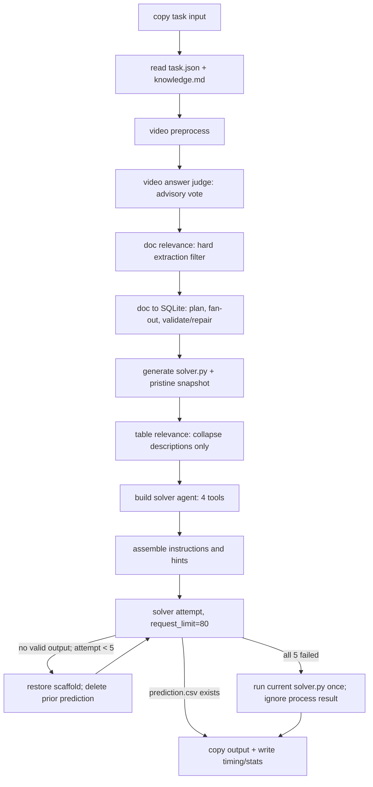

# KDD Champion Repository Reverse Audit

Date: 2026-08-11

Status: Final English research audit. This is not a final specification.

Scope: Verify the source-level accuracy of the Fable HTML and evaluate candidate mechanisms against the latest A/B goals using `Adopt / Adapt / Reject`. This audit does not study compatibility with a legacy architecture, create tickets, or authorize mutation, deployment, or rollback.

## Canonical-Policy Supersession

This source audit predates the owner-confirmed policy resolution. Its repository observations, fixed SHA, source anchors, and `Adopt / Adapt / Reject` judgments remain intact; its former four-label shorthand does not. The authoritative replacement is the [closed canonical domain and policy contract](wayfinder/freeze-canonical-domain-policy-contracts.md).

Read all current-target recommendations in this audit through these independent axes:

- **Evidence and Claim state:** `observed` is valid only for direct, validated Evidence or an `observed_fact` Claim. It is not a Cause Verdict.
- **Cause Verdict:** `unassessed | suspected | confirmed | ruled_out | inconclusive`.
- **Recommendation Readiness:** `not_applicable | blocked | proposal_ready | action_ready | rejected`.
- **Action Approval and Incident State:** separate human-owned dimensions; neither changes Cause Verdict or Recommendation Readiness.

Accordingly, historical source labels such as “source fact,” “not observed,” and “HTML directly observed” below describe audit evidence only. They are not product-state enums. `action_ready` is Recommendation Readiness, not a verdict; `confirmed` is a Cause Verdict only after all applicable Gates 0–7 and an independent causal ruling. No state authorizes mutation.

## 1. Conclusion

**Fable HTML factual accuracy: NO-GO.**

The page correctly identifies three real design choices: Python owns the top-level stage order, the solver receives only four specialized tools, and the scaffold is restored before a failed attempt is retried. It overstates local guardrails as end-to-end contracts, describes contest-oriented best-effort fallbacks as safe fallbacks, and implies that debug traces approach production evidence. Several material claims are only `partially correct`, `unsupported`, or `incorrect`. The page therefore cannot serve as an architecture source of truth.

For a greenfield Data Agent, **adopt principles, not this architecture**. Bounded stages, narrow tools, mechanical validation, soft relevance, and local retry are useful for A/B. Case and evidence lifecycle, production identity, typed changes, runtime-scope matching, metric-to-symbol mapping, causal gates, and immutable review packets must be built as new contracts.

The “Top-1 / champion” claim is separate from architecture correctness. This audit found only the repository README and `final_leaderboard.png`. It did not obtain an official leaderboard or a competition-signed result. The placement remains a **README author claim that was not independently verified**.

## 2. Source Identity and Evidence Labels

- Repository: [zhezh/kddcup2026_champion](https://github.com/zhezh/kddcup2026_champion)
- Fixed commit: `bdc874fc4260e3565ae0dce041728fdf5b376709`
- Audited upstream source: repository-relative paths at the fixed commit above. [Browse fixed source](https://github.com/zhezh/kddcup2026_champion/tree/bdc874fc4260e3565ae0dce041728fdf5b376709)
- Audited Fable HTML: `local review artifact, not included`; claims are verified against the fixed upstream source, not treated as source of truth.

Evidence labels:

- **Source fact**: directly implemented at the fixed SHA.
- **README author claim**: stated by the authors; not an independent reproduction or official proof.
- **Code-inferred behavior**: inferred from branches, fallbacks, or shared dependencies; it may lack a fixture.
- **Test/fixture evidence**: a runnable test or frozen sample. This repository has little such evidence.
- **Reviewer inference**: this audit’s applicability judgment for goals A/B.

Unless otherwise stated, source paths below are repository-relative to `zhezh/kddcup2026_champion` at fixed SHA `bdc874fc4260e3565ae0dce041728fdf5b376709`. Material entries retain a fixed-SHA-relative source anchor.

### 2.1 Presentation ASR Boundary and Terminology Check

The additional Mac Voice Memos ASR has no timestamps and frequently mistranscribes proper names. It was used only to navigate the source. It is not evidence for source facts, speaker quotations, speaker identity, or organizational affiliation. Presentation terms remain grounded in the fixed repository SHA, locatable slides/screenshots, and independently timestamped transcripts.

Fixed-SHA checks:

- The repository title says `KDD Cup 2026 DataAgents - Top1`. This is a README author claim, not proof of the official challenge name or placement. `README.md:1`.
- The exact model string is `qwen3.5-35b-a3b`. `README.md:55`; `tools_v2/general_tools.py:37`; `asr/gen_init_prompt.py:43`.
- The DuckDB dependency and solver SQL runtime are directly supported by source. `pyproject.toml:13`; `agents_v2/duckdb_dialect.py:16-18`.
- `solver.py` is the fixed solver artifact. `zz_agent_v2.py:331-343,483-498,519-541`.
- `record_universe` is part of the document-planner schema, with non-empty, uniqueness, and row-coverage checks. `doc_tools/fanout_struct.py:81-121,550-571,642`.
- The accurate video-slide mechanism is H.264 **packet-size bursts**, not a single “packet-size keyframes” technique. The code identifies and, by default, drops forced keyframes from static frames, then samples the settled frame after a burst. `video/slide_coarse_det.py:1-31,200-271`.
- What ASR called an “HTML-like layout” is more accurately a frame screenshot converted to a **Hiccup layout tree**. `video/frame_html_tool.py:1-4,32,76`.
- CER appears in ASR source and comments. `CER 0.0277 -> 0.0191` is an experimental claim in a source comment and was not reproduced here. `asr/gen_init_prompt.py:101-105,117-127`. This source pass did not confirm a WER implementation or result.

Common ASR errors such as `Queen / dark DB / circle / talk / recorded universe / WEI` are excluded from the report’s terminology. They only triggered source searches for candidates such as `Qwen3.5 / DuckDB / solver.py / record_universe / CER`.

### 2.2 Extraction Provenance Caveat

One formal `gpt-5.6-terra` max extractor was started for repository inventory, symbols, line anchors, and HTML-claim matching. It was repeatedly asked to stop and return its collected packet, but it remained running until interrupted and produced no usable mailbox or final packet. The earlier Luna-high explorer was navigation-only and did not satisfy the formal extraction requirement. Therefore:

- **Terra found:** no usable material claim was returned.
- **Sol verified:** every material source anchor and conclusion retained in this report was independently read and checked by the Sol main task.
- **Rejected:** no Terra-derived statement was admitted without verification; there was no usable Terra statement to admit.
- **Coverage caveat:** the requested dual-pass orchestration was not completed. This report does not claim dual confirmation.

## 3. Actual Task Flow



The actual `process_one_task()` spans `zz_agent_v2.py:173-641`. Python determines the top-level stage order. Inside each attempt, however, the solver model decides which tool to call, how to modify SQL, and when to finish. The HTML’s “0 LLM decisions about what runs next” is approximately true only for top-level stages, not for solver control flow.

## 4. Fable Key-Claim Assessments

| HTML claim | Verdict | Verification and fixed source anchor |
|---|---|---|
| “13-step fixed Python pipeline” | **correct, scope required** | `process_one_task()` has a fixed top-level order. Source fact: [`src/data_agent_baseline/zz_agent_v2.py:173`](https://github.com/zhezh/kddcup2026_champion/blob/bdc874fc4260e3565ae0dce041728fdf5b376709/src/data_agent_baseline/zz_agent_v2.py#L173), with main stages through `:641`. Thirteen is the HTML author’s grouping, not a source contract. |
| “0 LLM decisions about control flow” | **partially correct** | Python owns top-level stages; the model chooses among four solver tools and controls edits/runs. `solver_agent.py:158-197`; `zz_agent_v2.py:543-579`. |
| “4 tools; no shell/file browsing” | **correct, scope required** | Solver tools are exactly `explore_data/run_solver/read_solver/edit_solver`. `solver_agent.py:158-197`. This is the solver surface, not the entire Python process capability; `run_solver` starts a subprocess. |
| “Every tool returns a clear verdict, not raw output” | **partially correct** | `run_solver` returns three states plus shape checks. `explore_data` returns rows, columns, metadata, and truncation notices, not only a verdict. `tools_v2/explore_tool.py:293-383`; `tools_v2/run_solver_tool.py:220-244`. |
| “Everything else has a safe fallback at every step” | **incorrect** | Several paths are fail-open or best-effort, not safety proofs. Video step 3 failure yields `ADOPT_AND_VERIFY`; a successful but wrong document vote can delete input; the final fallback ignores the subprocess result. `video_result_agent.py:445-455`; `doc_relevance_agent.py:532-561`; `zz_agent_v2.py:591-618`. |
| “Six layers” | **incorrect** | The HTML lists `L0` through `L6`: seven layers. They are a report-authored taxonomy, not a repository-owned contract. HTML `:275-313,398-437`. |
| “Capabilities proven at build; failures visible, never silent” | **incorrect** | `uv sync --frozen` and the ffmpeg executable have build gates. ASR weights are copied from the host build context and load-tested only at startup. Startup preflight is explicitly non-fatal and the entrypoint continues after failure. `Dockerfile:10-33,50-69`; `preflight.py:1-11,104-141`; `docker-entrypoint.sh:1-6`. The final fallback also discards captured stdout/stderr and the return code. |
| “Every input becomes one queryable DuckDB database” | **incorrect** | CSV/JSON/DB inputs and successfully derived document tables enter the data runtime. Video becomes multimodal prompt parts and hints, not the same DuckDB substrate. Document extraction may fail or be skipped by relevance. `zz_agent_v2.py:239-329,500-515`. |
| “What a test query sees is exactly what the final script sees” | **partially correct** | Exploration and solver execution share `normalize_query()`, reducing dialect drift. `datasource_runtime.py:364-396`; `explore_tool.py:331-350`. The shared engine also shares bugs and is not an independent validator. |
| “Every LLM judge has schema, vote, timeout, safe default” | **incorrect** | Relevance and video paths have schema/timeout/vote behavior. Document fan-out has a planner, workers, and repair with different semantics; a failed section may retain a best-effort result. `doc_tools/fanout_struct.py:800-868,874-1053,1310-1450`. |
| “A judge suggests; never decides the final answer” | **partially correct** | Video is injected as a hint. Table relevance only collapses descriptions. Document relevance decides which documents reach extraction, so a successful correlated false negative removes evidence availability. `zz_agent_v2.py:280-321,348-377,426-458`. |
| “Scaffold runs end-to-end before the agent touches it” | **partially correct** | The scaffold includes load/save paths, but the initial query hole can leave `result=None`, which `run_solver` reports as `NO OUTPUT`. Executable is not equivalent to a valid answer. `run_solver_tool.py:227-244`. |
| “prediction.csv or fail loudly within 80 requests” | **incorrect** | Eighty is the limit per attempt. Up to five attempts run, followed by a non-agent fallback. `zz_agent_v2.py:519-618`. Local exceptions are logged, but the final fallback does not fail loudly. |
| “5 clean-slate attempts” | **correct for local state** | Each retry restores the pristine scaffold, clears `_schema_shown.flag`, and deletes the previous prediction. `zz_agent_v2.py:519-541`. This is not an append-only case lifecycle; it deletes attempt-local artifacts. |
| “fallback runs the scaffold anyway” | **partially correct** | It runs the current on-disk `solver.py`. If restoration failed or the last attempt edited it, it is not guaranteed to be pristine. The subprocess result is ignored. `zz_agent_v2.py:591-618`. |
| “voting improves correctness” | **unsupported** | A source comment reports a 30-video observation, but the repository lacks the frozen fixture, raw runs, and ablation. Votes share model, prompt, and input, so errors are correlated. `video_result_agent.py:514-530`. |
| “fail-open relevance means evidence is recoverable” | **partially correct** | Table relevance is soft collapse and the base table remains recoverable. Document relevance is recall-biased only on total failure/ties; a successful correlated false negative hard-excludes extraction. `table_relevance_agent.py:433-499`; `doc_relevance_agent.py:504-584`. |
| “context compaction at 70%/90%, never cuts a tool pair, full history searchable” | **unsupported / dependency observation** | The repository pins `pydantic-deep==0.3.17`: `pyproject.toml:24-33`. Champion-owned source does not define those exact contracts. Dependency implementation would still require a dependency SHA, tests, and runtime verification. |
| “Top-1, 0.8033, 48.6 min, 13.3 calls” | **README author claim only** | `README.md:1,11-22,39-55`. The page accurately transcribes the self-report, but the repository lacks ten raw-run bundles, a task digest, an environment receipt, or an independent reproduction. Top-1 was not independently verified. |
| “dead code proves the learning curve” | **unsupported** | Commented or unused code in one snapshot cannot prove an evolutionary cause. Git history, commit rationale, or ablation is required. |
| “what we should copy for SMA v2” | **incorrect framing** | The current boundary is greenfield and requirements-first. KDD and old SMA are candidates, not compatibility or module constraints. |

## 5. Negative Evidence and Failure Modes

### 5.1 Hardcoded and Task-Specific Logic

- `MAX_PARALLEL_TASKS=16`, five video votes, request limit 80, and five attempts are contest tuning, not A/B SLA or risk policy. SLA remains open pending real complexity benchmarks.
- Video rules contain task-specific heuristics about configuration panels, masked thresholds, boundary frames, and unreliable ASR numbers. `zz_agent_v2.py:405-424`. Migrating them into enterprise search would invite overfitting.
- “A wrong answer in the right format beats no answer” is leaderboard utility, not an incident or experiment evidence gate. `zz_agent_v2.py:591-593`.

### 5.2 Silent Fail-Open and Failure Propagation

- Video preprocessing, the video judge, document relevance, and document preparation can warn and continue. Continued execution does not prove complete evidence.
- Preflight failure does not stop execution. Environment defects may remain only in logs and never enter a case conclusion.
- The final fallback ignores return code, stdout, and stderr, then checks only whether a file exists.
- `task_stats['success']` uses the last agent attempt’s `run_ok`; it does not mean the delivered file passed numeric validation. `zz_agent_v2.py:631-640`.

### 5.3 Docker Implementation: Real Capabilities and Boundaries

Docker is implementation, not packaging prose. This audit read `Dockerfile`, `build.sh`, `docker_run_all.sh`, `docker-entrypoint.sh`, `preflight.py`, `sitecustomize.py`, and `asr/prepare_models.sh` line by line.

**Implemented positive mechanisms:**

- `uv sync --frozen --no-dev --no-install-project` builds third-party dependencies from `uv.lock`. `Dockerfile:10-18`.
- `static-ffmpeg` is downloaded at build time and runs `ffmpeg/ffprobe -version` with `check=True`; failure stops the image build. `Dockerfile:20-33`.
- Runtime sets `HF_HUB_OFFLINE=1` and `TRANSFORMERS_OFFLINE=1`, copies local ASR weights, and load-tests `tiny` and `medium` on CPU at startup. `Dockerfile:38-56`; `preflight.py:77-101`.
- `docker_run_all.sh` mounts contest input `:ro` and output/temp/logs `:rw`. `docker_run_all.sh:21-29`.
- `sitecustomize.py` only folds Python tracebacks and falls back to the default full traceback if folding fails. `sitecustomize.py:31-48`.

**What this cannot establish as sealed or production-safe:**

- ASR weights come from the host Hugging Face cache. `prepare_models.sh` checks for four files but records no artifact digest, HF revision, or signature. `asr/prepare_models.sh:21-55`. `COPY asr_models` is not provenance proof.
- Startup preflight does not block the task. `docker-entrypoint.sh:5-6` explicitly continues.
- The entrypoint places the main program in `{ ... } | tee` without `pipefail`. Container exit status may reflect `tee` rather than the Python program, weakening failure propagation. `docker-entrypoint.sh:1-7`.
- Images run under mutable tags rather than image digests. `build.sh:4-29`; `docker_run_all.sh:7-29`.
- The runner hardcodes host paths, model URL, and model name. It emits no runtime receipt proving the model artifact actually served. `docker_run_all.sh:12,22-29`.
- The container declares no non-root `USER`, read-only root filesystem, `--network none`, capability drop, resource limit, or security profile. Narrow solver tools are not container capability isolation.
- `/logs` is set to mode `777`. This is contest convenience, not tenant-safe evidence storage. `docker-entrypoint.sh:2`.
- `sitecustomize` affects only Python subprocesses that can import it, not “every subprocess”; failure to import the hook is silently ignored. `sitecustomize.py:26-37`.

The Docker implementation supports a reproducible-ish contest image with offline media dependencies. It does not establish production runtime identity, artifact attestation, a hard readiness gate, least privilege, or immutable evidence.

### 5.4 Correlated Failure in Broad Voting

- Rounds share model, prompt, preview, and input. They are not independent evidence.
- Truncated previews, shared schema misunderstandings, and shared model bias can repeat across all five votes.
- Relevance accumulates “successful rounds”; timeout and parse failures are discarded. Successful samples may be selected non-randomly.
- Voting may reduce stochastic variance. It cannot replace a source-read receipt, deterministic validator, or counterfactual.

### 5.5 Evidence Deletion and Recoverability

- The attempt loop overwrites `solver.py` and deletes `_schema_shown.flag` and `prediction.csv`. Per-attempt messages are logged, but this is not an append-only evidence graph.
- A document false negative prevents that document from reaching SQLite. Unlike table soft collapse, the solver has no equivalent recovery path to the base document.
- A failed document section can retain best-effort extraction without a mandatory taint gate that tells downstream consumers the field is unconfirmed.

### 5.6 Numeric Provenance

- `run_solver` checks exit code, file, shape, columns, non-null counts, and head rows. It does not prove formula, source rows, authoritative read, units, joins, or causal correctness.
- Exploration and final solver share DuckDB normalization. This reduces drift but lets the same normalization defect pass both “exploration” and “execution.”
- `__src_line` is produced by model extraction. It is candidate provenance, not an independent source-read receipt.

### 5.7 Identity, Runtime, and Change-Discovery Gaps

The repository has no:

- `scope x interval x rollout` matcher;
- observed runtime identity;
- typed `code | config | flag | model | data` production-change inventory;
- deployed-SHA and effective-rollout binding;
- metric-segment -> runtime-path -> repository/file/symbol mapping; or
- ACL-, tenant-, role-, locale-, and surface-aware evidence scope.

It therefore cannot safely promote “recent code” to a SEV candidate or bind an experiment miss to production implementation.

### 5.8 Test-Coverage Gaps

The repository has no conventional `tests/` suite. `asr/test_remote_whisper.py` is a manual ASR script. `run_compare_to_gt.py` is a local scorer implementation, not main-agent regression proof.

No frozen fixtures were found for stage transitions, document-relevance false negatives, correlated voting errors, retry/fallback, numeric derivation, read-only bypass, runtime identity, typed changes, append-only evidence, or README metric reproduction.

## 6. Gap Against the Canonical Target

| Canonical target | What the repository provides | What must be built greenfield |
|---|---|---|
| Contracts | Local Pydantic outputs and tool parameters | Case, evidence, claim, authorization, budget, freshness, coverage, verdict, and action contracts |
| Case lifecycle + append-only Evidence Graph | Task directories, logs, timing | Stable `case_id/evidence_id`; append-only nodes/edges; source digests; contradiction, invalidation, partial recomputation |
| Read-only Adapters | `explore_data` SQL filtering | Server-side read-only connections; metric/SCM/deploy/flag/config/model/data adapters; authorization receipts |
| Deterministic Validators / Runtime Matcher / Mapping | Shape/schema/syntax checks | Independent metric recomputation; experiment validity; changepoint; runtime identity; scope x interval x rollout; metric -> runtime -> symbol |
| Semantic Claims | Judge and solver prose | Typed predictions, falsifiers, supporting/contradicting/missing evidence, and cause roles |
| Claim Registry | None | Promotion history, claim/evidence links, conflicts, and supersession |
| Policy / Gates | Request and attempt limits | Gates 0–7; invalid-experiment blocker; high-risk escalation; separate Evidence/Claim state, Cause Verdict, Recommendation Readiness, Action Approval, and Incident State |
| Immutable Review Packet | `prediction.csv` plus mutable logs | Frozen manifest, receipts, deployed identities, unapplied diff/rollback packet, coverage, and human decision |
| Human review | No production review workflow | IC/code-owner gates, reviewer and action authority, and explicit non-authorization of agent mutation |

## 7. Adopt / Adapt / Reject for Goals A/B

| Champion practice | A: post-experiment miss | B: SEV drop | Judgment |
|---|---|---|---|
| Python-owned bounded stage order | validity -> recompute -> causal-chain localization | signal -> changepoint -> scoped change ranking | **Adopt the principle.** Rewrite stages for A/B. |
| Narrow solver tools | Reduce arbitrary reads/writes and opaque actions | Restrict incident-tool capability | **Adopt the principle.** Rebuild names, schemas, and permissions. |
| Soft table relevance | Reduce context noise while preserving base tables | Hide candidates without deleting them | **Adopt.** Apply to graph visibility, never the evidence registry. |
| Hard document relevance | May delete causal-chain evidence | May delete a decisive deploy or trace | **Reject as an evidence filter.** Permit ranking or default collapse only. |
| Same SQL engine for exploration/final | Reduce query-dialect drift | Reproduce the same query | **Adapt.** Add an independent validator; shared implementation cannot validate itself. |
| Schema/syntax/shape checks | Useful deterministic invariants | Useful packet-completeness checks | **Adopt and extend.** Add numeric derivation, receipt, scope, and identity. |
| Vote/fan-out/repair | Handle document semantics and candidate hypotheses | Parallelize change-mechanism interpretation | **Adapt selectively.** Fan out only independent, comparable work; correlated votes do not raise evidence grade. |
| Five clean-slate retries | Isolate failed solver attempts | Isolate query/adapter failure | **Adapt.** Retry only the failed stage and preserve append-only evidence. |
| Best-effort output fallback | May emit a system answer after invalid experiment evidence | May emit misleading candidates after environment/solver failure | **Reject.** A hard-gate failure must abstain or downgrade. |
| Video-answer adoption | May bypass metric derivation | Does not represent runtime evidence | **Reject.** Every source value needs a derivation/source-read obligation. |
| Contest traces/token stats | Debug navigation | Latency/cost observation | **Adapt.** Upgrade to stable receipts, budget, and failure propagation. |
| Fixed contest constants | Do not reflect experiment complexity | Do not reflect SEV risk or urgency | **Reject.** Set SLA and budgets only after real benchmarks. |
| README performance as validation | Does not prove production diagnosis | Does not prove incident causality | **Reject as evidence.** Use only as a reproduction hypothesis. |

## 8. Correct Use Under Goals A/B

### A — Post-Experiment Metric Miss

Validate the experiment first. If SRM, assignment, logging, join, freshness, or definition gates fail, output only validity, instrumentation, and data-quality fixes. Keep system hypotheses blocked; do not produce production patch direction.

After validity passes, locate the break in a layered causal chain. Cover at least eight cause classes instead of defaulting to a code bug: treatment/exposure, population/mix, data/measurement, corpus/ACL/freshness, retrieval/ranking/rendering, interaction/behavior, runtime/reliability, and concurrent production change.

Only deployed implementation evidence may bind a claim to exact `repo/SHA/file/symbol/line` or config/flag/model/data identity. A Recommendation with `Readiness=action_ready` may include an **unapplied** candidate diff, test, risk, and rollback plan; it does not change the linked Cause Verdict and never authorizes mutation or deployment. High-risk or large-blast-radius actions cannot reach `Readiness=action_ready`; escalate to the IC and code owner.

### B — SEV Metric Drop

Verify the signal and changepoint first. Rank only changes that entered the affected runtime scope. Matching must combine interval, rollout, tenant/region/surface/service, and observed runtime identity.

The output may be a rollback-ready packet bound to the deployed SHA and, where possible, file/symbol/line. It never executes rollback. After rollback, run recovery verification and continue RCA. `Incident State=recovered` does not change `Cause Verdict` to `confirmed`.

Complex SEVs do not require a single root cause. Model claims separately as `trigger / proximate mechanism / contributing factor / systemic condition`. Use a candidate group for jointly necessary conditions.

### Current State Boundary

This subsection supersedes the audit's earlier single-axis “observed / suspected / action-ready / confirmed” shorthand.

- `observed` is an Evidence state or the state of an `observed_fact` Claim after direct validation. A Cause Claim cannot be `observed`.
- `Cause Verdict=suspected` means scope-grounded support exists while at least one confirmation gate remains incomplete. `Cause Verdict=confirmed` requires every applicable Gate 0–7 to pass, no open material contradiction or HIGH promotion blocker, and an independent human causal ruling.
- `Recommendation Readiness=action_ready` means the exact target, bounded non-HIGH blast radius, recoverability, independent operational Evidence, monitoring, and stop conditions are complete. It is a separate action-specific result, not causal confirmation.
- A critical invalid experiment makes a production Recommendation `not_applicable`; a missing material identity, authority, or coverage receipt produces the relevant `blocked` readiness or Cause-Verdict ceiling under the closed contract.
- `Incident State=recovered`, Action Approval, and any human preference do not promote a Cause Verdict or authorize this Agent to mutate.

## 9. Enterprise Search Axes: Support and Misleading Transfer

Candidate chain:

```text
intended treatment
  -> eligible corpus
  -> permission-trimmed corpus
  -> retrieved candidates
  -> fused ranking
  -> reranked/rendered results
  -> user/session interaction
  -> metric
```

| Diagnostic axis | Champion mechanism | Risk / greenfield requirement |
|---|---|---|
| Query mix: head/tail | SQL can slice data | No query taxonomy, exposure, or counterfactual contract. Aggregate vote/score can hide tail regression. |
| Tenant/role/locale/surface | No production identity | Include these in case scope, runtime matching, metric receipts, and change receipts. |
| ACL/identity sync | None | Verify eligible -> permission-trimmed corpus. Missing permission evidence is a hard gate; retrieval results cannot prove ACL correctness. |
| Connector/index freshness | Only local input copy | Require connector/index watermarks, schema/enrichment versions, and freshness receipts. |
| Lexical/vector/hybrid/fusion/rerank | No search-runtime mapping | Observe candidate set, score, model/config, and fallback at each stage. |
| Zero results/snippet/presentation | SQL can aggregate; no UI/session telemetry | Separate retrieval absence, ACL trim, render suppression, snippet failure, and interaction. |
| Click position/intent bias | No experiment validity | CTR alone is not relevance. Require position/intent controls, task success, and guardrails. |
| Session/task success | One-task prediction is not equivalent | Build session chains and longer-term success metrics. |
| Latency/timeout/fallback/cache | Has timeout/fallback, biased toward best effort | Bind timeout, fallback, and cache state to affected cohorts; silent degradation blocks promotion. |
| Offline-online/counterfactual | README offline runs | Offline score does not prove online impact. Require a valid experiment, holdout/canary/rollback, or negative control. |

The repository usefully shows how to place semantic judgment between deterministic stages. It does not cover the enterprise-search causal path. CTR lift and aggregate lift cannot bypass tenant, tail, ACL, and session decomposition.

## 10. Specific Corrections Required in the Fable HTML

1. Label “winning / Top-1” as a repository self-report and state that this audit did not independently verify the official leaderboard.
2. Replace “six layers” with “seven report-defined layers (`L0-L6`)” and state that this is not a repository-owned contract.
3. Replace “0 LLM decisions about control flow” with “Python controls top-level stage order; the model controls solver tool choice and termination.”
4. Remove “safe fallback at every step” and “failures visible, never silent.” Label each path as fail-open, best-effort, or hard failure.
5. Replace “every input becomes one DuckDB database” with “structured files and successfully extracted documents enter the shared data runtime; video enters as multimodal prompt/hint.”
6. Split “every judge has schema + votes + timeout + safe default” into each agent’s actual semantics. Document fan-out is not a relevance vote.
7. Replace “a judge never decides” with: video is advisory; table relevance is soft collapse; document relevance controls downstream evidence availability.
8. Replace “fail within 80 requests” with “up to 80 requests per attempt, up to five attempts, then a best-effort subprocess fallback.”
9. Replace “fallback runs the scaffold” with “fallback runs the current on-disk `solver.py`; return code and result are not strongly validated.”
10. Replace “every tool returns a verdict, not raw output” with “tools return bounded textual feedback; `explore_data` includes raw rows and metadata.”
11. Downgrade exact pydantic-deep compaction percentages and history semantics to dependency claims, with dependency version/SHA/tests.
12. Remove causal statements such as “voting improves correctness,” “dead code proves the learning curve,” and “therefore 13.3 calls were enough” until ablation exists.
13. Remove “what we should copy for SMA v2.” Replace it with A/B-specific `Adopt / Adapt / Reject` judgments.

## 11. Graph and UI Observations

This section is research judgment only. It does not decide the owner’s evidence-graph product contract.

### 11.1 Visible Surface and User Operations

| Material observation | Evidence class | Evidence anchor | Conclusion |
|---|---|---|---|
| Fable shows `L0-L6` on the left, a 13-step pipeline on the right, arrows, and vote/fan-out badges | **HTML directly observed** | HTML `:258-394`; repository SHA remains `bdc874fc4260e3565ae0dce041728fdf5b376709`, but the HTML is outside that commit | Static architecture SVG. Arrows narrate stage order; they are not runtime evidence edges. |
| Node click opens detail | **not observed** | HTML `:258-394` has no interaction handlers; no frontend graph files were found | No click-to-source, click-to-receipt, or click-to-claim detail. |
| Group, expand/collapse, filter | **not observed** | HTML search finds only CSS `border-collapse` and prose about table-relevance collapse, neither of which is graph interaction | Table-schema soft collapse must not be presented as graph UI. |
| Timeline or trace UI | **not observed** | No timeline/trace renderer was found | JSON/timing artifacts exist, but no visual timeline, scope overlay, or trace drill-down exists. |
| Graph operation in video/UI | **not observed** | This task has no independent video artifact or timestamp/frame package; the repository processes contest briefing video | Adjacent video-pipeline capability cannot fill this evidence gap. |

### 11.2 How “Graph-Like” Data Is Generated

- **Source extraction — source fact.** The document cache key uses document bytes, model name, pipeline version, and knowledge digest. `doc_tools/doc_prepare.py:110-125`. This is cache identity, not case evidence identity.
- **Source-line mapping — source fact.** Worker-produced `__src_line` moves into `provenance {record_id -> section_id -> src_line}`. `doc_tools/fanout_struct.py:822-868`. It aids document lookup but remains a model-produced mapping, without an independent source-read receipt.
- **Agent artifacts — source fact.** Document fan-out writes `*.fanout_allmsg.json`. `doc_tools/doc_prepare.py:454-463`. Video writes step trajectories, per-vote JSON, and aggregate `result.json`. `agents_v2/video_result_agent.py:380-465,538-611`.
- **Execution trace — source fact.** The solver stores per-attempt messages, timing, and token statistics. `zz_agent_v2.py:543-572,631-640`.
- **Claim/evidence link — not observed.** No stable `claim_id/evidence_id`, typed link, promotion history, or claim registry was found.
- **Graph generation — not observed.** No builder converts these artifacts into nodes and typed edges. The Fable SVG is static report narration, not runtime generation.
- **Author claim.** Fable says each document row carries a source line, “the trace shows the environment,” and derived claims should carry evidence IDs. HTML `:514,570-575`. The first has partial source support. The latter two are recommendations for old SMA, not implemented champion-repository graph behavior.
- **Reviewer inference.** Current artifacts can answer which stage ran, what the model said, which round failed, how long it took, and which candidate document line was cited. They cannot answer whether a production change entered affected scope and caused a metric change.

### 11.3 What Actually Helps Users

**Useful:**

- Debug stage order, attempts, exceptions, vote distribution, tokens, and time.
- Return from document extraction to a candidate source line.
- Identify which trajectory produced a hint or solver edit.

**Narration or debug, not an evidence graph:**

- Static Fable architecture arrows.
- LLM reason/confidence prose.
- A majority result from repeated calls to the same model.
- Raw message history and timing JSON.
- Existence or shape validity of `prediction.csv`.

These artifacts lack production identity, typed relations, authorization/freshness, contradiction, falsifiers, and immutable promotion records.

### 11.4 Missing Production A/B Evidence Graph

The repository does not implement this chain:

```text
metric
  -> surface/component
  -> query/result
  -> ACL/corpus
  -> pipeline/runtime
  -> typed production change(code/config/flag/model/data)
  -> claim
  -> verification/falsifier
  -> recommendation / not-applied diff / rollback-ready packet
```

Missing elements include metric definition/version and recomputation receipt; surface/tenant/role/locale/query-class scope; query parameters/rows/result digest; eligible and permission-trimmed corpus; ACL/identity sync and index freshness; runtime trace and deployed identity; typed-change effective interval/rollout; metric-to-symbol mapping; claim registry; supporting/contradicting/missing evidence; predeclared verification/falsifier; unapplied diff and rollback-ready packet; and immutable human-review decision.

### 11.5 Edge Taxonomy Must Not Be Flattened

Greenfield research must distinguish at least:

| Edge type | Meaning | Champion repository status |
|---|---|---|
| `observed fact` | Direct source receipt, such as a query result or deployed runtime identity | Local rows/logs provide partial observations; no production receipts. |
| `derived fact` | Deterministic transform/recompute that links to inputs and validator version | Partial SQL implementation; no independent validator. |
| `mapping assertion` | Metric segment mapped to surface/runtime/symbol; may conflict or become stale | Not observed. |
| `causal claim` | Change causes effect through a mechanism, with predictions and falsifiers | Not observed. LLM narration cannot promote itself. |
| `contradiction` | Evidence refutes a claim or mapping | Not observed as a typed edge. |
| `supersedes / invalidation` | A new definition, identity, or item of evidence invalidates an older node/edge | Not observed. Attempt overwrite/deletion is not typed invalidation. |

Rendering every arrow as causal would conflate stage order, data lineage, mapping, and causal attribution.

### 11.6 Adopt / Adapt / Reject for Graph Practices

- **Adopt:** stage/attempt/trace visibility, source pointers, and click-through to original receipts. This remains research judgment.
- **Adapt:** convert mutable JSON logs into an append-only, typed, case-scoped graph. Candidate UI needs filter, group, expand/collapse, click detail, and timeline, but exact interaction remains an owner decision pending fixtures.
- **Reject:** treating a static architecture SVG, LLM confidence, majority vote, raw debug trace, or connection order as an evidence graph; treating all edges as causal.

## 12. Claims Requiring Fixtures or Ablation

- Whether five votes improve correctness over one vote rather than merely reducing stochastic variance.
- The false-negative rate of hard document filtering and the impact of removed evidence on scores and diagnoses.
- Field accuracy, source-line accuracy, and correlated error for fan-out + repair versus single-pass extraction.
- Marginal success, cost, and latency effects of five clean-slate attempts and context compaction.
- Whether shared SQL normalization reduces drift while allowing validator-shared defects.
- Whether README values `0.8033 / 48.6 min / 13.3` reproduce under a frozen task digest, model endpoint, hardware profile, and ten raw-run bundles.
- False-confirmation, false-abstention, coverage, latency, and human-review burden on real A/B fixtures. SLA must not be frozen without these data.

## 13. At Most Five High-Value Next Research Checks

1. Freeze adversarial document-relevance fixtures. Measure hard-delete false negatives against soft collapse.
2. Run video/document voting ablations at `1 vs 3 vs 5`, across model/temperature, and report correlated errors rather than majority accuracy alone.
3. Build a numeric-provenance fixture with an injected shared-normalization defect and test whether an independent validator catches it.
4. Test `scope x interval x rollout` on two synthetic production cases: a nearby but undeployed commit and a tenant-only configuration rollout.
5. Obtain the ten raw-run bundle or an official leaderboard receipt. If neither is available, keep the placement and metrics permanently labeled self-reported.

## 14. Coverage and Unresolved Gaps

Covered:

- Actual `process_one_task()` stage and control flow.
- Different fail-open and recoverability behavior in document/table relevance.
- Three-stage video judge and voting.
- Document-to-SQLite fan-out, schema, repair, best effort, and source lines.
- Four-tool surface, SQL safety, shared-engine behavior, and solver validation.
- Retry/fallback, trace, request budget, and failure propagation.
- Docker build/runtime implementation, dependency/media preflight, mounts, and exit-status boundary.
- Missing derivation/source-read receipts.
- Missing case lifecycle, append-only evidence, invalidation, and partial recomputation.
- Missing runtime identity, typed changes, matcher, and mapping.
- What README and tests/fixtures can and cannot prove.
- Main enterprise-search causal axes.
- Graph/UI visibility, artifact generation, edge taxonomy, and production A/B graph gaps.

Unresolved:

- The full contest workload was not run. Input, ground truth, model endpoint, and official evaluation receipt were unavailable.
- Official champion placement was not independently verified.
- All dependency internals were not verified. Pydantic-deep claims remain locked-version/dependency observations, not champion-owned contracts.
- No fixture/ablation confirms the net value of voting, fan-out, repair, compaction, or retry.
- No production systems were available to demonstrate A/B runtime/change mapping. This audit can only establish that the repository lacks the required contracts.
- The Terra max extractor returned no usable packet. The main task independently verified the retained evidence, but dual-pass confirmation remains incomplete.

## 15. Final Recommendation

**Fable HTML: NO-GO as a factual architecture report.** After the corrections in Section 10, it may be downgraded to “competition code-reading notes.”

**Champion repository: GO as a bounded-mechanism reference; NO-GO as the greenfield architecture base.** Adopt deterministic orchestration, narrow tools, soft relevance, and mechanical checks. Adapt retry, fan-out, traces, and the shared runtime. Reject hard evidence deletion, correlated votes as validation, silent/best-effort fallback, contest constants, and README metrics as production proof.

The target remains:

```text
Contracts
  -> Case lifecycle + append-only Evidence Graph
  -> Read-only Adapters
  -> Deterministic Validators / Runtime Matcher / Mapping
  -> Semantic Claims
  -> Claim Registry
  -> Policy / Gates
  -> immutable Review Packet
  -> human review
```

This is a research recommendation, not the canonical specification. The policy terminology in this audit is superseded by the [closed canonical domain and policy contract](wayfinder/freeze-canonical-domain-policy-contracts.md); source-level lessons here remain reference evidence rather than implementation authority.
