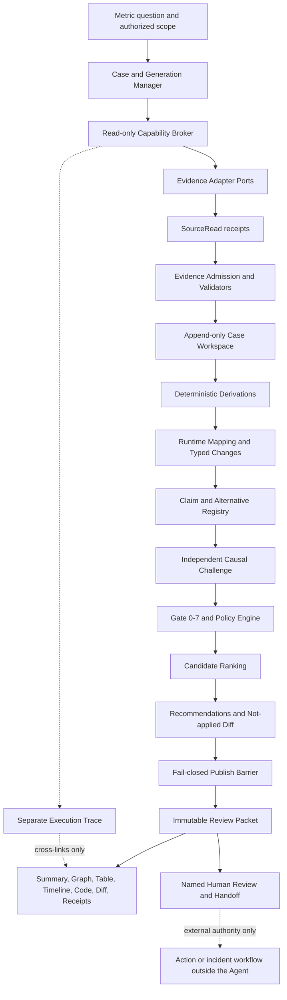
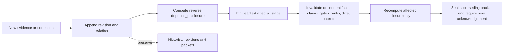

# Greenfield Search Metric Data Agent: Canonical Architecture Specification

Date: 2026-08-12
Status: canonical logical specification for the owner-aligned M0-M2 Validation Slice with a planned fixture-backed M0 MVP awaiting a new exact-digest start receipt and three explicit open human gates
Scope: this document does not itself grant implementation authority; the prior local continuation authorization is exhausted, and `M0-F1`-`M0-F5` require a new Owner authorization and bounded receipt; production access, M1/M2 implementation, mutation, commit, push, deployment, rollback, messaging, and publication remain unauthorized

## 1. Authority and Conformance

This is the canonical logical architecture for the greenfield Search Metric Data Agent. It supersedes the architecture implications in the historical [`greenfield-requirements.md`](greenfield-requirements.md) draft and the older single-axis or Gate 0–3 language identified by the [`cross-research-consistency-audit.md`](cross-research-consistency-audit.md). It does not rewrite primary-source observations.

The authority order is:

1. Owner decisions in the [`owner-alignment-record.md`](reviews/2026-08-16-opus5-m0-alignment/owner-alignment-record.md) and reconciled [`planning-decision-packet.md`](planning-decision-packet.md).
2. The closed [`freeze-canonical-domain-policy-contracts.md`](wayfinder/freeze-canonical-domain-policy-contracts.md) Wayfinder resolution.
3. Resolved future Wayfinder decisions. The three tickets named in Section 17 are currently open and must remain open.
4. Fixed-source facts routed through the [`source-manifest.md`](source-manifest.md) and [`research-synthesis.md`](research-synthesis.md).
5. Engineering decisions in this specification and the [`CE implementation plan`](../../plans/2026-08-12-001-feat-kdd-data-agent-greenfield-plan.md).

The [`enterprise experiment post-analysis profile`](enterprise-experiment-post-analysis-profile.md) is supporting requirements context with explicit owner gates. It is not product authority and cannot override the planning packet, closed policy contract, or this specification.

Where an open Wayfinder ticket controls a decision, this specification defines the port, fail-closed behavior, and pre-gate implementation boundary but does not invent the missing production or human answer.

Normative terms:

- **MUST** and **MUST NOT** are product or safety requirements.
- **SHOULD** is the selected logical design unless implementation evidence justifies a superseding design decision.
- **OPEN GATE** means work may implement fixture-backed interfaces and safe unknown behavior, but the dependent production behavior cannot be called resolved or production-ready.
- An **auditable reasoning path** is a structured path through claims, evidence, derivations, alternatives, GateReceipts, and policy decisions. It is not hidden chain-of-thought, private model scratch work, or free-form narration.

## 2. Product Outcome

The target architecture answers two specific production questions. Any future build/funding authorization is narrower.

### First gate and next planned slice — M0 Flight Readiness

The first gate and main deliverable is M0 Flight Readiness. After a new exact-digest start receipt exists, it accepts a versioned `ExperimentReadContract`, performs deterministic setup/read checks including the closed D4/D6 recomputation-independence contract, and seals an immutable `FlightReadinessPacket` with one stored readiness state, `analysis_use = decision_grade | directional_only | not_permitted`. Renderers derive `post_analysis_eligibility = eligible | blocked` from that state and never store or independently set it: `decision_grade -> eligible`; `directional_only | not_permitted -> blocked`.

The next local fixture-backed M0 MVP is planned only and is not currently executable. The prior continuation receipt is exhausted; `M0-F1`-`M0-F5` require a new exact-digest Owner authorization and bounded start receipt. M0 does not explain metric movement, rank product-logic production changes, make causal claims, or collect query-level win/loss examples. Within a future authorized slice, an invalid Experiment may produce a correct unapplied `InvalidExperimentRemediation` diff only after exact-target, authority, validation, capability-isolation, and human-only delivery gates pass; typed guidance plus a reopen condition remains the first path and permanent fallback.

M1 Metric Movement and Production Grounding and M2 Win/Loss Evidence belong to the same one-Flight M0-M2 Validation Slice, planned for four to six active engineering weeks with two builders. They require their named gates and separate implementation authorizations. Technical completion means review-ready M0, M1, and M2 packets, not Experiment Review Committee acceptance.

### Scenario A — Post-experiment metric miss

Determine whether an experiment observation is valid. If it is valid, explain why the target metric missed expectations and narrow the explanation to ranked deployed `code | config | flag | model | data` candidates. When evidence supports an exact bounded proposal, the Agent may generate a candidate diff marked `not_applied`.

Scenario A remains the broader target product outcome. Its M1 production-grounding behavior is planned in the validation program but is not part of the not-yet-authorized fixture-backed M0 slice.

### Scenario B — SEV metric drop

Confirm a metric drop, onset, and affected scope; find production changes that reached that scope; and prepare a rollback-ready packet for a human incident workflow. Scenario B is deferred. It reuses the shared case, evidence, runtime identity, typed change, claim, gate, ranking, packet, and projection substrate. It is not authorized by a future fixture-backed M0 receipt or the Owner-aligned Scenario A scope.

### Required result

For either scenario, the system narrows a broad metric symptom into reviewable production candidates and preserves this chain:

```text
metric phenomenon
  -> observed and derived facts
  -> surface/component and affected scope
  -> query/result, ACL/corpus, and pipeline/runtime evidence
  -> typed production change or candidate group
  -> falsifiable Cause Claim and material alternatives
  -> independent challenge and GateReceipts
  -> Cause Verdict + Recommendation Readiness
  -> verification or falsification plan
  -> immutable recommendation and handoff packet
```

No part of the chain grants execution authority.

## 3. Scope and Non-goals

### 3.1 In scope for the planned fixture-backed M0 slice after a new start receipt

- A versioned `ExperimentReadContract` with frozen experiment, metric, assignment/exposure, population, window, estimator, unit, source, and named human roles.
- Read-only fixture adapters and, only after P2 authority, the specifically approved primary-read source path.
- Source-read receipts, deterministic numeric derivations, D4/D6 recomputation receipts, and append-only Evidence/Coverage Gap history. Check 14 records `independence_class = independent_source | independent_transform | same_pipeline`, requires at least `independent_transform`, and exposes `shared_source_snapshot` when the authoritative snapshot is shared.
- Deterministic checks for experiment identity, runtime completion, metric registration, assignment, exposure, SRM, joins, completeness, freshness, estimator, unit, lineage, and recomputation independence.
- Explicit `PASS | FAIL | MISSING | UNKNOWN | NOT_APPLICABLE` check outcomes with fail-closed materiality.
- An immutable `FlightReadinessPacket` with the readiness decision, blocking reasons, disagreements, next safe action, named review/approval state, authorization/redaction manifest, and no production-cause conclusion.
- A read-only packet-centered M0 review projection and hermetic fixtures for trusted, invalid, materially unknown, conflicting, stale, partial, and unauthorized cases.

### 3.2 Planned M1 validation-program architecture

- Isolated, frozen Case Generations.
- Experiment validity, metric recomputation, and enterprise-search diagnosis.
- Read-only, narrow evidence adapters with source receipts and Coverage Gaps.
- Append-only evidence, derivations, mappings, claims, contradictions, and revisions.
- Exact deployed identity and `scope × interval × rollout` matching.
- A unified inventory of `code | config | flag | model | data` changes and multi-change candidate groups.
- Falsifiable claims, alternatives, independent challenges, Gate 0–7, and deterministic policy evaluation.
- Deterministic, inspectable candidate ranking.
- An optional exact candidate diff marked `not_applied`.
- Immutable review packets and digest-bound human handoff.
- Read-only summary, Evidence Graph, table, timeline, code, diff, receipt, and Trace projections.
- Threshold-free fixtures and evaluation hooks pending real adjudication and pilot calibration.

The items in this subsection are part of the Owner-aligned validation program. They remain unauthorized until a separate M1 start and applicable production gates exist. A blocked Flight may be investigated, but dependent claims remain capped by its M0 failures and may not be promoted as decision-grade.

### 3.3 Planned M2 validation-program architecture

- Query-level candidate discovery bound to one M1 Claim and predicted mechanism.
- Treatment/control replay or an explicit counterfactual Coverage Gap.
- ACL-safe exact query, result, runtime, corpus, and snapshot receipts.
- Human `win | loss | unclear | not_comparable` judgments with disagreement preserved.
- An immutable `WinLossEvidencePacket` linked to the same Flight and M0/M1 packet lineage.

M2 remains unauthorized until M1 is review-ready and the required P2/P3/P4 authority covers its evidence and review surface.

### 3.4 Deferred

- Scenario B-specific changepoint policy, rollback packet fields, recovery monitoring, continuing RCA orchestration, and incident fixtures.
- Real production adapters and live production mappings until the production-authority ticket closes.
- Final UI interaction and framework selection until live prototype review closes.
- Numeric case count, risk weights, candidate depth, stability, latency, token, source-load, cost, SLA, and shadow-read thresholds until adjudication and pilots close the evaluation ticket.
- Any transition from isolated shadow evaluation into formal decision support.

### 3.5 Non-goals

- Migrating, wrapping, or preserving old SMA, the local KDD repository, or any competition architecture. Old SMA domain assets may be read as historical candidates but never as production authority.
- Copying competition stage names, tools, constants, routing, votes, prompts, schemas, storage, or framework.
- A general-purpose data agent, arbitrary shell, arbitrary Python, or unrestricted code execution.
- Automatic mutation, diff application, commit, push, PR, deployment, rollback, incident-state update, message sending, or document publication.
- Treating a repository commit as deployed proof, a keyword match as a production tie, or temporal proximity as causation.
- Treating model narration, hidden reasoning, a tool trace, vote count, graph proximity, or a static diagram as evidence.
- Forcing one root cause for a complex incident.

## 4. Actors and Authority Boundaries

| Actor | Owns | Does not own |
| --- | --- | --- |
| Experiment Owner | Experiment design and execution, contract inputs, evidence package, business semantics, and response to review questions | Final approval of their own production Flight, production source authority, security exceptions, or evidence substitution |
| Independent DS Consultant | Independent challenge of methods, metric reads, Evidence, alternatives, uncertainty, and risk | Final pass/change/block approval, evidence substitution, or Agent execution |
| Experiment Review Committee | Experimentation triage/review and the final pass, change, or block decision for a real production Flight | Agent execution, evidence invention, silent contract revision, or production mutation |
| Code/Domain Reviewer | Code grounding, mechanism review, alternatives, exact target review | Causal promotion alone, production access policy, or action approval |
| Production Owner | Authoritative production source and mapping decisions within the approved inventory | Security/privacy exceptions or causal truth |
| Engineering Technical Owner | Source semantics, runtime/deploy identity, adapter behavior, mapping implementation, replay fidelity, and load evidence | Business adjudication or security-policy waiver |
| Security/Privacy Owner | Purpose, tenant/ACL boundary, raw-data policy, redaction, retention, credential and shadow isolation rules | Causal confirmation or action approval |
| Causal Reviewer | Independent G7 causal ruling based on the frozen evidence snapshot | Replacing missing evidence or approving an action |
| Action Approver | Human authorization for one immutable external action packet | Cause confirmation, scope expansion, or Agent execution |
| On-call / Incident Commander | Incident operational state, mitigation, recovery, monitoring, and closure | Automatic cause confirmation |
| Evaluation Owner | Gold integrity, blinding, packet sealing, rubric, and calibration analysis | Sole business judgment or permission to weaken hard vetoes |
| Data Agent | Bounded read-only investigation and creation of internal append-only derived records | Any external write, production mutation, human decision, permission expansion, or incident-state change |

For a real production Flight, the Experiment Owner, Independent DS Consultant, and Experiment Review Committee responsibilities MUST remain distinct. Fixture-only local development may record time-bounded role overlap, but that exception never extends to a production Flight. For a causal Case, the Causal Reviewer and Action Approver MUST be different humans. The Independent DS Consultant may serve as Causal Reviewer when independence and conflict requirements pass, but cannot become the Experiment Review Committee by that role. The Action Approver may also be the Incident Commander. Human rulings MUST cite visible evidence and MUST NOT replace a missing source, source read, runtime identity, or GateReceipt.

## 5. System Invariants

1. **Read-only authority:** source adapters read only. The Agent can append schema-validated internal records through a narrow workspace port; it cannot perform arbitrary writes.
2. **Validity first:** a critically invalid Experiment or materially unknown validity state prohibits product-logic production-change, mitigation, rollback, and causal candidate outputs. Only `validity_fix | instrumentation_fix | data_quality_fix` Recommendations are permitted. A correct unapplied remediation diff is allowed only as `InvalidExperimentRemediation` after exact-target, authority, validation, capability-isolation, and human-only delivery gates pass; typed guidance plus a reopen condition is the first path and permanent fallback.
3. **Production grounding:** code targets require deployed SHA plus owner/repo/file/symbol/line. Non-code targets require exact artifact identity, version, effective scope, and source receipt.
4. **Evidence before narration:** a successful tool call is Trace until evidence admission validates its identity, scope, authorization, freshness, digest, and receipt.
5. **Orthogonal state:** Case lifecycle, Stage state, Evidence state, Claim state, Cause Verdict, Recommendation Readiness, Action Approval, and Incident State never update one another implicitly.
6. **Dual axes:** Cause Verdict and Recommendation Readiness are independent. No value on either axis authorizes mutation.
7. **Append-only history:** corrections, invalidations, supersession, rulings, and packets create new revisions. Old revisions remain inspectable. A current-generation correction appends superseding Claim and VerdictEvent revisions; a verdict in a closed generation or sealed closed packet can be revisited only through a new linked generation.
8. **Fail closed:** missing authority, zero reads, timeout, partial pages, stale data, conflict, budget exhaustion, or human timeout becomes a Coverage Gap or blocker, not negative evidence or implicit approval.
9. **Hard safety vetoes:** false `confirmed`, a wrong exact target, or a security/ACL/authorization violation is NO-GO and cannot be averaged away.
10. **Risk ceiling:** HIGH risk or large blast radius cannot be `action_ready`, even when the related cause is `confirmed`.
11. **Deterministic facts:** numbers, identity, scope, interval, rollout, policy combinations, dependency closure, and packet digest are mechanically derived and reproducible.
12. **No forced answer:** a bounded investigation may end with `inconclusive`, `blocked`, or Abstain plus exact Coverage Gaps and next safe checks.
13. **Current production authority wins:** old SMA metric definitions, schema catalogs, business-table routing, and fixture facts are discovery candidates only. Adoption requires a current production owner, source receipt, effective scope and time, validation receipt, and visible drift record.

## 6. Logical Architecture

### 6.0 Owner-confirmed M0, advisory, and diff state dimensions

- Every packet and receipt carries `evidence_class = fixture | production_authorized`. Fixtures are pre-production evidence and cannot demonstrate production-backed M0 capability.
- Program `m0_capability_state = not_demonstrated | demonstrated` is separate from per-Flight `analysis_use`, production authorization, advisory state, and Committee Acceptance. A correctly blocked real Flight may demonstrate capability only after the sealed fixed-floor core checks execute and independent adjudication confirms the block; the Flight remains non-decision-grade and carries `positive_production_path_unverified`.
- The versioned sealed `core_check_set` has fixed floor CHK-01, CHK-03, CHK-05 core assignment/exposure, CHK-06, CHK-08, CHK-12, CHK-14, CHK-19, and CHK-16. CHK-05 parity and CHK-11 enter only when their production sources were declared available before the read. Core `MISSING` or `UNKNOWN` leaves capability unproven.
- Query Success is the production-bound union `TraditionalResultSuccess OR AIAnswerSuccess`. Production definitions, schemas, sources, owners, overlap policy, thresholds, and timer bindings remain `PRODUCTION_BINDING_REQUIRED`; components are diagnostic and cannot acquire hidden post-hoc guardrails.
- M1 appends `FlightAdvisoryRevision` with advisory value `recommend_pass | recommend_change | recommend_block | insufficient_evidence`, official metric result, evidence IDs/lineage, counterevidence, falsifier and execution state, `query_evidence_state`, selection timing, tested-analysis inventory, independent-confirmation receipt, DS challenge record, and supersession. It is separate from Cause Verdict, Recommendation Readiness, Action Approval, and Incident State.
- Challenge lineage is `independent_instrumentation | shared_logs_independent_definition | derived_from_decision_metric_inputs`; the last is not independent. Post-unblinding evidence may trigger `urgent_investigation` but cannot alone carry change/block without an independent confirmation receipt. Human judgment is decision-bearing only under a preregistered blind rubric and applicable P4 authority.
- `candidate_diff_eligibility` is separate from advisory publication. It requires exact deployed artifact/SHA, reliable file/symbol attribution, runtime/scope reachability, supported mechanism, alternatives/counterevidence challenge, independent code-domain review, and LOW/MEDIUM risk. HIGH risk or large blast radius fails closed. M2 is mandatory for user-visible search semantics; versioned N/A is limited to deterministic technical corrections not dependent on query-level user value.
- Authorization and redaction are orthogonal typed axes. Coverage Gap kinds come only from an explicit versioned policy registry; an implementation enum cannot silently expand canonical policy.



### 6.1 Component responsibilities

| Component | Owns | Required boundary / failure behavior |
| --- | --- | --- |
| Case and Generation Manager | Frozen question, scope, input digest, lifecycle events, budgets, and generation identity | Never reactivates a closed generation; reopen creates a new generation |
| Capability Broker | Allowlisted tool, adapter, scope, pagination, redirect, path, concurrency, timeout, cancellation, and budget enforcement | Source content cannot expand capability; denied requests create receipts and Coverage Gaps |
| Evidence Adapter Port | Narrow source-specific reads and complete/partial/blocked/failed/unavailable results | No write method; production implementations blocked by the authority OPEN GATE |
| Evidence Admission | Source identity, authorization, freshness, digest, scope, validator, and materiality checks | Tool success alone cannot admit Evidence; zero reads never becomes `observed` |
| Append-only Case Workspace | Stable entities, revisions, typed relationships, dependency edges, and current projections | No mutable update/delete API; case and authorization isolation is mandatory |
| Deterministic Derivation Engine | Metric computations, numeric lineage, completeness, validity checks, and reproducible transforms | Every numeric output names nonzero SourceRead IDs, units, timezone, transform version, and receipt |
| Flight Readiness Evaluator | `ExperimentReadContract` validation, required M0 checks, per-check outcome/materiality, disagreement, Coverage Gaps, and stored `analysis_use`; `post_analysis_eligibility` is derived only for rendering | Pure deterministic evaluation; material fail/unknown blocks eligibility; failure of declared preregistered runtime or sample/unit sufficiency is `blocked + directional_only` when no other material blocker applies; missing required `runtime_and_sample` inputs is `blocked + not_permitted` with `contract_correction`; emits no Cause Claim, production candidate, product-logic Recommendation, diff, or Win/Loss label |
| Runtime Mapping Resolver | Metric/surface/runtime/artifact relationships, precedence, cardinality, and conflicts | Keyword or heuristic links create candidates only; unknown/conflict is retained |
| Symbol Attribution Resolver | Build provenance, source maps, debug information, package manifests, and runtime stack/profile observations that derive deployed code locators | A model-read diff or keyword proximity cannot establish symbol/line identity; file-only attribution leaves G2 inconclusive |
| Typed Change Normalizer | Uniform code/config/flag/model/data revisions and candidate groups | Declared, reachable, and observed impact remain separate |
| Claim and Alternative Registry | Observed Facts, Cause Claims, predictions, falsifiers, alternatives, support, and contradiction | Cause Claim cannot use claim state `observed`; model text is a draft until linked and validated |
| Challenge Executor | Replay, holdout/control, negative control, discriminating test, or externally authorized paired action evidence | Voting is not challenge; a real action is always outside Agent authority |
| Gate and Policy Engine | GateReceipts, ceilings, legal state pairs, risk propagation, and publish blockers | Pure deterministic evaluation; unknown rules fail closed |
| Ranking Engine | Versioned feature cards, eligibility, ordering, groups, and stable ties | Hard gates and risk are ceilings, not compensating score features |
| Recommendation Builder | Exact proposal, target, delta, risk, verification, monitoring, stop, undo, and `not_applied` diff | Cannot create a production proposal after critical invalidity; never applies a diff |
| Packet and Handoff Service | Immutable packet revision, projection manifest, digest, recipient, expiry, acknowledgement, escalation, and reopen | Any material dependency revision invalidates delivery currency and requires a superseding packet |
| Trace Store | Independently collected append-only diagnostic events and opaque cross-links | Holds no canonical truth; Trace loss or divergence creates a diagnostic anomaly or Coverage Gap and never Evidence or counterevidence |
| Projection Renderer | Read-only summary, Evidence Graph, table, timeline, code, diff, receipts, and Trace | Maintains no truth; final interactions remain behind the observability OPEN GATE |
| Evaluation Harness | Blind packets, fixtures, hard vetoes, repeated-run evidence, human utility, and efficiency | Cannot emit numeric GO criteria before pilot calibration closes the evaluation OPEN GATE |

### 6.2 Required logical ports

Concrete serialization, database, UI framework, model vendor, and agent framework are not frozen. Implementations MUST preserve these technology-neutral operations:

```text
EvidenceAdapter.read(ReadRequest) -> ReadResult
Workspace.append(RecordEnvelope) -> AppendReceipt
Workspace.resolve(record_id, authorization_context) -> AuthorizedRecord | DeniedReceipt
EvidenceAdmission.evaluate(SourceRead, AdmissionPolicy) -> EvidenceRevision | CoverageGap
DerivationEngine.compute(DerivationRequest) -> DerivedFactRevision + DerivationReceipt
FlightReadiness.evaluate(ExperimentReadContract, EvidenceSnapshot, DerivationReceipt[]) -> FlightReadinessPacketDraft | CoverageGap[]
MappingResolver.resolve(MappingRequest) -> MappingRevision[] + ConflictReceipt[]
SymbolAttribution.resolve(DeployedArtifactRevision, AffectedComponent) -> AttributionRevision | CoverageGap
ChangeNormalizer.normalize(SourceChange[]) -> ProductionChangeRevision[]
ClaimRegistry.submit(ClaimDraft) -> ClaimRevision | ValidationFailure
GateEngine.evaluate(ClaimRevision, DependencySnapshot) -> GateReceipt
PolicyEngine.evaluate(VerdictCandidate, RecommendationRevision, GateReceipt[]) -> PolicyReceipt
RankingEngine.rank(CandidateRevision[], RankingPolicy) -> RankingRevision
PacketService.seal(PacketManifest) -> PacketRevision
TraceStore.append(TraceEnvelope) -> TraceAppendReceipt | RedactionFailureReceipt
ProjectionRenderer.render(PacketRevision, ViewRequest, AuthorizationContext) -> AuthorizedProjection
```

Every request and response carries `case_id`, `generation_id`, schema/policy version, actor identity, authorization context, and a stable receipt or failure receipt.

## 7. Canonical Domain Model

### 7.1 Identity and revision rules

- Every current object has a stable logical ID and an immutable revision ID.
- Every revision records schema version, actor, timestamp, reason, input IDs, authorization labels, content digest, predecessor digest for the same logical ID, and current/history status.
- Relationships are records, not untyped pointers. A decision-bearing relationship records edge type, source and target revision, scope, interval, assertion provenance, validator receipt, authorization labels, state, and invalidation dependencies.
- Combined records inherit the intersection of source permissions and the strictest handling label. Missing or conflicting labels fail closed.
- Physical deduplication across cases or tenants is prohibited until the production-authority OPEN GATE explicitly permits a safe scheme. Logical identity, existence, digest, locator, and cardinality MUST NOT leak across authorization boundaries.

### 7.2 Required entities

| Entity | Required fields and behavior |
| --- | --- |
| `Flight` | One A/B `Experiment`; rollout, exposure, analysis-window, and run-attempt observations remain revisions or observations under the same Flight identity |
| `MetricQuestion` | Metric ID/version, expected outcome, optional `outcome_class=positive|negative|neutral|mixed` pending the owner scope decision, population, segment contract, window, timezone, locale, device, experiment/incident, surface/component, tenant/role/source scope, authorization snapshot |
| `Case` | `case_id`, scenario, owner roles, lifecycle, current generation, creation and close events |
| `CaseGeneration` | Frozen-input digest, scope, source snapshot set, policy/schema versions, budget, stage states, parent/reopen link |
| `RunAttempt` | Attempt ID, bounded capability contract, model/config identity, start/end, status, budget use, Trace references |
| `SourceRead` | Source alias and revision, query/request digest, locator, page/read set, observed time, scope, authorization receipt, completeness, result digest, error state |
| `CoverageGap` | Missing authority/read/coverage, affected scope and gates, reason, owner/escalation, next safe check; never treated as negative Evidence |
| `EvidenceRevision` | SourceRead IDs, evidence kind, state, locator, snapshot/time, scope, authorization, freshness, validator, digest, materiality, dependencies |
| `DerivedFactRevision` | Deterministic transform/version, input Evidence IDs, source-read set, units, timezone, value or categorical result, recomputation receipt |
| `MappingRevision` | Typed directed edge, node IDs, cardinality, effective interval, scope, declared/reachable/observed class, provenance, status, conflict, validator |
| `ProductionChangeRevision` | `code | config | flag | model | data` plus proposed typed `index | connector | permission | presentation | telemetry` subtypes, stable source identity, effective interval, environment, rollout, owner, runtime identity, exact locator, rollback state; subtype adoption remains an Engineering/domain-owner gate |
| `CandidateGroupRevision` | One or more inseparable Production Changes, grouping reason, joint mechanism, separation test, current status |
| `ClaimRevision` | Claim kind, scope/window, segment, cause role, change/condition, effect, mechanism, predictions, falsifiers, alternatives, support, counterevidence, failed checks, claim state |
| `GateReceipt` | Gate and version, claim/generation, inputs, executor kind/ID, times, status, checks, failed checks, gaps, risks, output digest, ceiling, reopen condition; G4 additionally records execution status and causal result |
| `VerdictEvent` | Cause Verdict, prior event, applicable GateReceipts, support/counterevidence, scope, rationale, actor, policy version |
| `RecommendationRevision` | Kind, exact target, proposed delta, supporting claims, readiness, risk/blast radius, verify/falsify, monitoring, success/stop/escalation, undo, `not_applied` |
| `RankingRevision` | Full candidate set, feature cards, eligibility/ceilings, policy version, ordering, stable tie rules, candidate groups, calibration state |
| `HumanRuling` | Role, actor, conflict declaration, reviewed snapshot/digest, decision, citations restricted to `EvidenceRevision | DerivedFactRevision | GateReceipt`, reason, expiry; cannot cite Trace as support or replace hard Evidence |
| `SegmentationContract` | Preregistered segment set, weighting basis, minimum-size and per-segment detectability rule, multiplicity-control method, decision metric, scope, owner, version, and receipt; unset numeric values remain an owner/pilot gate |
| `ExperimentReadContract` | Flight identity; Query Success union and diagnostic component definitions; versioned policy with `PRODUCTION_BINDING_REQUIRED` production bindings; assignment/analysis units; estimator/ratio variance; preregistered sufficiency; exposure/join/overlap roles; grain/window/population; CUPED; arm parity and applicability; compositional SRM; authoritative source; D4/D6 recomputation independence/comparison rules; sealed `core_check_set`; orthogonal authorization/redaction receipts; legal readiness projection; and named Experiment Owner, Independent DS Consultant, and Committee route |
| `M0CheckResult` | Check ID/version, `PASS | FAIL | MISSING | UNKNOWN | NOT_APPLICABLE`, `materiality = material | non_material | unknown`, materiality rule, affected decision metric/scope/window, input Evidence and receipt IDs, reason, and reopen condition; identity/policy, assignment/exposure, population/scope, numerator/denominator/join/unit, estimator/CUPED, authoritative source, and authorization/isolation failures are always material; failure of declared runtime or sample/unit sufficiency is material but maps to `directional_only` when no other blocker applies; missing declared `runtime_and_sample` inputs is contract-incomplete and maps to `not_permitted` plus `contract_correction`; missing required arm-parity evidence maps to `not_permitted` plus `evidence_collection`, while `NOT_APPLICABLE` requires a versioned applicability rule; unknown/unclassified remains stored as `unknown` while the applied decision ceiling treats it as material |
| `NextSafeAction` | Exactly one kind from `evidence_collection | contract_correction | validity_fix | instrumentation_fix | data_quality_fix`, affected checks and Coverage Gaps, named owner, required receipts, and reopen condition; carries no exact production target and no diff |
| `FlightReadinessPacket` | `evidence_class`; frozen contract and core-set revisions; source/derivation/check receipts; disagreements and versioned Coverage Gaps; stored `analysis_use`; blockers; typed `NextSafeAction`; `human_state`; orthogonal authorization/redaction state; laptop export manifest/redaction receipt where applicable; digest, expiry, and supersession. Derived eligibility is render-only. No causal/advisory/diff authority. |
| `M0CapabilityRevision` | Program `m0_capability_state`; production-authorized Flight packet ID; sealed core-set revision; independent-adjudication receipt; remaining Coverage Gaps including `positive_production_path_unverified`; predecessor and supersession. Never substitutes for Flight `analysis_use`, P2, or Committee Acceptance. |
| `FlightAdvisoryRevision` | Non-binding advisory value; official Query Success result; Evidence IDs and lineage classes; counterevidence; falsifier/execution state; `query_evidence_state`; selection timing and tested-analysis inventory; independent-confirmation receipt; DS challenge record; predecessor and supersession. Separate from Verdict, Recommendation Readiness, Action Approval, and Incident State. |
| `CandidateDiffEligibilityRevision` | Proposed change type; exact deployed identity/SHA and attribution; reachability; supported mechanism; alternative/counterevidence challenge; independent code-domain review; action risk/blast radius; M2 applicability rule/receipt; eligible or blocked state and reasons. No mutation capability. |
| `InvalidExperimentRemediation` | Typed validity, instrumentation, or data-quality guidance, reopen condition, and optional exact unapplied candidate diff; the diff requires exact-target, authority, validation, capability-isolation, and human-only delivery receipts and never becomes a production-cause or product-logic recommendation |
| `AttributionRevision` | Deployed artifact, affected component, exact file/symbol/line or generated-source locator, admissible provenance class, source receipt, confidence status, conflict, and validator |
| `JudgmentEvidenceRevision` | Proposed E15 offline-evaluation or relevance judgment with query-set version, rubric, judge identity class, judgment date, and tenant/query-class coverage; source authority remains P2/P4-gated |
| `PacketRevision` | `packet_kind`, manifest of `(revision_id, content_digest)` pairs, included projections/gaps, applicable policy result, authorization/redaction versions, recipient, digest, expiry, superseded packet, delivery state; `packet_kind=flight_readiness` excludes M1/M2 causal objects; Trace navigation is a separately versioned non-digested annex |
| `Acknowledgement` | Named recipient, packet digest, authorization/session receipt, decision, timestamp, expiry; invalid after packet supersession |
| `InvalidationEvent` | Actor/reason/source receipt, effective time/scope, target revisions, dependency closure, `recompute_from_stage` |

### 7.3 Canonical relationship direction

```text
new_revision --supersedes--> old_revision
affected_revision --invalidated_by--> invalidation_event_or_evidence
derived_revision --depends_on--> input_revision
evidence --supports|contradicts--> claim
claim --explains--> observed_fact
claim --names_alternative--> claim
recommendation --supported_by--> claim|evidence
packet --includes--> immutable_revision
trace_event --cross_links_to--> source_read|stage|failure
```

The listed triples are closed. `trace_event` is legal only as the source of `cross_links_to`; it cannot `supports`, `contradicts`, `explains`, or satisfy a HumanRuling citation. `supports`, `contradicts`, `explains`, and mapping edges require explicit provenance and validation state. Graph adjacency has no semantic force.

## 8. Canonical State and Policy Contract

The following values are frozen by the closed Wayfinder resolution.

| Dimension | Canonical values |
| --- | --- |
| `case_state` | `draft | active | paused | blocked | review_ready | handed_off | closed` |
| `stage_state` | `not_started | running | paused | blocked | completed | invalidated | skipped` |
| `evidence_state` | `observed | validated | stale | invalidated | superseded` |
| `claim_state` | `draft | testable | observed | supported | contradicted | falsified | invalidated | superseded` |
| Cause Verdict | `unassessed | suspected | confirmed | ruled_out | inconclusive` |
| Recommendation Readiness | `not_applicable | blocked | proposal_ready | action_ready | rejected` |
| `action_approval_state` | `not_requested | pending | approved | rejected | expired | revoked` |
| `incident_state` | `not_applicable | investigating | mitigating | recovered | monitoring | stable | closed` |

`claim_state=observed` is legal only for `claim_kind=observed_fact` with validated direct Evidence. A Cause Claim can be `testable` or `supported`, but never `observed`. Evidence may be `observed`; `observed` is never a Cause Verdict.

### 8.1 Cause Verdict

- `unassessed`: claim/evidence contract is not yet evaluable.
- `suspected`: scope-grounded support exists, but at least one confirmation gate is incomplete.
- `confirmed`: all applicable Gate 0–7 conditions pass, no open material contradiction or HIGH promotion blocker remains, and an independent human Causal Reviewer rules explicitly.
- `ruled_out`: validated falsifier or identity/scope/time impossibility excludes the claim.
- `inconclusive`: feasible work within current authority and budget is complete, but a key gate remains inconclusive.

Only these transitions are legal:

```text
unassessed -> suspected | ruled_out | inconclusive
suspected -> confirmed | ruled_out | inconclusive
inconclusive -> suspected | ruled_out  [new Evidence or reopened generation required]
```

New Evidence creates a new verdict revision; it never overwrites `confirmed` or `ruled_out`.

### 8.2 Recommendation Readiness

- `not_applicable`: the Recommendation class is not permitted or not needed.
- `blocked`: exact target, action-specific Evidence, risk, recovery, monitoring, or another hard requirement is missing.
- `proposal_ready`: exact target, delta, Evidence, and verification plan are ready for review, but action conditions are incomplete.
- `action_ready`: exact target, bounded non-HIGH blast radius, recoverability, independent operational Evidence, monitoring, and stop conditions are complete with no action-changing material contradiction.
- `rejected`: deterministic policy or a human rejects this immutable Recommendation revision with a reason.

Readiness is computed per Recommendation item. Required kinds are `validity_fix | instrumentation_fix | data_quality_fix | production_change | mitigation | rollback`.

### 8.3 Deterministic two-axis policy matrix

| Cause Verdict | `not_applicable` | `blocked` | `proposal_ready` | `action_ready` | `rejected` |
| --- | --- | --- | --- | --- | --- |
| `unassessed` | legal | legal | illegal | illegal | legal |
| `suspected` | legal | legal | legal | conditional | legal |
| `confirmed` | legal | legal | legal | conditional | legal |
| `ruled_out` | legal | legal | illegal when sole supporting claim | illegal when sole supporting claim | legal |
| `inconclusive` | legal | legal | legal | conditional | legal |

Conditional `action_ready` requires all of:

1. exact deployed target and exact delta or parameter;
2. bounded, non-HIGH blast radius;
3. recoverability and undo/rollback path;
4. independent action-specific operational Evidence;
5. monitoring, success, stop, and escalation conditions;
6. no open material contradiction that changes action or risk;
7. experiment validity permits the Recommendation kind; and
8. a policy receipt naming all supporting Evidence IDs.

Illegal pairs remain visible with `policy_fail`, violated predicates, Evidence IDs, and the forced readiness ceiling. No legal pair is Action Approval.

### 8.4 Case and Stage transitions

Every transition appends an event with actor, time, reason, input IDs, policy version, and receipt.

| Case transition | Required receipt and behavior |
| --- | --- |
| create -> `draft` | Creator, scenario, and initial question |
| `draft` -> `active` | Frozen-input digest, scope/window, authorization, and new `generation_id` |
| `active` -> `paused` | Actor and pause reason; pause is not failure or a blocker |
| `paused` -> `active` | Actor and resume reason; continue the same generation |
| `active` -> `blocked` | Blocker type, affected stages, owner/escalation, and next safe check |
| `blocked` -> `active` | Blocker-resolution receipt; timeout is not resolution |
| `active` -> `review_ready` | Current policy result, packet digest, and no open publish blocker |
| `review_ready` -> `active` | Reviewer request and reason for more investigation |
| `review_ready` -> `handed_off` | Immutable packet revision, named recipient, expiry, and acknowledgement requirement |
| `handed_off` -> `closed` | Required acknowledgement and authorized human close receipt |

A closed generation never returns to `active`. Reopen creates a new `generation_id` with a parent link and a new frozen-input digest. Handoff expiry makes the packet stale and the Case blocked; re-handoff requires a superseding packet. Closing a Case does not change Cause Verdict or Incident State.

Normal Stage flow is `not_started -> running -> completed`. `running <-> paused` records pause and resume. `running -> blocked -> running` requires blocker and resolution receipts. `completed -> invalidated` requires a later invalidation event and preserves the completion. `skipped` requires a deterministic applicability receipt and cannot bypass a hard gate. Re-entry recomputes only the dependency closure.

### 8.5 Evidence and Claim state behavior

- Evidence=`observed` requires a successful nonzero source read but is not independently validated.
- Evidence=`validated` requires identity, digest, scope/time, query/read set, and applicable validators.
- Evidence=`stale` preserves the historical observation but removes current promotion support.
- Evidence=`invalidated` is unusable for the original claim because authorization, identity, scope, derivation, or source correction changed.
- Evidence=`superseded` has a newer current revision; it is not necessarily false.
- Claim=`draft -> testable` requires G0. Claim=`supported` means predictions match Evidence but does not imply Cause=`confirmed`.
- Claim=`contradicted` preserves material counterevidence. Claim=`falsified` requires a validated falsifier. Claim=`invalidated` requires recomputation; Claim=`superseded` preserves the old wording and scope as history.

Timeout, no authority, zero reads, and unavailable or partial sources create Coverage Gaps, not Evidence=`observed`.

### 8.6 Action Approval and Incident State

Only an independent human Action Approver may set `action_approval_state=approved`. Approval binds an immutable Recommendation and packet digest, target, scope, actor, and expiry. Any material Packet, Recommendation, Evidence, authorization, or policy revision expires the old approval. Approval never gives this Agent mutation authority.

Only a human On-call/IC/action owner may set Incident State to `recovered | stable | closed`. Recovery verification and continuing RCA proceed in parallel after a mitigation or rollback. Incident recovery, stability, or closure does not change Case state or Cause Verdict.

## 9. Gate 0–7 Contract

Every GateReceipt has status `pending | pass | fail | inconclusive | not_applicable`. `not_applicable` requires a deterministic applicability receipt and is not equivalent to pass.

G4 uses two separate fields. `challenge_execution_status = pending | complete | blocked | failed` records execution. `challenge_result = supports | falsifies | nondiscriminating` is present only for a completed challenge. The deterministic mapping is: complete/supports -> G4 `pass`; complete/falsifies -> G4 `fail`, Claim=`falsified`, Cause=`ruled_out`; complete/nondiscriminating or blocked/failed execution -> G4 `inconclusive`. Operational failure is never causal falsification. G7 requires G4 `pass` with a supporting result, not merely a complete receipt.

| Gate | Required inputs and executor | Pass condition | Failure ceiling and reopen |
| --- | --- | --- | --- |
| **G0 Claim contract** | Change/condition, effect, scope/window, mechanism, predictions, falsifiers, alternatives. Deterministic schema validator; semantic worker drafts only. | Complete and falsifiable with no forbidden shortcut. | Fail/inconclusive: Cause=`unassessed`; production readiness≤`blocked`. Reopen on scoped claim revision. |
| **G1 Observation and validity** | Metric/version, source reads, freshness/completeness, effect interval; Scenario A also assignment and analysis units, variance estimator, SRM and compositional SRM, exposure, trigger/ramp/power, joins, interference, arm parity for index generation/serving alias/ACL snapshot/effective pipeline, zero-result delta, preregistered segmentation/multiplicity control, window stability, and guardrails. Deterministic numeric/data validators; Experiment Owner rules only on business semantics. | Nonzero read set and every critical check has value, rule source, result, and reason and passes. Assignment, exposure, join, metric-definition, and unit/variance mismatches are material by construction; unclassified validity gaps default to material. Arm parity may be `NOT_APPLICABLE` only under a versioned policy rule; otherwise missing required per-arm identity is `MISSING`, and divergent applicable arms are a material `FAIL`. | Critical invalidity: effect Cause≤`inconclusive`; production Recommendation=`not_applicable`; only validity/instrumentation/data-quality fixes. Arm-parity divergence caps Cause at `suspected` and blocks query comparability. Reopen with repaired data and refrozen snapshot, normally a new generation. |
| **G2 Runtime identity and reachability** | Environment, tenant/role/surface, deployed versions, interval, rollout, mapping, and provenance-backed attribution. Deterministic matcher, mapping resolver, and Symbol Attribution Resolver. | `in`, or policy-accepted `partial`, with exact identity and locator; conflicts resolved. A code target requires admissible file/symbol/line attribution, not a model-read diff. | `out`: candidate=`ruled_out`. File-only attribution, `unknown`, or conflict makes G2=`inconclusive`, caps Cause at `suspected`, and sets readiness=`blocked`. Reopen with runtime/mapping/attribution receipt or scoped human semantic ruling. |
| **G3 Mechanism coherence** | Code/config/data path, effect direction/shape, intermediate observations, candidate group, and the estimator basis for behavioral signals. Deterministic identity/numeric validation; semantic worker drafts mechanism. | At least one runtime observation matches a prediction and no validated impossibility exists. Click-derived support is admissible only with a named position-bias/propensity correction source or an authorized interleaving design. | Fail: `ruled_out` or claim revision. Inconclusive: Cause≤`suspected`; causally linked action≤`proposal_ready`. Reopen with mechanism Evidence, replay, or claim revision. |
| **G4 Independent causal challenge** | Predeclared prediction, scope/window, criterion, and receipt for replay, holdout/control, negative control, interleaving, discriminating test, or externally authorized paired action. | At least one challenge is complete with `challenge_result=supports` and a valid receipt. Its SourceRead set is disjoint from G3 support, or it is a predeclared counterfactual such as a control, holdout, or negative control. | Complete/falsifies: G4=`fail`, Claim=`falsified`, Cause=`ruled_out`. Reused G3 support, nondiscriminating evidence, or blocked/failed execution makes G4=`inconclusive`, Cause≤`suspected`; independently justified safe mitigation may still follow the matrix. Reopen with a new test; never reinterpret the old result. |
| **G5 Alternatives and counterevidence** | Concurrent changes, dependencies, traffic/load/cache, metric pipeline, recovery confounders, and eight-plane coverage. Deterministic coverage registry. | No open realistic material alternative that changes action; search scope has a receipt. | Open material alternative/contradiction: Cause≤`suspected`; production readiness=`blocked`. Reopen with resolving Evidence or scoped semantic ruling; hard Evidence cannot be waived. |
| **G6 Recovery, regression, recurrence** | Applicable recovery window; primary/guardrail/error/latency/availability/dependency health; targeted regression or replay; action-specific recurrence-prevention/monitoring plan. Deterministic validators; IC owns incident health. | All applicable causal-verification checks pass. For an unapplied Scenario A proposal, recovery and post-action recurrence are `not_applicable`; targeted pre-action replay/regression and guardrail checks may satisfy G6. | Failed applicable checks prevent `confirmed`. Missing authority, coverage, or budget yields `inconclusive`, never `not_applicable`. N/A is reserved for a provably inapplicable change class with a deterministic receipt and named human rationale. A missing prevention/monitoring plan lowers Recommendation Readiness separately. |
| **G7 Promotion and independent review** | G0–G6 receipts, dependency closure, risk/contradiction registry, policy result, and packet digest. Policy Engine first; independent human Causal Reviewer second. | All applicable G0–G6 pass; no HIGH/open material contradiction; reviewer cites only admitted EvidenceRevision, DerivedFactRevision, or GateReceipt IDs in an explicit ruling. | Timeout, denial, invalid citation type, or missing/conflicted reviewer: Case=`blocked`, Cause≤`suspected`, no publication. Reopen after a valid ruling, new Evidence and rerun, or new generation. |

There is one path to Cause=`confirmed`: every applicable Gate 0–7 condition is satisfied and G7 passes. A confirmed VerdictEvent is never mutated. Contradicting validated Evidence within an active generation appends superseding Claim and VerdictEvent revisions; if the confirmed verdict is part of a closed generation or sealed closed packet, retraction requires a new generation linked to the prior generation. History remains immutable. For unapplied Scenario A proposals, G6 requires pre-action replay/regression and guardrail Evidence, not impossible post-action recovery or recurrence proof. A recurrence-prevention/monitoring plan affects Recommendation Readiness; later action outcomes append superseding receipts. A model, worker, vote, consensus, narration, or confidence score cannot confirm a cause.

## 10. Planned Scenario A M1 Workflow

This section specifies the M1 continuation within the Owner-aligned validation program. The planned fixture-backed M0 implementation ends after `intake_and_freeze` and `validity_and_observation`, then seals a `FlightReadinessPacket`; it must not enter `production_identity_and_scope` or any later causal stage. M0 itself requires a new exact-digest start receipt. M1 investigation requires its separate authority and applicable production gates; a blocked Flight caps dependent claim publication but does not itself prohibit investigation.

### 10.1 Stage contract

The canonical stages are fixed. Re-entry follows dependency closure; the flow is not a one-pass waterfall.

| Stage | Required inputs | Required output | Stop or ceiling |
| --- | --- | --- | --- |
| `intake_and_freeze` | Metric Question, experiment ID, expected outcome, population/window, surface/component, authorization and source snapshot | Active Case Generation, frozen-input digest, capability/budget contract | Missing question, scope, authorization, or source snapshot -> Case `blocked` |
| `validity_and_observation` | Metric and experiment receipts, assignment/exposure, joins, completeness/freshness, guardrails | Validity result, observed effect, deterministic derivations, G1 receipt | Critical fail/unknown -> validity-only branch; no production candidate or diff |
| `production_identity_and_scope` | Valid observation, environment, tenant/role/surface, runtime/deploy identities, corpus/ACL/pipeline context | Scoped runtime snapshot, mapping and Coverage Gaps, G2 inputs | Unknown/conflict -> Cause≤`suspected`, readiness=`blocked` |
| `candidate_discovery_and_mapping` | Scoped evidence planes, typed source changes, mapping catalog | Production Changes, candidate groups, declared/reachable/observed impact, exact or unknown locators | Repository proximity alone cannot promote; missing exact identity blocks patch target |
| `claim_construction` | Observed/derived facts, candidates, intermediate metrics, known alternatives | Testable Claim revisions with cause role, mechanism, predictions, falsifiers, support/counterevidence | Incomplete claim -> G0 fail/inconclusive and Cause=`unassessed` |
| `causal_challenge` | Testable claims, alternatives, predeclared checks, allowed read-only tests | G3–G6 receipts, contradiction and alternative registry, revised/ruled-out claims | No independent challenge or open material alternative prevents confirmation |
| `recommendation_and_risk` | Current claims/verdicts, exact targets, action Evidence, blast radius, verification/monitoring/undo | Per-item Recommendation, readiness, risk receipt, optional `not_applied` diff | Invalid experiment, HIGH risk, stale target, or missing action evidence applies policy ceiling |
| `review_packet_and_handoff` | Current dependency closure, GateReceipts, ranking, recommendations, gaps, authorization/redaction manifest | Immutable packet, authorized projections, named-recipient handoff | Open publish blocker, human timeout, stale dependency, or authorization conflict -> Case `blocked` |

### 10.2 Enterprise-search evidence planes

Scenario A MUST inspect applicability and coverage across these eight cause planes. A plane may be deterministically `not_applicable`, but it cannot be silently omitted.

| Plane | Minimum questions and evidence |
| --- | --- |
| Treatment and exposure | Intended behavior, assignment, trigger, ramp, flag prerequisites, actual exposure, interference, control integrity |
| Population and mix | Tenant, role, locale, device, surface, head/torso/tail query mix, intent mix, compositional SRM, component mix, cohort shifts, preregistered segments, tenant-equal and traffic-weighted views, heterogeneous regressions |
| Measurement and telemetry | Metric definition/version, assignment and analysis units, ratio-metric variance estimator, event/join lineage, completeness, freshness, late data, logging, position/intent bias and correction source, zero-result delta, guardrails |
| Corpus, ACL, connector, and freshness | Eligible corpus, permission trimming, identity/ACL sync, per-arm ACL snapshot and serving alias, connector checkpoints, indexing generation, deletes/duplicates, source/index freshness |
| Retrieval and ranking | Rewrite, lexical/vector/hybrid retrieval, candidate recall, embedding compatibility, fusion, rerank, zero results, interleaving when authorized, and E15 judgment/offline-eval divergence |
| Rendering and interaction | Rendered list, snippet/presentation, traditional versus AI components, click position, session/task success |
| Runtime and reliability | Deployed artifact, config/flag/model/data/index versions, latency, timeout, fallback, cache, errors, availability, mixed rollout |
| Concurrent change and product hypothesis | Other code/config/flag/model/data changes and proposed index/connector/permission/presentation/telemetry subtypes, dependencies, traffic effects, offline-online divergence, product-mechanism failure, realistic alternatives |

The canonical chain is:

```text
intended treatment
  -> eligible and permission-trimmed corpus
  -> retrieved candidates
  -> fusion / rerank / rendered results
  -> user and session interaction
  -> metric
```

CTR alone MUST NOT be treated as relevance, and aggregate lift MUST NOT hide tenant, tail, locale, component, or ACL regression. A read may be labeled `directional_only` only according to the preregistered sufficiency rule declared in the `ExperimentReadContract`: `runtime_only` compares observed runtime with the preregistered runtime threshold; `runtime_and_sample` also compares observed sample/units with preregistered inputs. The Agent never computes or substitutes post-hoc or achieved power. Missing required `runtime_and_sample` inputs is contract-incomplete and yields `not_permitted` plus `contract_correction`, not `directional_only`. This does not expand Scenario A outcome scope or satisfy a causal gate.

### 10.3 Invalid-experiment branch

When G1 has a critical `fail` or material `inconclusive` result. Any assignment, exposure, join, or decision-metric-definition inconclusive is material by construction, and an unclassified validity gap defaults to material:

- Preserve the failed check, data/read set, threshold or rule source, result, reason, invalidated scope, repair, and retest.
- Emit only `validity_fix`, `instrumentation_fix`, or `data_quality_fix` Recommendations.
- Set production-change, mitigation, rollback, and candidate-diff Recommendations to `not_applicable`.
- Keep any discovered system hypothesis only as a non-ranked, non-publishable blocked lead. Exclude it from production candidate output.
- Return a partial immutable packet with Coverage Gaps and the next safe revalidation step.
- Treat any production proposal from this branch as an evaluation NO-GO.

### 10.4 Candidate and exact-target contract

All changes share a common envelope: stable ID, type and subtype, source identity, effective interval, environment, rollout/scope, owner, runtime binding, source receipt, risk, and rollback state. Proposed `index | connector | permission | presentation | telemetry` subtypes remain behind an Engineering/domain-owner schema gate; they must not be collapsed into misleading generic data when exact identity differs.

Type-specific exact identity:

| Type | Required exact target |
| --- | --- |
| `code` | Deployed artifact/SHA binding plus owner/repo, commit/tree, file, symbol, and line or generated-source locator |
| `config` | Effective config object/revision, resolved inheritance/defaults, scope, time, and redacted value digest |
| `flag` | Flag/rule revision, prerequisites, evaluation result, cohort/rollout, scope, and effective time |
| `model` | Model artifact/digest, preprocessing/schema, serving endpoint/routing revision, fallback state, scope, and effective time |
| `data` | Dataset generation, lineage, schema/mapping, shard/coverage, scope, and effective time |
| proposed `index` | Index generation, serving alias, shard/coverage, schema, build receipt, scope, and effective time |
| proposed `connector` | Connector identity/version, source checkpoint, sync policy/status, ACL propagation receipt, scope, and effective time |
| proposed `permission` | Policy/rule revision, principal class, evaluated scope, authorization receipt, and effective time; never raw membership in the packet |
| proposed `presentation` | Renderer/template/component artifact revision, surface/device/locale scope, and effective time |
| proposed `telemetry` | Event/instrumentation schema and pipeline revision, producer/consumer versions, coverage, and effective time |

If multiple simultaneous changes cannot be separated, keep a Candidate Group with a joint claim and an explicit separation test. Do not invent false file-line precision.

### 10.5 Candidate diff

A candidate diff is allowed only when the experiment is valid, the deployed target and current context digest are exact, the mechanism is supported, action-specific evidence exists, risk is bounded, and tests plus verification/falsification are specified.

The diff MUST:

- be marked `not_applied` in both metadata and rendering;
- bind to owner/repo and deployed revision, not default-branch HEAD;
- state intended delta, affected scope, guardrails, proposed tests, success/stop conditions, and undo path;
- contain no production secret or unauthorized data;
- become invalid when its target, context, policy, or supporting dependency changes; and
- never be written into a source worktree by the Agent; and
- be delivered only through an authorized human review surface. The Agent exposes no apply, commit, PR, deploy, rollback, webhook, queue, or polling interface, and no automation-consumable action feed. The diff remains syntactically valid and independently reviewable; safety comes from capability isolation and recipient/channel enforcement, not intentional corruption.

## 11. Scenario B Extension Boundary

Scenario B consumes the shared substrate but adds a later, separately specified policy:

1. Detect and validate the changepoint and affected scope.
2. Build a scoped change window and rank only changes that reached the affected runtime.
3. Run safe read-only checks and distinguish `trigger | proximate_mechanism | contributing_factor | systemic_condition`.
4. Produce a rollback-ready packet bound to deployed SHA or exact non-code state; never execute rollback.
5. After a human action, run recovery verification and continuing RCA in parallel.
6. Allow only the human On-call/IC to set `recovered | stable | closed`.

Scenario B MUST NOT force one root cause. Recovery after rollback is strong but rebuttable evidence and does not automatically set Cause=`confirmed`. Scenario B-specific schemas, stage policy, safe-action latency, load budgets, rollback receipt, and evaluation fixtures remain deferred.

## 12. Invalidation and Partial Recomputation



Required algorithm:

1. Append the new Evidence, correction, or invalidation event with source receipt, actor, reason, scope, and effective time.
2. Add `supersedes` and/or `invalidated_by`; never edit the old record.
3. Traverse reverse `depends_on` edges to compute the affected dependency closure.
4. Set `recompute_from_stage` to the earliest affected canonical stage. It is not a manual full-rerun flag.
5. Create new revisions for affected Derived Facts, Claims, GateReceipts, VerdictEvents, Rankings, Recommendations, diffs, and Packets.
6. Leave unrelated scopes and revisions unchanged.
7. Require a new packet digest and acknowledgement when any decision-bearing dependency changes.

Examples:

- Runtime or mapping invalidation begins at `production_identity_and_scope`.
- Metric-definition or experiment-validity invalidation begins at `validity_and_observation` and can invalidate every later production conclusion.
- Renderer-only invalidation rebuilds the projection and does not change Evidence, Claims, Verdicts, or Readiness.
- A closed packet remains immutable. Reopen creates a new generation linked to the old one.

## 13. Candidate Ranking Contract

Ranking narrows review; it does not prove cause.

### 13.1 Eligibility and feature card

Each candidate or Candidate Group receives a versioned feature card containing:

- exact identity status and `scope × interval × rollout` match;
- evidence-plane coverage and material Coverage Gaps;
- mapping authority, cardinality, and conflict state;
- mechanism/prediction support and contradiction;
- Gate 0–7 outcomes and applicable ceilings;
- cause role and current Cause Verdict;
- recommendation-specific Evidence and Readiness;
- risk, blast radius, reversibility, monitoring, and stop conditions;
- source freshness and authorization state; and
- deterministic derivation IDs and ranking-policy version.

Hard gate failures, authorization failures, HIGH risk, and invalid-experiment rules are filters or ceilings, never negative weights that a high aggregate score can offset.

### 13.2 Determinism and calibration

- Frozen admitted Evidence, Claims, feature cards, and ranking policy MUST produce byte-stable ordering and explanations.
- Equal comparison keys use stable candidate IDs.
- The full ranked list remains in the packet. A UI depth or future top-k never deletes lower-ranked Evidence.
- Feature weights, risk weights, candidate depth/top-k, stability tolerances, and production ordering thresholds remain unset until the evaluation OPEN GATE closes.
- Before calibration, fixture ranking uses an explicitly versioned `uncalibrated_fixture` policy and MUST NOT be presented as production priority or production GO. Its reviewer-recomputable lexicographic comparator is: eligible exact identity first; then G2 status; then validated mechanism support; then fewer material contradictions; then stable candidate ID. Gate ceilings are applied before this comparator, never as compensating weights.
- A blind case or pilot that must measure ranking before P4 closes uses a sealed `pilot_ranking_policy`, never the fixture policy or an inferred production policy. The Evaluation Owner must preregister it before Agent output and bind it to one named rung, case/snapshot set, policy version and digest, fixed eligibility filters, feature definitions, normalization, deterministic comparator or pilot-only weights, stable candidate-ID tie rule, and full-list retention. It is explicitly non-production, expires with the named rung, cannot authorize production priority or numeric GO, and its results may calibrate but never retroactively change that run's ordering.
- Live model-generated claim/read sets may vary; record repeated-run divergence separately rather than describing it as deterministic replay.

The ranking explanation MUST state which validated feature, gate, conflict, or gap changed each candidate's eligibility, group, position, or ceiling.

## 14. Evidence Graph, Trace, and Review Surface

### 14.1 Canonical substrate versus projection

The append-only workspace and immutable packet are the system of record. Evidence Graph, table, timeline, diff, and receipt are read-only packet projections. Trace is a separately collected, noncanonical diagnostic store rendered under the same authorization context. No UI action creates a source fact, changes Claim state, changes either canonical axis, or modifies source state. When Trace and canonical Evidence diverge, Evidence controls; the divergence is a diagnostic anomaly and Coverage Gap, never Evidence or counterevidence.

For a future authorized fixture-backed M0 slice, the first screen is fixed at the product level:

- the Flight Readiness question and current packet/review state;
- blocking, failed, missing, unknown, and conflicting checks before passed checks;
- primary-versus-recomputation disagreement, D4/D6 independence class, comparison-rule receipt, and `shared_source_snapshot` Coverage Gap;
- Coverage Gaps, next safe action, and named reviewer/approver state; and
- direct entry to the exact source-read, derivation, authorization, and check receipts.

M0 does not require an Evidence Graph or Trace as a default view, and neither may imply a production cause. For the planned M1 slice, the later first screen is:

- conclusion summary;
- current Cause Verdict and per-item Recommendation Readiness shown separately;
- local Evidence Graph for the primary claim;
- visible coverage, material gaps, and competing claims; and
- entry points to full graph, Trace, timeline, exact code/config proof, diff, and source/Gate receipts.

The exact layout, visual encoding, local/full switching, filters, groups, sensitive-content behavior, and interaction acceptance remain behind the observability OPEN GATE.

### 14.2 Evidence Graph contract

The graph is a typed projection of Evidence, Derived Facts, mappings, Production Changes, Claims, challenges, contradictions, GateReceipts, Verdicts, Recommendations, and verification. Every decision-bearing node or edge exposes:

- stable identity and type;
- current, historical, stale, invalidated, or superseded state;
- source locator, snapshot/time, scope, authorization and redaction state;
- receipt/digest, validator, derivation, and freshness;
- relationship semantics and assertion provenance;
- supporting and contradicting material;
- affected gate, verdict, readiness, and invalidation reason; and
- safe authorized navigation to detail.

The production chain that the graph must be able to project is:

```text
metric
  -> surface/component
  -> query/result/session
  -> ACL/corpus/index/connector
  -> pipeline/runtime
  -> typed production change
  -> Cause Claim and alternatives
  -> verification/challenge
  -> Recommendation
```

Not every edge is causal. The renderer MUST distinguish at least source lineage, derivation, mapping, support, contradiction, invalidation, supersession, and recommendation dependency.

### 14.3 Trace contract

Trace contains allowlisted stage and tool order, request/result metadata, retries, errors, repairs, worker/model identity, tokens, cost, latency, source load, and approved artifact digests. It is a separate tab backed by the Trace Store, with opaque cross-links to SourceReads and stages. A Trace event never affects a Cause Claim, Verdict, Recommendation Readiness, or publication authority. Only a separately admitted Evidence revision and typed dependency may do so. Optional Trace absence is a visible Coverage Gap, not negative Evidence and not a global packet blocker. A missing capture receipt, pin mismatch, or malformed required record blocks only the predeclared operational assertion or diagnostic view that depends on it.

### 14.4 View-selection rule

Use the representation that makes the review question easiest to verify:

| Review task | Default representation |
| --- | --- |
| M0 Flight Readiness decision, blockers, disagreement, and next safe action | Packet summary plus ordered check table and receipts |
| Primary claim, support, contradiction, and local provenance | Local Evidence Graph |
| Coverage by source, plane, tenant/role/surface, or gate | Table |
| Deploy, rollout, metric movement, incident, invalidation | Timeline |
| Exact proposed code change and context | Diff plus code locator |
| Source read, calculation, authorization, Gate, or policy proof | Receipt |
| Agent retry, failure, and tool debugging | Trace |

Every graph fact MUST have an equivalent table/list path. Partial, blocked, failed, unauthorized, stale, invalidated, superseded, expired, and not-applicable states must be visible and must not produce misleading empty views.

## 15. Security, ACL, Privacy, and Capability Safety

The source-specific policy is not yet known. Section 15 defines mandatory architecture behavior; the production-authority OPEN GATE supplies the real source inventory and values.

### 15.1 Mandatory controls

- Every source request includes purpose, case/generation, environment, tenant/role/source scope, requested fields, authorization receipt, and expiry.
- The Capability Broker is a constrained boundary outside model execution. It validates tool, adapter, resource, page/cursor, path or URL, redirects, scope, rate/load budget, and cancellation before a read. Every production source uses credentials physically incapable of writes plus an egress allowlist; P2 must bind a real-credential write-denial receipt before that source is admitted.
- Source text, code, logs, retrieved documents, and tool errors are untrusted data and cannot change capabilities, policy, or human gates.
- Tenant, role, source, sensitivity, redaction, retention, and authorization labels propagate through every derived object, projection, and Packet.
- Combined records use permission intersection and the strictest handling label.
- Reauthorize every render, object open, and acknowledgement against trusted actor identity, live recipient entitlements, packet digest, current policy, recipient role, and scope. Cross-user diagnosis uses synthetic allow/deny principals or aggregate-only comparison by default; any elevated identity is purpose-bound, named, approved, and expiring under P2.
- Denial MUST NOT reveal object existence, locator, digest, count, or cross-tenant cardinality.
- Raw query/result/session content, real user/group membership, tenant identifiers, credentials, tokens, cookies, sensitive screenshots, and secrets MUST NOT enter model context, Trace, logs, packets, errors, caches, or this repository unless an explicit future policy authorizes the exact field and path. Collectors persist no raw pre-redaction object. A redaction failure emits a typed no-body `redaction_failure`, sets dependent coverage to `blocked`, and blocks the dependent publish condition. Any secured pre-envelope intake must have a named owner, ACL, retention, approver, and deletion behavior, or it must not exist.
- Credentials are never Evidence and ordinarily retain no value-derived identifier. Production credentials, identity mechanism, secret store, rotation/revocation, encryption, cache/backup/log handling, deletion proof, and source-compromise fallback require the production-authority decision before implementation.
- Adding a tenant, source, role class, raw-content field, purpose, or retention period requires new authorization; old approval cannot be reused by inference. Erasure-eligible content stays behind ACL-scoped opaque pointers in separately keyed storage. A permitted deletion destroys the scoped key and appends a tombstoned revision; retention owners and maximum artifact-tier periods remain P2/privacy decisions.

### 15.2 Security failure behavior

- Unauthorized, revoked, expired, forged, replayed, cross-case, or cross-tenant access fails closed and produces a safe receipt.
- A security/ACL/authorization violation is HIGH risk and a hard evaluation NO-GO.
- Security/privacy disagreement or missing acknowledgement blocks the affected work; majority vote cannot override it.
- Permission revocation or redaction-policy revision invalidates affected projections and packets and triggers dependency recomputation.
- Missing access is a Coverage Gap. It does not prove that a result, document, user, group, or change is absent.
- Public software and approved releasable artifact digests may use ordinary collision-resistant byte-identity hashes. Bare hashes of confidential content, secrets, or low-entropy values must not appear in Trace, packets, cross-case indexes, or denial responses. Confidential content stays behind an ACL-scoped opaque receipt; explicit equality testing uses a versioned tenant-, case-, and field-scoped keyed commitment or a non-reversible change indicator. A digest proves byte identity only, not authority, membership, truth, or causality.
- Trace collectors may run only inside Data Agent-owned, enterprise-managed runtimes for explicitly authorized Case Generations. Personal IDE or endpoint installation, unrelated-session collection, and employee performance or behavior monitoring are prohibited. Trace queries require case-scoped purpose, named roles, per-render authorization, audit, retention, and deletion controls. Any future employee-endpoint collection requires a separate authority receipt and any jurisdiction- and processing-dependent privacy or labor review.
- Every RunAttempt emits a minimal Data Agent-owned lifecycle and resource receipt; this is not cross-host Trace. Cross-host Trace enrichment and transcript backfill are optional. A required adapter pin mismatch or malformed record emits no normalized event for that source and records `unsupported | malformed` coverage for the dependent assertion or view.

## 16. Packet, Publication Barrier, and Handoff

### 16.1 Publish barrier

Before `case_state=review_ready`, deterministic policy MUST confirm:

- current dependency closure and packet manifest;
- valid experiment branch or correctly restricted invalid branch;
- no missing material source read disguised as Evidence;
- legal Cause Verdict × Recommendation Readiness pair for every item;
- applicable GateReceipt ceilings;
- no hidden HIGH risk, material contradiction, stale exact target, or unauthorized content;
- coverage, failed checks, abstentions, and alternatives are visible;
- candidate diff, if present, is exact and `not_applied`; and
- recipient and projection authorization can be evaluated;
- optional diagnostic Trace absence is a visible Coverage Gap, never negative Evidence or a global packet block;
- a Trace-dependent operational assertion or required diagnostic view is omitted or marked unsupported unless it has a matching capture receipt and supported host/adapter manifest; and
- any redaction failure blocks only its dependent content or view unless that content is itself required by another canonical publish condition.

Failure of a canonical condition issues a partial packet or blocks publication. A missing required Trace capture, adapter pin, or well-formed normalized record blocks only the dependent operational assertion or diagnostic view; it never establishes or globally blocks an otherwise Evidence-complete canonical claim, verdict, readiness state, or packet. Never lower disclosure merely to make the result look complete.

### 16.2 Immutable packet

Each packet binds:

- `case_id`, `generation_id`, packet revision and superseded packet ID;
- frozen question/input/policy/schema/authorization/redaction digests;
- conclusion summary and answerability state;
- complete ranked candidate set and Candidate Groups;
- claims, alternatives, support, contradiction, Coverage Gaps, GateReceipts, both axes, and policy receipts;
- exact targets and typed changes;
- recommendation, risk, verification/falsification, monitoring, stop, undo, and optional `not_applied` diff;
- projection manifest plus a separately versioned, non-digested Trace-navigation annex; the packet digest never depends on an unfrozen or deletable Trace schema;
- named recipient, acknowledgement rule, expiry, escalation, and close/reopen terms; and
- content digest over the immutable manifest.

### 16.3 Handoff lifecycle

`review_ready -> handed_off` requires a named recipient and expiry. Acknowledgement binds the exact packet digest. Timeout, expiry, or non-acknowledgement blocks the Case and triggers escalation; it never means approval. Material revision requires a superseding packet and new acknowledgement. Closing ends that generation's investigation/delivery flow only; it does not change Cause Verdict or Incident State.

Action Approval is a separate human record bound to the immutable Recommendation/packet digest, target, scope, actor, and expiry. Even `approved` does not authorize this Agent to act.

## 17. Open Human Gates and Safe Pre-gate Boundary

The logical architecture is final, but the following three decisions are deliberately not closed.

| OPEN GATE | Current state | Work allowed now | Work prohibited until closure |
| --- | --- | --- | --- |
| [Production Evidence Authority and Access Boundaries](wayfinder/establish-production-evidence-authority.md) | Open and claimed; the [intake](wayfinder/production-evidence-authority-intake.md) is prepared, but all real answers remain unknown | Technology-neutral adapter protocol, fixture adapters, authority fields, failure receipts, opaque per-case handles, unknown/conflict behavior | Production adapters, real credentials, source/mapping authority claims, sensitive evidence, cross-tenant sharing, retention/redaction implementation, production mapping, replay, or shadow-read |
| [Observability-First Review Surface](wayfinder/prototype-observability-first-review-surface.md) | Open and claimed; the existing Evidence Room is M1 research and is not an accepted M0 surface; no live M0 review receipt exists | Read-only M0 `FlightReadinessPacket` projection, state matrix, synthetic fixture prototype, accessibility and authorization tests | Treating the M1 claim graph as M0 acceptance; final interaction contract, visual encoding, framework selection, or claim that review time/quality improved |
| [Evaluation Gold, Adjudication, and Calibration](wayfinder/freeze-evaluation-gold-and-calibration.md) | Open and claimed; [threshold-free contract](wayfinder/evaluation-gold-calibration-contract.md) prepared, not adjudicated | Adjudication schema, blind-isolation controls, de-identified fixtures, hard-veto tests, metric capture, sealed pilot-ranking policy, and calibration hooks; then evidence collection for one specifically authorized rung under the prepared contract. A production-grounded historical case requires P2 or its exact archival-snapshot receipt. | Treating the ticket as closed before its receipts exist; inventing thresholds; using an unsealed or production-claimed pilot ranking policy; counting a no-identity case as exact-target acceptance; starting production-like replay without P2 and rung-specific Eng/security/privacy approval; starting shadow-read without its own named scope, isolation, retention, load, stop, and exit authorization; or claiming production GO/NO-GO before evidence-backed closure |

Missing human evidence keeps each ticket open. This specification MUST NOT be used to mark any of them resolved.

## 18. Failure and Retry Behavior

| Condition | Required result | Prohibited shortcut |
| --- | --- | --- |
| Missing authority or permission | Coverage Gap, blocked stage, owner/escalation, next safe request | Substitute memory, repo search, or broader source |
| Zero reads or unavailable source | No observed Evidence; partial packet or Abstain | Treat absence as proof |
| Pagination/partition failure | Preserve counts, cursor, failed partitions, retry receipt, completeness ceiling | Mark result complete |
| Stale evidence | Retain historical state; block current promotion; request fresh bounded snapshot | Silent refresh or current claim |
| Conflicting identity/mapping/source | Preserve both revisions and conflict; apply G2/G5 ceiling | Choose convenient source or overwrite |
| Deterministic validation failure | Fail the applicable gate; preserve inputs and failure receipt | Ask a model to waive or narrate around it |
| Redaction failure | Emit a typed no-body failure, block dependent coverage and publish condition, preserve only the approved receipt | Persist raw intake, downgrade silently, or render partial content as complete |
| Required Trace pin/capture failure | Emit no normalized event; mark the dependent operational assertion/view `unsupported` or `malformed` | Promote Trace absence into negative Evidence or globally block an otherwise Evidence-complete packet |
| Query/transform error | Bounded repair of the failed query/transform only | Rerun unrelated stages or force output |
| Transport/transient error | Retry the identical bounded read under a versioned retry policy | Widen scope or change semantics silently |
| Permanent authorization failure | Stop retry; create Coverage Gap and escalation | Consume budget repeatedly |
| Worker/model timeout | Preserve partial work, cost, Trace, checkpoint, and gaps | Promote incomplete claim |
| Budget exhaustion | Partial immutable packet, ceilings, and next safe check | Force submit or confirm |
| Material contradiction | Preserve both sides; Cause≤`suspected`; production readiness=`blocked` if action changes | Hide low-ranked contradiction |
| Human timeout or conflict | Case `blocked`, pending/denied receipt, escalation | Default approval or publication |
| HIGH risk / large blast radius | Readiness=`blocked`; escalate to IC, code owner, and relevant security owner | Mark `action_ready` |
| Wrong target / false confirmation / security violation | Hard NO-GO, preserve output as failure Evidence | Average away with other metrics |

Retries are failure-typed and bounded. Transport retries the same read; query repair repairs only the query; an evidence gap changes source only through an authorized route; a semantic conflict may fan out only the unresolved branch. Repeated workers reading the same source are not independent corroboration.

## 19. Evaluation and Acceptance Evidence

The evaluation ladder is fixed in shape but not in numeric exit thresholds:

```text
de-identified offline fixtures
  -> blind historical case
  -> authorized production-like replay
  -> narrow isolated shadow-read
```

Each rung has independent evidence and human authority. Passing an earlier rung does not imply permission or readiness for a later one. Shadow output is visible only to named reviewers and cannot enter formal experiment decisions, Slack, documents, commits, PRs, deployments, rollbacks, or action workflows.

A future authorized fixture-backed M0 slice would use only de-identified Flight Readiness fixtures unless a later, exact P2/P3/P4 authorization permits a named M0 production read, live review, or pilot. No local M0 start receipt is currently live. The blind causal case, production-like replay, shadow-read, ranking, and M1/M2 measurements belong to the validation program but remain unauthorized until their specific gates and implementation starts are recorded.

The evaluation OPEN GATE is a governing procedure while it remains open, not a prerequisite that must already be closed before evidence can be collected. Its prepared threshold-free contract permits a specifically authorized evaluation run only when the Evaluation Owner seals the case and rung authorization, names reviewers, records handling and blinding controls, seals any `pilot_ranking_policy`, and does so before reviewers see Agent output. De-identified fixtures require their sealed fixture authority. A production-grounded blind historical case additionally requires either P2 closure or a narrower archival-snapshot authority receipt for that exact case. The narrow receipt binds source and snapshot digests, permitted fields, deployment/mapping authority, tenant/ACL handling, named reviewers, retention/redaction/deletion, expiry, prohibited reuse, and an explicit ban on live adapters or broader production authority. If exact deployed identity is unavailable, the case may evaluate abstention and workflow behavior but cannot count toward exact-target or production-grounding acceptance. Production-like replay additionally requires the production-authority OPEN GATE to have closed and explicit Engineering plus security/privacy authorization for that rung. Narrow shadow-read additionally requires its own named scope, reviewers, isolated output channel, retention/redaction, load, stop, and exit authorization.

Those runs create the blind-case, fixture, replay, pilot-distribution, human-baseline, adjudication, and decision receipts required by the evaluation ticket's closure checklist. Only after the applicable receipt set is complete may the Evaluation Owner and the named decision owners close that ticket. Closure therefore follows evidence collection; it is not an entry condition for the evidence-collection work. Missing authority, owner, evidence, receipt, or agreement is NO-GO for advancing that rung and keeps the ticket open.

### 19.1 Required case classes

Planned M0 fixture classes, non-executable until a new exact-digest start receipt exists:

- Trusted, complete, internally consistent Experiment and decision-metric read.
- Invalid experiment through assignment, exposure, SRM, join, metric-definition, unit, estimator, or lineage failure.
- Materially unknown result through missing authority, missing required field, unsupported source, or unclassified validity gap.
- Primary-source versus recomputation disagreement exercised with all three D4 independence classes; `same_pipeline` yields `UNKNOWN`, `independent_transform` is the minimum conformant class, and shared input snapshots emit `shared_source_snapshot`.
- Stale, partial, paginated-failure, unavailable, or redaction-failed source read.
- Unauthorized or cross-case/tenant access attempt.
- Deterministic replay and packet-digest reproduction.
- Forbidden M1/M2 output in a `flight_readiness` packet.

Planned M1/M2 validation-program cases:

- Invalid experiment.
- Implementation or configuration defect.
- ACL, index, connector, or pipeline failure.
- Measurement bias.
- Product-hypothesis failure with no fabricated code patch.
- Correct abstention under missing evidence or authority.
- Multiple simultaneous causes or a Candidate Group.
- Current-main versus deployed-SHA conflict.
- Tenant/role/surface scope separation and unauthorized-access attempts.
- Invalidation, partial recomputation, packet supersession, and acknowledgement expiry.
- Trivial-baseline and adversarial-decoy cases that test whether the suite can distinguish the Agent from always abstaining and, for change ranking, always selecting the most recent deploy.
- Symbol-attribution cases in which file identity is known but symbol/line provenance is absent or contradictory.
- Search-domain cases covering compositional SRM, assignment/analysis-unit mismatch, zero-result shifts, arm-parity divergence, click-position bias, offline-online judgment divergence, and preregistered segment effects.

Gold is immutable and set-valued: `required | acceptable | forbidden | unknown`. It supports multiple causal roles and preserves disagreement. The old RCA is one provenance item, never sole truth. Blind labels precede Agent-output review; the Experiment Owner adjudicates with independent code/domain and production evidence.

### 19.2 Required measurements

Planned M0 measurements, collectable only after a new exact-digest start receipt:

- contract completeness and invalid-field detection;
- per-check correctness, materiality, and false-readiness rate;
- primary-versus-recomputation disagreement preservation with independence class, transform/input/output digests, comparison rule, and shared-snapshot Coverage Gap;
- Coverage Gap correctness for partial, stale, unavailable, unauthorized, and redaction-failed reads;
- deterministic check and packet-digest reproduction;
- reviewer correctness and time to locate a blocking check and its source/recomputation independence receipts;
- false inclusion of any M1/M2 Claim, candidate, ranking, Recommendation, diff, or Win/Loss label; and
- authorization, ACL, redaction, latency, tokens, source reads, and fixture resource use without numeric GO thresholds.

Planned M1/M2 validation-program measurements:

- validity-defect detection and invalid-scope correctness;
- candidate coverage, precision by inspected depth, rank, grouping, and forbidden candidates;
- claim completeness, entailment, counterevidence, falsifier executability, and alternative coverage;
- exact deployed target and diff correctness;
- Cause Verdict and Recommendation Readiness confusion and promotion-ceiling compliance;
- justified/excessive abstention and usefulness of next safe checks;
- authorization, ACL, tenant, redaction, retention, and provenance;
- deterministic replay and repeated-run candidate/evidence/gate/axis stability;
- human time to first valid hypothesis and exact target, reviewer activity, corrections, and usefulness;
- latency, tokens, compute, cost, source reads, bytes/rows, retries, workers, and source load; and
- partial-packet quality at failures and budget exhaustion;
- separation from preregistered trivial baselines before Agent scoring, adversarial-decoy resistance, and fixture-author/evaluator independence or disclosed conflicts;
- predecessor-digest and packet-manifest integrity across supersession, invalidation, and reopen;
- veto-detector provenance by `deterministic | human | not_yet_implemented`, including false-negative detection gaps; and
- leakage controls over exact strings, n-grams, symbols, filenames, prompts, indexes, caches, and later-resolution artifacts.

Model graders may assist semantic comparison but cannot establish numeric recomputability, deployed identity, authorization, hard Gate status, exact target correctness, or Cause=`confirmed`.

### 19.3 Normative acceptance scenarios

| Scenario | Required evidence and result |
| --- | --- |
| M0 trusted read | Frozen valid contract, typed evidence class, complete authorized source receipts, sealed core set, every required check explicit, conformant D4/D6 recomputation receipt, immutable `FlightReadinessPacket` with `decision_grade`, and no M1/M2 object. |
| M0 pre-runtime read | Frozen valid contract whose observed runtime is shorter than the preregistered runtime; packet is `blocked + directional_only`, cannot pass the decision metric, and cannot enter M1 causal promotion |
| M0 invalid or materially unknown read | Exact failed or unavailable check, rule source, materiality, affected scope, Coverage Gap, blocker, typed `NextSafeAction`, and reopen condition; packet is `blocked + not_permitted`; no cause or product-logic candidate; an optional `InvalidExperimentRemediation` diff requires its full exact-target and safety receipts |
| M0 CUPED-mode mismatch | Adjusted and unadjusted values and mode identities remain visible; silent substitution is impossible; packet is `blocked + not_permitted` |
| M0 unit or ratio-estimator mismatch | Numerator, denominator, grain, assignment unit, analysis unit, ratio method, and relative-percent/percentage-point interpretation are explicit; a missing or inconsistent required estimator blocks eligibility |
| M0 source-version decoy | A superficially consistent contract whose registered metric-definition version differs from the computed source version is caught by the exact validator and cannot become eligible |
| M0 source disagreement | Both primary and recomputed values, source/derivation receipts, difference, affected checks, and fail-closed packet state remain visible; no silent winner |
| M0 sealed-source correction | A corrected read creates a superseding packet with a new digest and invalidates the prior acknowledgement; no sealed packet or verdict is edited in place |
| M0 materiality-review conflict | Both named reviewer positions remain visible and the packet stays blocked until a versioned ruling resolves the conflict; seniority and timeout do not silently decide it |
| M0 authorization or isolation failure | Typed denial or no-body redaction failure, blocked dependent coverage, no existence leakage, and immediate hard NO-GO for any cross-case/tenant leak |
| M0 packet contamination | Any Cause Claim, product-logic production candidate/ranking/Recommendation, Win/Loss label, or Trace-only fact in `packet_kind=flight_readiness` fails acceptance; a remediation link is legal only when it resolves to a typed `InvalidExperimentRemediation` artifact |
| M0 trivial baseline or decoy failure | Run preregistered always-ready and always-blocked evaluators plus metric-version, CUPED-mode, and source-identity decoys; reject the suite before Agent scoring if either trivial evaluator is not contradicted by planted truth or a decoy escapes its required validator |
| Valid exact-mapping experiment miss | Recomputed valid effect; full source-read lineage; deployed target; ranked candidates; testable claim and alternatives; applicable gates; legal dual-axis pair; optional exact `not_applied` diff; immutable packet |
| Critical SRM or measurement failure | G1=`fail/inconclusive`; effect Cause≤`inconclusive`; production Recommendations=`not_applicable`; only validity/instrumentation/data-quality remediation; a correct unapplied remediation diff is optional only after its exact-target and safety gates pass |
| Runtime mapping unknown | G2=`inconclusive`; Cause≤`suspected`; readiness=`blocked`; explicit Coverage Gap; no exact patch |
| File-only code attribution | G2=`inconclusive`; Cause≤`suspected`; readiness=`blocked`; no file/symbol/line claim until an admissible SymbolAttribution receipt exists |
| Rollout after effect | Validated G2 `out`; candidate Cause=`ruled_out` |
| Product hypothesis failure | Valid experiment and evidence-backed product explanation may end with no code candidate; no manufactured production patch |
| Material alternative unresolved | G5=`inconclusive`; Cause≤`suspected`; production readiness=`blocked`; both alternatives visible |
| Cause confirmed but action unsafe | Cause=`confirmed`; readiness=`blocked`; no Action Approval implied |
| Low-risk mitigation with unconfirmed cause | Cause=`suspected`; readiness may be `action_ready` only if every conditional matrix predicate has independent action-specific Evidence; no cause promotion or Agent action |
| Human correction | Append scoped revision; preserve old evidence; invalidate dependency closure; recompute; supersede packet; require new acknowledgement |
| Closed Case reopened | New generation with parent link; old generation and packet remain closed and immutable |
| Renderer or Trace defect | Rebuild only the affected projection/trace; Evidence, Claim, Verdict, and Readiness do not change |
| Trivial baseline is indistinguishable | Reject the evaluation suite before Agent scoring; preserve the baseline receipt and revise cases without inventing a numeric cutoff |
| Leakage or evaluator conflict | Mark the affected case contaminated or conflicted; exclude it from clean estimates; retain the sealed receipt and replace it only through P4 |
| Variance, unit, or digest-chain mismatch | G1 or packet-integrity validation fails or is inconclusive as applicable; no causal promotion or publication through the affected dependency |
| Security/ACL violation, wrong target, or false `confirmed` | Immediate hard NO-GO independent of aggregate performance |

### 19.4 Milestone acceptance

**Planned fixture-backed M0 Flight Readiness:** a hermetic M0 path accepts `ExperimentReadContract`, records source-read and D4/D6 recomputation receipts, evaluates every readiness check, preserves disagreement and Coverage Gaps, and seals a fixture-class `FlightReadinessPacket` with no M1/M2 output or mutation authority. The prior local continuation authorization is exhausted; `M0-F1`-`M0-F5` require a new exact-digest Owner authorization and bounded start receipt. Fixture completion is not production-backed capability. The first real Flight requires the D8 laptop receipt or stricter applicable policy; normalized production expansion requires P2; live review acceptance requires P3; decision-bearing human judgment and evaluation exits require P4.

**Planned validation-program foundation beyond M0:** contracts, append-only workspace, deterministic mapping/policy, a thin Scenario A causal fixture path, full Evidence Graph/Trace projections, candidate ranking, and causal-evaluation hooks belong to the M1/M2 program. They are not part of any M0 implementation authorization and must wait for their named gates and start decisions.

**Evaluation evidence-collection milestone:** the evaluation ticket remains open. Its prepared threshold-free contract and a sealed rung-specific human authorization permit the authorized fixtures, blind historical case, and only those later rungs whose separate production/security prerequisites are satisfied. These runs collect the receipts needed to resolve the ticket; they cannot emit a production GO decision while the ticket remains open.

**Evaluation closure:** after the applicable fixture, blind-case, production-like replay, pilot-distribution, human-baseline, adjudication, and owner-decision receipts satisfy the ticket's closure checklist, the named owners may close the evaluation ticket and bind the pilot-derived numeric decisions to those receipts. A missing receipt or hard veto leaves it open and blocks rung advancement.

**Full Scenario A and production GO:** is a later validation-program acceptance decision. It requires all three OPEN GATES to have evidence-backed closure; the blind historical case and de-identified fixture matrix; the applicable authorized production-complexity pilot; no hard veto; exact production grounding; live owner/reviewer acceptance of the review surface; and pilot-derived numeric decisions. M0 completion does not authorize M1/M2 execution, imply full Scenario A GO, or establish production readiness.

## 20. Source Practice Disposition

These are adopted architecture judgments grounded in the research; they are not claims that the source systems implemented the target production contract.

| Source practice | Disposition | Target use or rejection reason |
| --- | --- | --- |
| Champion code-owned bounded stages and narrow tools | **Adopt principle** | Deterministic stage/policy ownership and allowlisted reads; replace competition flow with Scenario A stages |
| Champion soft relevance | **Adopt** | Collapse or rank context without deleting underlying Evidence |
| Champion shape/syntax checks | **Adapt** | Extend to numeric lineage, authorization, deployed identity, scope, receipt, and gate checks |
| Champion hard document deletion, correlated votes, best-effort fallback, fixed constants | **Reject** | Can erase decisive evidence, amplify shared errors, or force an unsupported result |
| Fourth-place phase tool allowlists, timeouts, experiment lineage, run-by-task matrix | **Adopt/Adapt** | Capability contracts, bounded failure, research archaeology, and evaluation dashboard |
| Fourth-place unified query plane and answer repair | **Adapt** | Parameterized read-only evidence with independent validation and complete receipts |
| Fourth-place forced terminal submit, fail-open checks, consensus as verdict, arbitrary code | **Reject** | Budget, model agreement, or code generation cannot replace evidence or authority |
| Team 1286 source topology, node/group detail, question path, re-layout, shared replayable state | **Adapt** | Use for evidence navigation and reviewer correction; add production identity, claims, contradictions, authorization, and gates |
| Team 1286 fail-open human timer and narration taxonomy as evidence | **Reject** | Timeout is not approval; narration type is not evidence grade |
| Team 1401 typed graph navigation, node detail, page locator, filter, collapse/expand, exact SQL receipt | **Adapt** | Use as interaction evidence for locators and receipt access; require verified edge semantics and independent derivation |
| Team 1401 heuristic joins, Event Log as evidence graph, arbitrary Python, uploaded-files-only substrate | **Reject** | Heuristic proximity and Trace are not verified lineage; substrate lacks production/runtime/ACL proof |
| Champion and Fourth-place traces and dashboards | **Adapt as separate Trace/eval views** | No interactive evidence graph was observed; do not relabel them as one |
| Old SMA deterministic metric checks and decomposition | **Adopt principle only** | Reuse ideas through new contracts; do not copy old stages, schemas, thresholds, or broad hypotheses |
| Blind, repeated, selective-risk evaluation research | **Adopt** | Preserve hard vetoes, abstention, stability, human utility, and pilot calibration |

Research boundaries remain important:

- Team 1286 and Team 1401 show observed graph UI affordances, but neither proves the complete production causal chain.
- Champion and Fourth-place show bounded orchestration and trace/debug affordances, but no interactive evidence graph was observed.
- Competition benchmarks, rankings, README claims, demo success, model choice, and fixed retry/vote constants are not production reliability evidence.
- Protected legacy paths are read-only references, not migration targets. The new package may read and independently validate domain assets and may clean-room reimplement selected mechanisms behind new greenfield contracts. It must not edit protected paths, import or depend on legacy runtime code, copy legacy stages, schemas, or thresholds, or claim production authority without current owner, license, source, and access receipts. Any direct component reuse requires an explicit interface, provenance, test, security, and license review. Screenshot-observed or unmanifested components remain unverified and unavailable until those receipts exist; local visibility is not copying authority.
- The [`source-manifest.md`](source-manifest.md) remains the compact authority for source identity and unresolved research values.

## 21. Implementation Boundary and Sequencing Link

This specification selects logical contracts and failure behavior, not a vendor stack. The validation program runs through six evidence-bound slices while keeping current authority narrow:

1. `V0` freezes this alignment packet, records the provisional toolchain decision, and produces the pre-leave Continuity Checkpoint.
2. `V1` completes the fixture-backed M0 Flight Readiness vertical slice.
3. `V2` obtains and proves exactly one P2-authorized production-read and deployed-identity path for the same Flight.
4. `V3` completes M1 Metric Movement and Production Grounding for that Flight.
5. `V4` completes M2 query-level Win/Loss Evidence under its authorized replay and review contracts.
6. `V5` seals the review-ready M0/M1/M2 handoff for the Experiment Review Committee. Committee Acceptance remains external.

No current authorization covers `V1`; the prior continuation receipt is exhausted. A new exact-digest Owner receipt is required for `M0-F1`-`M0-F5`. Within any later authorized slices, the dependency order remains contract-first and Scenario A first:

Before 2026-08-24, `V0` MUST also seal a reproducible Continuity Checkpoint that another builder can run without oral history. If no builder works during the primary builder's leave from 2026-08-24 through 2026-09-14, calendar progress pauses. On return, the checkpoint MUST support effective restart within half a day.

1. Versioned domain, lifecycle, dual-axis, Gate, and policy contracts.
2. Isolated Case workspace and append-only Evidence registry.
3. Invalidation, supersession, dependency closure, and partial recomputation.
4. Read-only adapter protocol and hermetic fixture adapters.
5. Deterministic derivation, matcher, mapping, change normalization, and uncalibrated fixture ranking.
6. Bounded orchestrator and Claim/alternative registry.
7. Scenario A fail-closed workflow, Recommendations, optional `not_applied` diff, and immutable packet.
8. Read-only review projections and rough prototype pending live review.
9. Threshold-free evaluation, blind-adjudication schema, hard vetoes, and calibration hooks.
10. After the production-authority OPEN GATE closes, add exactly one authorized read-only production-evidence path and validate it end to end before expanding sources.
11. After live prototype review closes the observability OPEN GATE, freeze and implement only the accepted review interaction contract.
12. While the evaluation OPEN GATE remains open, use its prepared threshold-free procedure plus a sealed rung-specific authorization to run the blind case and only the separately authorized production-complexity pilots. These runs create closure evidence; they do not assume closure.
13. Close the evaluation OPEN GATE only after the resulting receipts satisfy its applicable closure checklist and the named owners make an evidence-backed decision.
14. Evaluate Scenario A production GO only after that closure and the approved rung criteria pass with no hard veto.

The dependency-ordered units and corrected evaluation-gate sequencing are in [`implementation-sequencing.md`](implementation-sequencing.md). Detailed proposed test files and lower-level work are in the [`CE implementation plan`](../../plans/2026-08-12-001-feat-kdd-data-agent-greenfield-plan.md). Where the CE plan can be read as requiring evaluation closure before the blind case or pilots that generate its closure evidence, this specification and `implementation-sequencing.md` control: prepared contract plus rung-specific authority -> evidence collection -> evidence-backed evaluation closure -> Scenario A production GO. Both planning artifacts are subordinate to this specification and MUST be superseded if a future closed Wayfinder decision changes an engineering proposal.

## 22. Final Conformance Checklist

An implementation conforms only when all applicable statements are true:

- Scenario A is complete before Scenario B-specific implementation expands.
- Old SMA and KDD code are references, not a migration base or compatibility contract.
- The Agent has no production write or external publication capability.
- All eight state dimensions and the exact dual-axis enums remain separate.
- `observed` is never used as Cause Verdict.
- Invalid experiments cannot produce a production proposal or diff.
- Every numeric conclusion has nonzero source reads and a deterministic derivation receipt.
- Every exact target binds to deployed identity and affected scope/interval/rollout.
- Every Cause Claim is falsifiable and retains alternatives and counterevidence.
- Every Cause=`confirmed` follows the single Gate 0–7 plus independent-review path.
- HIGH risk, material contradiction, human timeout, missing authority, and budget exhaustion fail closed.
- Corrections and invalidations append revisions and recompute only the affected dependency closure.
- Ranking is deterministic for frozen inputs, fully inspectable, and cannot compensate for hard failures.
- Evidence Graph is a canonical packet projection. Trace is a separate, cross-linked diagnostic store and never canonical Evidence.
- Review packets are immutable, digest-bound, authorized, named-recipient, acknowledged, expiring, and superseded on material change.
- Hard evaluation vetoes cannot be averaged away.
- Production authority, final review interactions, and numeric calibration are not claimed before their three tickets close.
- No hidden chain-of-thought is requested, stored as evidence, or exposed; only structured claims, evidence, gates, and decisions are audited.

## 23. Canonical References

- [`planning-decision-packet.md`](planning-decision-packet.md) — owner-confirmed destination, constraints, and current frontier.
- [`owner-alignment-record.md`](reviews/2026-08-16-opus5-m0-alignment/owner-alignment-record.md) — durable O1-O6 decisions for the one-Flight M0-M2 Validation Slice.
- [`freeze-canonical-domain-policy-contracts.md`](wayfinder/freeze-canonical-domain-policy-contracts.md) — closed state, policy, Gate, invalidation, and human-responsibility contract.
- [`research-synthesis.md`](research-synthesis.md) — problem-oriented research routing and Adopt/Adapt/Reject synthesis.
- [`cross-research-consistency-audit.md`](cross-research-consistency-audit.md) — conflicts superseded by this specification and remaining evidence boundaries.
- [`source-manifest.md`](source-manifest.md) — compact source identity, coverage, revision, and unresolved-item ledger.
- [`enterprise-experiment-post-analysis-profile.md`](enterprise-experiment-post-analysis-profile.md) — supporting, non-authoritative enterprise requirements context with unresolved owner gates.
- [`deepseek-harness-practices.md`](deepseek-harness-practices.md) — supporting fixed-artifact research on safe reuse, collectors, redaction, and diagnostic Trace; not product authority.
- [`03-codex-disposition.md`](reviews/2026-08-15-opus5-enterprise-plan-review/03-codex-disposition.md) — disposition of all 38 Opus B/M findings and remaining authority gates.
- [`production-evidence-authority-intake.md`](wayfinder/production-evidence-authority-intake.md) — prepared, non-authoritative human intake for the production OPEN GATE.
- [`evaluation-gold-calibration-contract.md`](wayfinder/evaluation-gold-calibration-contract.md) — prepared, not-adjudicated threshold-free evaluation contract.
- [`eval-acceptance-plan.md`](eval-acceptance-plan.md) — threshold-free rung, hard-veto, adjudication, measurement, and pilot-acceptance contract.
- [`implementation-sequencing.md`](implementation-sequencing.md) — dependency-ordered delivery path, including evidence collection before evaluation-ticket closure.
- [`creative-team1286-practices.md`](creative-team1286-practices.md), [`creative-team1401-practices.md`](creative-team1401-practices.md), [`champion-repo-reverse-audit.md`](champion-repo-reverse-audit.md), and [`fourth-place-repo-reverse-audit.md`](fourth-place-repo-reverse-audit.md) — graph, orchestration, trace, and source limitations.
- [`rca-sev-causal-confirmation-practices.md`](rca-sev-causal-confirmation-practices.md), [`enterprise-search-experiment-failure-practices.md`](enterprise-search-experiment-failure-practices.md), and [`experiment-analysis-agent-evaluation-practices.md`](experiment-analysis-agent-evaluation-practices.md) — external-practice basis for causality, search diagnosis, and evaluation.

This specification preserves the full logical target and the Owner-aligned one-Flight M0-M2 Validation Slice. M0 Flight Readiness is the first gate and main deliverable. No local fixture-backed M0 implementation authority is currently live: the prior continuation receipt is exhausted, and `M0-F1`-`M0-F5` require a new exact-digest Owner authorization and bounded start receipt. M1/M2 and production access remain gated. The system is not production-ready until the applicable OPEN GATES have evidence-backed closure and the Experiment Review Committee has made its separate decision.
