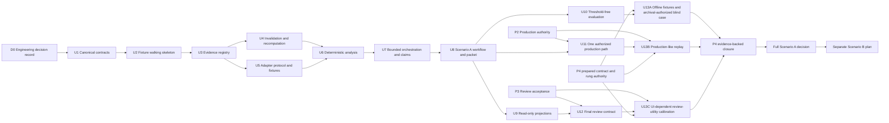

# Greenfield Data Agent Implementation Sequencing

## Status and authority

This document defines the dependency order for a future implementation. It does not start `ce-work`, create implementation files, access production, apply a candidate diff, commit, deploy, roll back production, send a message, or publish a decision.

The Owner-confirmed first gate and main deliverable is **M0 — Flight Readiness**. M1 Metric Movement and Production Grounding and M2 Win/Loss Evidence belong to the same one-Flight M0-M2 Validation Slice. The program target is four to six active engineering weeks with two builders. The first planned implementation scope is a local fixture-backed M0 MVP, but the prior continuation authorization is exhausted. `M0-F1`-`M0-F5` require a new exact-digest Owner authorization and bounded start receipt. Production access, M1/M2 implementation, and Scenario B remain unauthorized.

The target is a new, isolated Data Agent package. Old SMA, the KDD workshop, and the audited competition repositories are references only. Their code, package layout, architecture, languages, schemas, storage, and behavior are not compatibility requirements.

Authority order for this sequence:

1. The Owner-settled [M0-M2 alignment record](reviews/2026-08-16-opus5-m0-alignment/owner-alignment-record.md).
2. The exact digest-bound [M0-M2 Build Alignment Packet](reviews/2026-08-16-opus5-m0-alignment/m0-m2-build-alignment-packet.md) after its independent review and freeze record are complete.
3. [Planning decision packet](planning-decision-packet.md) meanings not superseded by items 1-2.
4. The closed [canonical domain and policy contract](wayfinder/freeze-canonical-domain-policy-contracts.md).
5. Closed resolutions of the three currently open Wayfinder tickets, which supersede affected pre-gate design where they have authority without silently changing the Owner contract.
6. The [canonical architecture specification](final-architecture-spec.md) for all logical design not superseded above.
7. The [CE implementation plan](../../plans/2026-08-12-001-feat-kdd-data-agent-greenfield-plan.md) for startable engineering detail, where it does not conflict with higher authority.

The CE plan proposes Python, Pytest, JSON Schema, and `.agents/skills/kdd_data_agent/`. Those are engineering proposals, not frozen product decisions. This sequencing preserves their logical responsibilities but does not select a language, schema encoding, storage system, UI framework, agent framework, model vendor, SLA, or numeric threshold.

## Target design versus delivery path

### Target design

The broader M0-M2 validation-program target is a greenfield, read-only investigation system with:

- immutable Case Generations and append-only Evidence, Claim, Recommendation, GateReceipt, human-ruling, and Packet revisions;
- narrow, authorized, read-only evidence adapters;
- deterministic validity, numeric derivation, `scope × interval × rollout` matching, deployed-runtime mapping, typed-change normalization, dependency invalidation, policy evaluation, and ranking;
- bounded model workers that propose source reads and falsifiable claims but cannot establish facts, widen authority, or produce `confirmed` alone;
- independent Cause Verdict and Recommendation Readiness axes;
- runtime Gate 0–7 receipts as the only path to causal promotion;
- an immutable Scenario A review packet with ranked `code | config | flag | model | data` candidates and, only when allowed, a `not_applied` candidate diff;
- read-only Graph, table, timeline, code, diff, and receipt projections over canonical packet records, plus a separate cross-linked diagnostic Trace store; and
- threshold-free evaluation first, followed by human-adjudicated, pilot-calibrated gates.

Scenario B is not part of the M0-M2 Scenario A validation program. A later plan may reuse the Case, Evidence, runtime identity, typed-change, Claim, GateReceipt, policy, packet, and projection substrate. It must separately define changepoint investigation, rollback-ready packet semantics, recovery verification, continuing RCA, incident-specific orchestration, and human incident ownership.

### Delivery path

The first planned implementation path stops at fixture-backed M0 pre-production evidence. It freezes one `ExperimentReadContract`, reads the Query Success union and diagnostic components, records D4/D6 recomputation receipts, evaluates the readiness checks, and seals one immutable fixture-class `FlightReadinessPacket`. It does not demonstrate production-backed M0 capability or create M1/M2 output. This path is planned, not currently executable.

The later U1–U13 sequence is the planned implementation path for M1/M2 in the same validation program. It may inform replaceable interface seams, but no M1/M2 unit may enter a future fixture-backed M0 backlog without its named gates and a separate implementation-start receipt. No local M0 backlog is currently executable.

There is no migration from old SMA or a KDD repository. Protected legacy paths are read-only references, not migration targets. The new package may read and independently validate domain assets and may clean-room reimplement selected mechanisms behind new greenfield contracts. It must not edit protected paths, import or depend on legacy runtime code, copy legacy stages, schemas, or thresholds, or claim production authority without current owner, license, source, and access receipts. Any direct component reuse requires an explicit interface, provenance, test, security, and license review. Screenshot-observed or unmanifested components are unavailable until those receipts exist; local visibility is not copying authority.

## Planned fixture-backed M0 slice awaiting a new start receipt

The following units define the next bounded backlog but are not currently executable. Before `M0-F1`-`M0-F5`, the Owner must issue a new start authorization and receipt binding the accepted packet path, revision, SHA-256, active-time cap, run/read/tool cap, expiry, and halt owner. Names remain distinct from the planned U1–U13 M1/M2 sequence.

| Unit | Required work | Required exit evidence |
| --- | --- | --- |
| `M0-F0` | Record technology choices and define the isolated package boundary without selecting production sources, vendors, thresholds, or a final UI framework. | One hermetic test validates a closed M0 enum and proves no legacy runtime or write capability is reachable. |
| `M0-F1` | Encode Query Success and component contracts with `PRODUCTION_BINDING_REQUIRED`; `evidence_class`; sealed versioned `core_check_set`; single stored `analysis_use` and derived eligibility; `m0_capability_state`; typed/versioned Coverage Gap registry; `M0CheckResult`; `NextSafeAction`; orthogonal authorization/redaction; laptop export/redaction receipts; immutable packets and revisions. | Schemas reject missing bindings, illegal enum values, hidden component guardrails, independently set eligibility, unversioned Coverage Gap kinds, or conflated authorization/redaction. Fixture evidence cannot set capability to demonstrated. |
| `M0-F2` | Implement fixture-only read adapters, append-only Evidence admission, D4/D6 recomputation receipts with immutable shared input snapshot and independently versioned transform, pagination/partial/error behavior, and orthogonal authorization/redaction failures. | All three independence classes are exercised; `same_pipeline` is `UNKNOWN`, `independent_transform` is the minimum conformant class, and shared snapshots emit `shared_source_snapshot`. No network, production, secret, or mutation capability exists. |
| `M0-F3` | Implement the fixed check inventory, D7 core-floor rules, Query Success union/component integrity, source/change revalidation, sufficiency, parity, CUPED, D4/D6 recomputation, authorization/isolation, redaction, and Coverage Gap registry validation. | Deterministic outcomes preserve the D1-D8 ceilings. Core `MISSING`/`UNKNOWN` leaves capability unproven; no fixture outcome can demonstrate production capability; authorization success cannot mask redaction failure and vice versa. |
| `M0-F4` | Seal fixture-class `FlightReadinessPacket` and render program capability separately from Flight `analysis_use`, derived eligibility, `human_state`, blockers, gaps, receipts, and export/redaction state. | A blocked real-Flight shape can later demonstrate capability only with production evidence plus independent adjudication; it remains non-decision-grade and carries `positive_production_path_unverified`. Projection proves no P2/P3/P4 or Committee closure. |
| `M0-F5` | Build threshold-free M0 fixtures and review checks for trusted, pre-runtime directional, invalid, materially unknown, conflicting, stale, partial, unauthorized, superseded, and reviewer-conflict cases. Preregister always-ready and always-blocked evaluators, adversarial metric-version/CUPED/source decoys, and fixture-author/evaluator independence or disclosed conflicts. Measure review correctness and resource use without inventing numeric GO thresholds. | False readiness and security/ACL leakage are hard NO-GO. Reject the suite before Agent scoring unless planted truth contradicts both trivial evaluators and each required decoy is caught. Local fixture reviewers act only on the sealed packet digest; the Experiment Review Committee remains the sole final decision authority for a real Flight. |

Future M1 units must add append-only `FlightAdvisoryRevision`, operational challenge lineage, post-unblinding confirmation receipts, and the separate `candidate_diff_eligibility` gate. Advisory publication never creates diff eligibility. M2 corroboration is mandatory for user-visible search semantics; only versioned deterministic-technical-correction N/A is legal. HIGH risk and large blast radius fail closed. These requirements do not authorize those units now.

```mermaid
flowchart LR
  F0["M0-F0 Isolated engineering seam"] --> F1["M0-F1 M0 contracts"]
  F1 --> F2["M0-F2 Fixture reads and Evidence"]
  F2 --> F3["M0-F3 Readiness validators"]
  F3 --> F4["M0-F4 FlightReadinessPacket"]
  F4 --> F5["M0-F5 M0 fixtures and review"]
  F5 --> M0D["M0 local acceptance evidence"]
  M0D -. "separate M1 authority; failed or missing M0 evidence caps dependent claims" .-> M1D["M1 planned slice"]
  M1D -. "review-ready plus M2 authority" .-> M2D["M2 planned slice"]
```



Fixture completion would not demonstrate M0 capability or close P2/P3/P4. A first real Flight may use the narrower D8 laptop receipt only if company policy permits it; normalized production paths and any broader source/service/export require P2. Live interaction acceptance requires P3; decision-bearing human judgment and blind/pilot exits require P4.

## Validation-slice delivery checkpoints

These checkpoints keep the broader one-Flight program visible without
broadening today's implementation authority:

| Checkpoint | Outcome | Start boundary |
| --- | --- | --- |
| `V0` | Continuity-ready fixture foundation with replaceable interfaces, deterministic receipts, and a fresh-context runbook | Prior foundation work is historical; any further execution requires a new bounded receipt |
| `V1` | Local fixture-backed M0 pre-production evidence | Requires a new exact-digest Owner authorization and start receipt for `M0-F1`-`M0-F5`; cannot demonstrate capability |
| `V1P` | One real authorized Flight establishes production-backed M0 capability or leaves it unproven | Requires a separate start receipt plus D8 laptop authority or stricter applicable policy, sealed core set, audit packet, and independent adjudication |
| `V2` | One normalized least-privilege production source and deployed-identity path | Requires P2 closure and a separate implementation-start receipt |
| `V3` | M1 Metric Movement and Production Grounding for the same Flight | Requires applicable production authority and a separate implementation-start receipt; blocked-Flight investigation preserves M0-dependent publication ceilings |
| `V4` | M2 Win/Loss Evidence linked to the supported M1 mechanism | Requires review-ready M1 and its replay/SBS, ACL, comparability, and human-label authority |
| `V5` | Review-ready M0/M1/M2 handoff for the same Flight | Technical completion only; the Experiment Review Committee still decides pass/change/block |

Before the primary builder's leave on 2026-08-24, `V0` must include a
Continuity Checkpoint: exact branch/revision, locked prerequisites, one
documented hermetic command, fixture/source manifest, unit/scenario ledger,
current receipts and gaps, next bounded task, and a fresh-context rehearsal.
The rehearsal must let another builder continue without oral context and must
let the primary builder resume effective work within half a day on or after
2026-09-15. Leave time is excluded from the four-to-six-active-week program
envelope; if nobody continues, calendar progress pauses rather than being
reported as engineering progress.

### Authoritative `VAL-*` ownership registry

This is the single ownership mapping for the 26 active acceptance IDs defined by the packet. Packet and CE-plan scenario text define meanings but do not assign competing owners. “Evidence” below is either the proving test/receipt or the open-gate evidence that must exist; an open external gate is not an implementation pass.

| Active ID | Sole owner | Proving test/receipt or open-gate evidence |
| --- | --- | --- |
| `VAL-FLT-001` | `M0-F1` | `tests/test_m0_contracts.py`: one Experiment/Flight retains multiple rollout, run, and window observations |
| `VAL-MET-001` | `M0-F1` | `tests/test_m0_contracts.py`: default one-metric policy without a singular-cardinality schema |
| `VAL-MET-002` | `M0-F1` | `tests/test_m0_contracts.py`: preregistered co-primary combination/conflict rule and rejection of an unapproved second metric |
| `VAL-M0-001` | `M0-F4` | `tests/test_m0_packet.py`: trusted complete read seals a stable review-ready packet digest |
| `VAL-M0-002` | `M0-F3` | `tests/test_m0_readiness_checks.py`: exact directional, contract-correction, and not-permitted branches with no post-hoc power |
| `VAL-PRE-001` | `M0-F3` | `tests/test_m0_readiness_checks.py`: preregistered runtime shortfall yields `directional_only` and blocks M1 |
| `VAL-CUP-001` | `M0-F3` | `tests/test_m0_readiness_checks.py`: CUPED-mode mismatch preserves both reads and yields `not_permitted` |
| `VAL-UNIT-001` | `M0-F3` | `tests/test_m0_readiness_checks.py`: unit/ratio-variance mismatch is a material block |
| `VAL-SRC-001` | `M0-F3` | `tests/test_m0_readiness_checks.py`: metric-definition/source-version decoy is detected |
| `VAL-SUP-001` | `M0-F4` | `tests/test_m0_packet.py`: corrected read creates a superseding packet and invalidates acknowledgement without history edit |
| `VAL-CONF-001` | `M0-F4` | `tests/test_m0_packet.py`: unresolved named-reviewer materiality conflict remains visible and blocked |
| `VAL-REM-001` | `M0-F4` | `tests/test_m0_packet.py`: invalid Flight without exact target emits typed guidance and no diff |
| `VAL-REM-002` | `M0-F4` | `tests/test_m0_packet.py`: gated exact remediation is syntactically valid, `not_applied`, and has no automation consumer |
| `VAL-M1-001` | `U8` | `A-001`: exact deployed-bound fixture mapping yields ranked mechanism Claims and an unapplied candidate |
| `VAL-M1-002` | `U8` | `A-003`: unknown production mapping caps Cause and blocks exact recommendation |
| `VAL-M2-001` | `U8` | Planned `tests/scenarios/experiment_miss.*` receipt for comparable treatment/control query evidence; M2 start and replay authority remain open |
| `VAL-M2-002` | `U8` | Planned `tests/scenarios/experiment_miss.*` receipt for missing ACL/replay/counterfactual/comparability yielding `not_comparable` or Coverage Gap; M2 start remains open |
| `VAL-ROL-001` | external Experiment Review Committee gate | Open role-separation receipt: Experiment Owner preparation, Independent DS challenge, and Committee pass/change/block ruling |
| `VAL-OLD-001` | external `P2` production-authority gate | Open source/definition-owner receipt proving current production authority and recorded legacy drift |
| `VAL-CON-001` | `M0-F0` | Continuity Checkpoint fresh-context rehearsal receipt with exact revision, command, manifest, ledger, and next bounded task |
| `VAL-APR-001` | external Experiment Review Committee gate | Open Committee decision receipt; technical review-ready state alone is explicit non-evidence of Acceptance |
| `VAL-SEC-001` | `M0-F5` | `tests/test_m0_hard_vetoes.py`: write, cross-tenant, secret, unsafe-redaction, or unauthorized-delivery reachability is hard NO-GO |
| `VAL-UI-001` | `M0-F4` | `tests/test_m0_review_projection.py`: synthetic packet projection reaches source and D4/D6 recomputation receipts without implying production capability, cause, or P3 closure |
| `VAL-UI-101` | external `P3` interaction-acceptance gate | Open named-reviewer live interaction receipt bound to the accepted first-screen hierarchy |
| `VAL-BASE-001` | `M0-F5` | `tests/test_m0_hard_vetoes.py`: planted truth contradicts both always-ready and always-blocked evaluators before Agent scoring |
| `VAL-DECOY-001` | `M0-F5` | `tests/test_m0_readiness_checks.py`: metric-version, CUPED-mode, and source-identity decoys are caught by exact validators |

## Two kinds of gates

The implementation must keep planning prerequisites separate from runtime causal gates.

### Planning prerequisites

The final architecture specification, this sequencing document, and the reconciled CE plan all call these prerequisites P1–P4 so they cannot be confused with runtime Gates G0–G7. Any older G1–G4 planning label is superseded.

| ID | Wayfinder decision | Current state | What it governs |
| --- | --- | --- | --- |
| P1 | [Canonical domain and policy contract](wayfinder/freeze-canonical-domain-policy-contracts.md) | Closed | Canonical states, dual-axis matrix, runtime G0–G7, append-only corrections, recomputation, and human responsibility. |
| P2 | [Production evidence authority](wayfinder/establish-production-evidence-authority.md) | Open and claimed; [intake prepared](wayfinder/production-evidence-authority-intake.md) | Authoritative sources, mapping owners, access, tenant/ACL boundaries, sensitive evidence, retention/redaction, credentials, and production-read authority. |
| P3 | [Observability-first review surface](wayfinder/prototype-observability-first-review-surface.md) | Open and claimed; human review pending | Accepted review hierarchy and interactions. It does not own source truth. |
| P4 | [Evaluation gold and calibration](wayfinder/freeze-evaluation-gold-and-calibration.md) | Open and claimed; [threshold-free contract prepared](wayfinder/evaluation-gold-calibration-contract.md) | Blind gold, archival-snapshot authority, sealed pilot ranking, adjudication, rung exits, pilot calibration, and numeric GO/NO-GO decisions. |

### Runtime Gate 0–7

Every future implementation must preserve these exact runtime meanings:

| Gate | Required decision | Failure ceiling |
| --- | --- | --- |
| G0 | Claim is complete and falsifiable. | Cause=`unassessed`; production readiness at most `blocked`. |
| G1 | Observation and experiment validity are supported by nonzero source reads and required checks. | Critical invalidity makes effect Cause at most `inconclusive`; production Recommendation=`not_applicable`; only validity, instrumentation, or data-quality fixes. |
| G2 | Deployed runtime identity and affected-scope reachability are established. | `out` means `ruled_out`; `unknown/conflict` means Cause at most `suspected` and Readiness=`blocked`. |
| G3 | A mechanism is coherent with at least one runtime observation. | Failure rules out or revises the Claim; inconclusive caps Cause at `suspected` and causal production action at `proposal_ready`. |
| G4 | A completed independent challenge returns a separate causal result: `supports | falsifies | nondiscriminating`. | Supports passes; falsifies fails and produces Claim=`falsified`, Cause=`ruled_out`; nondiscriminating or blocked/failed execution is inconclusive. |
| G5 | Material alternatives and counterevidence are resolved. | An open material alternative caps Cause at `suspected` and Readiness=`blocked`. |
| G6 | Applicable causal replay/regression, guardrail, and recovery checks pass. For unapplied A, recovery and post-action recurrence are N/A. | Applicable causal-check failure blocks `confirmed`; prevention/monitoring gaps lower item-specific Readiness separately. |
| G7 | Policy passes and an independent human causal reviewer rules on the immutable Evidence snapshot. | Timeout, denial, or missing reviewer blocks the Case, caps Cause at `suspected`, and prevents publication. |

`confirmed` requires every applicable G0–G7 condition plus the independent G7 human ruling. Action Approval is separate. No Cause Verdict, Recommendation Readiness value, human ruling, or Action Approval gives this Agent mutation authority.

## Planned M1/M2 Scenario A dependency graph



U3–U5 may overlap after U2 proves the shared object boundary. U9 and U10 may overlap after the U8 packet contract is stable. U13 is one implementation unit with rung-conditional entries: U13A does not wait for P2/U11 or P3/U12 when its fixture or blind-case authority is valid; U13B requires P2/U11; U13C requires P3/U12. The P4 closure decision consumes only the receipt set applicable to the approved evaluation program and cannot infer a missing later-rung pass. Overlap does not permit any unit to invent a dependency owned by an open planning prerequisite.

## Proposed package map

The following paths allocate later Scenario A responsibility within the Owner-aligned M0-M2 Validation Slice. They do not grant fixture-backed M0 implementation authority, freeze file extensions, or select a toolchain. The prior continuation receipt is exhausted; a future M0 slice could use only the minimum corresponding contract, fixture adapter, evidence, validator, packet, presenter, evaluation, and test paths selected by `M0-F0` after a new exact-digest Owner start receipt exists. `<schema>` and `<source>` are selected by D0 before their dependent unit starts.

```text
.agents/skills/kdd_data_agent/                 # proposed isolated package root
  README.md
  contracts/
    case.<schema>
    evidence.<schema>
    claim.<schema>
    policy.<schema>
    packet.<schema>
  domain/
    case_lifecycle.<source>
    evidence_graph.<source>
    claim_registry.<source>
    policy_matrix.<source>
  evidence/
    registry.<source>
    invalidation.<source>
    receipts.<source>
  adapters/
    base.<source>
    fixture.<source>
    production/                              # forbidden before P2 closes
  analysis/
    scope_interval_rollout_matcher.<source>
    mapping.<source>
    change_normalizer.<source>
    ranking.<source>
  orchestration/
    capability_contract.<source>
    bounded_runner.<source>
  scenarios/
    experiment_miss.<source>
  packets/
    review_packet.<source>
  presenters/
    review_surface.<source>
  evals/
    fixtures/
    cases/
    adjudication/
    calibration/
  tests/
    contract/
    evidence/
    adapters/
    analysis/
    orchestration/
    scenarios/
    presenters/
    evals/
```

The future implementation must not edit `.agents/skills/sma/` or `.agents/skills/sma_rewrite/evals/`. These paths are protected references, not migration targets.

## Planned dependency-ordered M1/M2 implementation units

The D0/U1-U13 units below describe the planned M1/M2 continuation of the same one-Flight validation program. No local M0 receipt is live. No unit may execute now: `M0-F1`-`M0-F5` first require the new exact-digest receipt, and every later unit requires its named prerequisite and a separate implementation-start receipt. No new Owner decision is needed merely to restate that M1/M2 belong to the accepted program.

### D0. Record engineering choices without changing product meaning

**Entry:** P1 is closed; the final architecture specification and this sequence are accepted for implementation planning.

**Work:** Select the implementation language, contract encoding, local persistence approach, test runner, package entry point, and development checkpoint mechanism. Classify each choice as `engineering_proposal`, list the cheapest proof, and name the replacement boundary. Do not select production sources, credentials, UI framework, model vendor, thresholds, or SLA through this unit.

**Proposed files:** package `README.md` plus an engineering-decision record in the repository's accepted decision-document location.

**Exit:** the selected toolchain can validate a closed enum, run one hermetic test, and create an isolated package without importing old SMA/KDD implementation code. Rejection of a proposal returns to D0; it does not revise the owner product contract.

### U1. Encode canonical domain and policy contracts

**Entry:** D0 is accepted and P1 remains the current authority.

**Work:** Encode the eight independent state dimensions, legal transitions, dual-axis policy matrix, G0–G7 receipt fields/statuses/ceilings/reopen rules, immutable generation semantics, and separate causal-review/action-approval/incident-owner roles.

**Proposed files:** `contracts/case.<schema>`, `contracts/claim.<schema>`, `contracts/policy.<schema>`, `domain/case_lifecycle.<source>`, `domain/policy_matrix.<source>`.

**Required tests:**

- `POL-001`: every Cause Verdict × Recommendation Readiness pair has one deterministic legal/conditional/illegal result and rationale;
- `POL-002`: Cause=`confirmed`, Readiness=`blocked` is legal when action evidence is incomplete;
- `POL-003`: Cause=`suspected`, Readiness=`action_ready` is conditional and requires every action-specific predicate;
- `POL-004`: unknown enums, invalid transitions, and ambiguous aliases fail closed;
- `POL-005`: `confirmed` is impossible without all applicable G0–G7 receipts and independent review;
- `POL-006`: a closed generation reopens only as a new generation; and
- `POL-007`: self-review, role collision, missing conflict declaration, or unknown reviewer independence cannot promote Cause.
- `POL-008`: G4 maps complete/supports to pass, complete/falsifies to fail and `ruled_out`, and nondiscriminating or blocked/failed execution to inconclusive.
- `POL-009`: an unapplied Scenario A proposal may pass G6 through targeted replay/regression and guardrails while recovery/post-action recurrence are N/A; a prevention-plan gap affects Readiness, not Cause confirmation;
- `POL-010`: HumanRuling support accepts only admitted Evidence, DerivedFact, or GateReceipt revisions and rejects Trace or narration citations;
- `POL-011`: missing G6 authority, coverage, or budget produces `inconclusive`, never `not_applicable`; and
- `POL-012`: a confirmed VerdictEvent is immutable; active-generation contradiction appends superseding Claim/VerdictEvent revisions, while a closed generation or sealed packet requires a new linked generation.

**Exit:** contract fixtures cover every enum, transition, matrix cell, GateReceipt status, ceiling, and reopen condition with no invented threshold.

### U2. Deliver a thin fixture-backed walking skeleton

**Entry:** U1 passes.

**Work:** Traverse frozen intake → one admitted fixture Evidence revision → one scoped Cause Claim → deterministic policy result → immutable partial review packet. Use only in-memory or fixture-backed development state chosen by D0. Exclude production access, model fan-out, UI framework, and ranking sophistication.

**Proposed files:** `contracts/evidence.<schema>`, `contracts/packet.<schema>`, the thinnest implementations under `evidence/`, `domain/`, and `packets/`, plus `tests/scenarios/walking_skeleton.*`.

**Required tests:**

- `SKEL-001`: stable IDs and frozen-input digest reproduce the same packet digest;
- `SKEL-002`: missing source identity or authorization yields a Coverage Gap, not Evidence;
- `SKEL-003`: Trace input cannot satisfy an Evidence dependency; and
- `SKEL-004`: the package exposes only the positive capability allowlist; every adapter method rejects writes with a typed denial receipt, and an import-graph check finds no reachable legacy runtime, arbitrary execution, publication, or mutation capability.

**Exit:** one hermetic command proves the end-to-end object seam and leaves all live-source fields explicitly unknown.

### U3. Build the append-only Evidence registry and capability boundary

**Entry:** U2 passes.

**Work:** Add stable Evidence identity, revisions, source locators, snapshot/time, scope, authorization/data-handling labels, digest, freshness, validators, source-read receipts, typed dependency edges, and a narrow case-scoped append-only submission port. Before P2, use isolated fixture identities and opaque per-case handles; do not infer global deduplication or cross-tenant sharing.

**Proposed files:** `evidence/registry.<source>`, `evidence/receipts.<source>`, `orchestration/capability_contract.<source>`, `tests/evidence/registry.*`, `tests/orchestration/capability_contract.*`.

**Required tests:**

- `EVD-001`: zero reads, timeout, missing authority, or permission denial creates a Coverage Gap;
- `EVD-002`: partial pages remain partial and cannot be described as complete;
- `EVD-003`: transitive authorization uses the intersection of permissions and the strictest handling label;
- `EVD-004`: identical content in two fixture Cases leaks no locator, digest, existence, acknowledgement, budget, or Claim state across Cases; and
- `EVD-005`: a heuristic edge remains review-only until a validator receipt admits it; and
- `EVD-006`: every revision validates its predecessor digest, and a missing, reordered, or substituted predecessor breaks the chain without deleting history.

**Exit:** every decision-bearing node and edge can be traced to admissible inputs and a validator; unauthorized or incomplete material remains visible but cannot promote a Claim.

### U4. Implement invalidation, supersession, and partial recomputation

**Entry:** U3 passes.

**Work:** Implement canonical edge direction, dependency closure, `recompute_from_stage`, and append-only revisions. A changed dependency creates new Claim, GateReceipt, ranking, diff, and packet revisions as applicable; it never overwrites history.

**Proposed files:** `evidence/invalidation.<source>`, `domain/evidence_graph.<source>`, `tests/evidence/invalidation.*`, `tests/evidence/partial_recompute.*`.

**Required tests:**

- `REV-001`: `new_revision --supersedes--> old_revision` preserves the old revision while removing its current effect;
- `REV-002`: a scoped correction invalidates only the dependent closure;
- `REV-003`: a numeric digest, unit, or time-zone correction recomputes from the earliest affected stage;
- `REV-004`: renderer-only invalidation does not recompute Evidence, Claim, verdict, or readiness; and
- `REV-005`: a changed dependency creates a superseding packet and requires new acknowledgement; and
- `REV-006`: packet manifests bind every included revision ID to its content digest; substitution or omission blocks sealing.

**Exit:** a recomputation receipt identifies the invalidator, dependency closure, earliest affected stage, new revisions, and preserved history.

### U5. Define read-only adapter protocols and fixture adapters

**Entry:** U3 passes. P2 may still be open.

**Work before P2:** Define only the source-read request/result/receipt protocol, pagination and checkpoint behavior, complete/partial/blocked/failed/unavailable states, authorization inputs, freshness, and fixture adapters. Production adapter implementations remain absent.

**Proposed files:** `adapters/base.<source>`, `adapters/fixture.<source>`, `tests/adapters/contract.*`, `tests/adapters/fixture.*`.

**Required tests:**

- `ADP-001`: pagination retries deduplicate stable page receipts;
- `ADP-002`: permanent authorization failure is not retried as a reasoning failure;
- `ADP-003`: snapshot change creates a new Evidence revision;
- `ADP-004`: a redacted revision preserves protected lineage without exposing raw identity; and
- `ADP-005`: no adapter method has a write, mutation, message, deploy, rollback, or arbitrary execution capability; and
- `ADP-006`: redaction failure emits a typed no-body result, records blocked coverage, and never persists raw pre-redaction content.

**Exit before P2:** fixtures reproduce every status without a network, secret, or production dependency. No test or documentation claims production fidelity.

### U6. Build deterministic derivation, mapping, typed changes, and ranking

**Entry:** U3–U5 pass for fixtures.

**Work before P2:** Implement fixture-backed numeric source-read obligations, ExperimentReadContract validation, mapping precedence/conflict/cardinality, the `scope × interval × rollout` matcher, a technology-neutral SymbolAttribution port, normalization of `code | config | flag | model | data`, candidate groups, explicit ranking features, stable tie-breaking, and explanation receipts. Proposed `index | connector | permission | presentation | telemetry` subtypes may exist only as schema/interface proposals until their owners and exact identities are accepted. Unknown production authority remains `unknown`; fixture mappings prove interface behavior, not production fidelity.

**Proposed files:** `analysis/scope_interval_rollout_matcher.<source>`, `analysis/mapping.<source>`, `analysis/change_normalizer.<source>`, `analysis/ranking.<source>`, and matching tests under `tests/analysis/`.

**Required tests:**

- `ANA-001`: a scope, interval, or rollout mismatch excludes a keyword-similar change;
- `ANA-002`: partial tenant or gradual-rollout reachability remains proportional rather than boolean;
- `ANA-003`: deployed SHA conflict is retained and never silently replaced by repository HEAD;
- `ANA-004`: missing deployed identity or non-code artifact receipt blocks an exact target;
- `ANA-005`: simultaneous change types remain a candidate group until Evidence separates them; and
- `ANA-006`: identical admitted inputs and configured features yield byte-stable ordering and explanations;
- `ANA-007`: file identity without admissible symbol/line provenance makes G2 inconclusive and blocks an exact code target;
- `ANA-008`: assignment/analysis-unit or variance-estimator mismatch, compositional SRM, arm-parity divergence, or zero-result shift produces the declared G1 failure or ceiling;
- `ANA-009`: click-derived mechanism support is inadmissible without a named bias correction or authorized interleaving receipt; and
- `ANA-010`: the `uncalibrated_fixture` comparator is reviewer-recomputable and applies gate ceilings before exact identity, G2, mechanism support, contradictions, and stable candidate ID.

**Exit before P2:** deterministic fixture behavior is reproducible and production mapping is explicitly blocked, never guessed.

### U7. Build bounded orchestration and the Claim registry

**Entry:** U1–U6 pass for fixtures.

**Work:** Add scoped Claim revisions, falsifiers, alternatives, counterevidence, bounded read requests, cancellation/resume, per-worker budget receipts, and a deterministic broker that validates capability and Case scope. Models may draft claims and source-read requests. They may not admit Evidence, change policy, expand access, or vote a cause into `confirmed`.

**Proposed files:** `domain/claim_registry.<source>`, `orchestration/bounded_runner.<source>`, `tests/orchestration/claim_registry.*`, `tests/orchestration/bounded_runner.*`.

**Required tests:**

- `ORC-001`: timeout returns partial coverage and a resumable checkpoint without promotion;
- `ORC-002`: repeated workers over the same source do not count as independent corroboration;
- `ORC-003`: missing mechanism, falsifier, alternatives, or counterevidence keeps G0 incomplete;
- `ORC-004`: cancellation/resume does not duplicate Evidence or Packet revisions;
- `ORC-005`: prompt injection, redirects, path traversal, fake receipts, and worker scope escalation cannot change capabilities; and
- `ORC-006`: live-run divergence is recorded separately from deterministic replay.

**Exit:** all model output is typed, scoped, reviewable, and subordinate to deterministic admission and policy.

### U8. Implement the Scenario A fixture workflow and immutable packet

**Entry:** U1–U7 pass. Real production execution remains blocked by P2.

**Work:** Implement the canonical stages: `intake_and_freeze`, `validity_and_observation`, `production_identity_and_scope`, `candidate_discovery_and_mapping`, `claim_construction`, `causal_challenge`, `recommendation_and_risk`, and `review_packet_and_handoff`. Produce one packet schema for valid, invalid, incomplete, contradictory, and abstaining fixture cases. A candidate diff is allowed only for a valid experiment and an exact fixture target, is clearly `not_applied`, and has tests, falsifiers, risk, monitoring, and stop conditions.

**Proposed files:** `scenarios/experiment_miss.<source>`, `packets/review_packet.<source>`, `tests/scenarios/experiment_miss.*`, `tests/scenarios/review_packet.*`.

**Required tests:**

- `A-001`: valid exact mapping produces ranked candidates and a deployed-bound `not_applied` fixture diff;
- `A-002`: critical SRM failure produces only validity/instrumentation/data-quality repair and no production proposal;
- `A-003`: valid experiment with unknown mapping yields Cause at most `suspected`, Readiness=`blocked`, and no exact patch;
- `A-004`: product-hypothesis failure does not fabricate a code candidate;
- `A-005`: a suspicious deployment found after experiment invalidation remains only a blocked lead;
- `A-006`: stale, partial, or conflicting Evidence lowers the correct Gate ceiling and stays visible;
- `A-007`: moved diff target or stale context invalidates the diff before handoff; and
- `A-008`: multiple Cases preserve identity, Evidence, budget, ranking, recipient, and acknowledgement isolation;
- `A-009`: a valid `not_applied` diff is available only through an authorized human review surface and no apply/commit/PR/deploy/rollback/webhook/queue/polling interface exists; and
- `A-010`: contradiction in an active generation appends superseding Claim/VerdictEvent revisions, while contradiction after closure creates a new linked generation and superseding packet.

**Exit before P2:** every fixture branch ends in a policy-consistent immutable packet or explicit Abstain, and no branch can mutate a source or development worktree.

### U9. Build technology-neutral, read-only review projections

**Entry:** U4 and U8 packet objects are stable enough to project. P3 may still be open.

**Work before P3:** Implement or refine a rough projection boundary using only synthetic data. Show conclusion plus the primary Claim's local graph, coverage, competing Claims, full graph, separate cross-linked Trace, timeline, code, diff, and receipts. Every graph fact has a table/list equivalent. HIGH contradictions, stale/invalidated/superseded state, unauthorized state, and Coverage Gaps remain prominent. Do not select a final UI framework or declare interaction acceptance.

**Proposed files:** `presenters/review_surface.<source>`, `tests/presenters/review_surface.*`; the existing claimed prototype remains a research artifact until its owner task synchronizes it and receives human review.

**Required tests:**

- `UI-001`: a technology-neutral synthetic projection reaches exact target proof and its validator receipt without claiming P3 interaction acceptance;
- `UI-002`: local view exposes entry to competing Claims and cannot hide a HIGH contradiction;
- `UI-003`: Graph and Trace remain distinct and cross-linked;
- `UI-004`: no UI action changes Evidence, Claim, Cause Verdict, Recommendation Readiness, or source state;
- `UI-005`: guessed IDs, revoked roles, cross-Case access, and stale authorization fail closed without object-existence leakage; and
- `UI-006`: keyboard and non-graph paths expose equivalent proof and current-versus-historical state.

**Exit before P3:** a synthetic prototype and technology-neutral state/interaction matrix are ready for owner/reviewer review. Final interaction acceptance remains open.

### U10. Build threshold-free evaluation and calibration hooks

**Entry:** U1–U8 are testable; P4 may still be open.

**Work before P4:** Encode set-valued `required | acceptable | forbidden | unknown` assertions, separate deterministic/expert/model-grader provenance, blind-isolation controls, de-identified fixtures, hard vetoes, abstention scoring, ranking-by-depth outputs, repeated-run observations, human-utility fields, and resource receipts. Add a sealed `pilot_ranking_policy` record with rung/snapshot scope, fixed features, normalization, deterministic comparator or pilot-only weights, stable tie rule, version/digest, expiry, and full-list retention. Leave final production thresholds and policy unset.

**Proposed files:** `evals/adjudication/`, `evals/fixtures/`, `evals/calibration/`, `tests/evals/adjudication.*`, `tests/evals/hard_vetoes.*`, `tests/evals/stability.*`.

**Required tests:**

- `EVAL-001`: old RCA is one provenance item and cannot be the sole gold;
- `EVAL-002`: an acceptable alternative is not incorrectly penalized;
- `EVAL-003`: correct abstention receives credit;
- `EVAL-004`: false `confirmed`, wrong exact patch target, or any security/ACL violation is hard NO-GO regardless of aggregate score;
- `EVAL-005`: dangerous Gate or dual-axis flips are visible across frozen-input runs;
- `EVAL-006`: thresholds remain unset without a named calibration receipt; and
- `EVAL-007`: gold leakage or shadow-output workflow leakage is a hard failure.
- `EVAL-008`: ranking-bearing blind/pilot output is rejected unless its pilot policy was sealed before output and matches the named rung, snapshot, version, and digest;
- `EVAL-009`: preregistered applicable baselines include always-abstain and most-recent-deploy for change ranking; a suite that cannot materially distinguish the Agent is rejected before Agent scoring, without inventing a numeric threshold;
- `EVAL-010`: adversarial decoys remain distinguishable from planted truth, and the sealed fixture receipt records fixture-author/evaluator independence or conflicts;
- `EVAL-011`: exact-string, n-gram, symbol, filename, prompt, cache, and retrieval-index leakage checks detect contaminated cases and preserve the prompt-freeze receipt;
- `EVAL-012`: each hard veto records its detector as `deterministic | human | not_yet_implemented`, and a missing detector remains an explicit acceptance gap; and
- `EVAL-013`: widely published incidents are excluded from clean MVP blind gold and retained only as non-clean provenance when useful.

**Exit before P4:** the fixture harness emits separate scorecards and veto receipts without a numeric GO decision or production claim.

### U11. Add exactly one authorized production-evidence path

**Entry:** P2 is closed with named source, mapping, security/privacy, retention/redaction, credential, and incident-handling authority; U3–U8 pass with fixtures. This entry gate is mandatory.

**Work:** Implement one least-privilege read-only adapter through a constrained Capability Broker and one deployed-target mapping for the owner-approved Scenario A path. Use per-source credentials physically incapable of writes. Prove environment, tenant/role/surface, interval, rollout, snapshot, freshness, pagination, partial/error behavior, redaction, provenance, identity/ACL enforcement, retention/deletion, source-load ceilings, and source compromise behavior. Keep outputs isolated from formal decision workflows.

**Proposed files:** one adapter under `adapters/production/`, source-specific contract tests, and an authorized replay fixture. Exact source name and credentials mechanism come only from P2.

**Required tests:**

- `PROD-001`: cross-environment, cross-tenant, revoked, expired, or over-broad identity is denied;
- `PROD-002`: credentials and sensitive values never enter Evidence, Trace, logs, errors, cache, projections, or packets;
- `PROD-003`: pagination, partial reads, source changes, retention expiry, and redaction produce explicit receipts;
- `PROD-004`: deployed identity wins over repository working state and conflicts stay visible;
- `PROD-005`: an authority or mapping gap blocks G2 and exact targeting; and
- `PROD-006`: source compromise or revocation disables the adapter without corrupting preserved Evidence history;
- `PROD-007`: every source enforces the P2-approved per-case and per-window read ceilings; exceedance stops the read and emits a Coverage Gap rather than a partial-as-complete result; and
- `PROD-008`: the P2-named halt role can disable the path through a tested mechanism, and a real-credential write attempt is denied with a receipt.

**Exit:** one production-complexity path is reproducible, read-only, authorized, and reviewable. Do not fan out to more sources until this seam passes human and security/privacy review.

### U12. Freeze and implement the accepted review contract

**Entry:** P3 is closed after live owner/reviewer feedback; U9's synthetic surface is available.

**Work:** Apply only the accepted hierarchy, interactions, trust-detail expansion, alternate representations, accessibility behavior, and sensitive-evidence navigation. UI framework selection is an engineering proposal made after P3, not a product decision. The presenter remains a projection and owns no canonical state.

**Proposed files:** the P3-accepted presenter modules and interaction/authorization tests under `presenters/` and `tests/presenters/`; exact paths and framework follow the accepted P3 contract.

**Required tests:**

- `UI-101`: each accepted interaction preserves packet identity and current-versus-history state;
- `UI-102`: per-render authorization denies revoked, cross-case, and cross-tenant access without existence leakage; and
- `UI-103`: Evidence Graph, Trace, table, timeline, code, diff, and receipt links preserve their separate authorities and accepted alternate representations.

**Exit:** the owner/reviewer can efficiently identify the conclusion, coverage, conflicts, exact target, validator receipt, and next safe check; interaction tests and authorization tests pass against the same immutable packet objects.

### U13. Run blind adjudication, production-complexity pilots, and calibration

**Entry:** P4's prepared threshold-free contract is the controlling procedure; the evaluation owner has sealed the specific case/rung authorization, any `pilot_ranking_policy`, and named reviewers before exposure to Agent output; U10 is clean. A production-grounded blind historical case may start only after its investigation-time snapshot, blinding, code/domain reviewers, Experiment Owner, and either P2 closure or a case-specific archival-snapshot authority receipt are recorded. That narrow receipt binds source/snapshot digest, permitted fields, deployment/mapping authority, tenant/ACL handling, reviewers, retention/redaction/deletion, expiry, prohibited reuse, and no live adapter. Without exact deployed identity, the case is limited to abstention/workflow evaluation and cannot count for exact-target acceptance. Production-like replay additionally requires P2 closure and explicit Eng/security/privacy authorization. Narrow shadow-read additionally requires its own named scope, reviewers, isolation, retention, load, stop, and exit authorization. U11 and U12 are required before the production-complexity calibration that depends on them, not before every offline fixture.

**Work:** Run de-identified fixtures, the owner-confirmed blind historical experiment miss, then only authorized later evaluation rungs. Capture candidate-depth curves, hard failures, dual-axis/Gate confusion, repeated-run behavior, human baseline, review utility, latency, tokens, source load, and cost. Propose numeric thresholds from observed distributions and obtain separate owner, experiment-owner, Eng, and security/privacy receipts.

**Required tests:**

- `CAL-001`: the sealed receipt records case/rung authority, prompt freeze, fixture-author/evaluator independence or conflicts, applicable baselines, decoys, detector coverage, and exclusions before output review;
- `CAL-002`: repeated-run count remains pilot-selected and no default of five or any other number is frozen;
- `CAL-003`: production-like replay and shadow-read stop at their P2/P4 load ceiling or named halt authority and preserve a partial receipt; and
- `CAL-004`: variance-estimator mismatch, leakage, hard veto, or unsupported exact target prevents rung advancement regardless of other metrics.

**Exit:** The resulting blind-case, fixture, replay, pilot-distribution, baseline, adjudication, and owner-decision receipts satisfy the applicable P4 closure checklist. Only then may P4 close. Scenario A receives GO only after that closure and the approved rung criteria pass with no hard veto. Missing owner, evidence, receipt, threshold, or authority is NO-GO for rung advancement, not a product failure to hide.

## What can start before P2, P3, and P4

| Work | May start now in a future authorized implementation? | Must wait |
| --- | --- | --- |
| `M0-F0`–`M0-F5` against hermetic fixtures | Not currently. `M0-F1`-`M0-F5` require a new Owner authorization and start receipt binding the accepted packet path, revision, SHA-256, caps, expiry, and halt owner. | Any product-meaning change, production source, final UI choice, or numeric threshold returns to its named gate. |
| M0 production read path | No. | The exact P2 source, credential, ACL, retention, redaction, load, and halt authority must close first. |
| M0 live review acceptance | No. | P3 must accept the packet-centered M0 review interaction with real reviewers. |
| M0 blind/pilot acceptance | No. | P4 must authorize the exact rung, case, reviewers, handling, and exit decision. |
| Planned U1–U10 M1/M2 foundation | Not authorized. | The relevant M0 permission, dependency gates, and a separate implementation-start receipt; program membership is already Owner-aligned. |
| Production adapters and exact deployed mapping | No. | P2 must close; then U11 starts with one bounded path. |
| Production-like replay or narrow shadow-read | No. | Both P2 authority and P4 rung-specific approval are required. |
| Final review UI | No. | P3 must close after live human review. |
| Full Scenario A GO/NO-GO | No. | U1–U13 plus the required P2–P4 and validation-slice human receipts. |
| Scenario B implementation | No. | Scenario A substrate and acceptance are stable, then a separate Scenario B plan and owner scope gate. |

No open prerequisite may be closed by repository inference, a model opinion, a prototype screenshot, or a mechanically green test.

## Deterministic halt contract for a future authorized M0 slice

No fixture-backed M0 start receipt is currently live. Any future exact-digest Owner receipt must name its implementation lead, active-time cap, run/read/tool cap, expiry, and halt owner. After that receipt exists, the local M0 slice halts immediately when any of these occurs:

1. a fail-closed default is bypassed by an enum alias, unenumerated value, or permissive default branch;
2. any file appears under `adapters/production/` before P2 and a separate start receipt;
3. a test requires a network socket, secret, production credential, or path outside the isolated package and declared fixture roots;
4. packet bytes or digest differ across two clean runs with identical frozen inputs;
5. the fixture set cannot produce a failing case for SRM, CUPED-mode mismatch, unregistered or mismatched decision metric, and pre-runtime invocation; or
6. the slice-specific cap or expiry is missing or exceeded without a green hermetic command and reviewable partial packet.

On halt, preserve immutable receipts, emit the affected Coverage Gap, and return to the named Owner or gate authority. Do not expand scope, loosen a validator, add a production adapter, or silently consume more budget to make the suite green.

## Development checkpoints and failure recovery

"Rollback" in this section means restoring a prior verified development checkpoint. It never means a production rollback, applying a candidate diff, or invoking an external action.

Each unit must have a small, isolated change set and a before/after verification receipt. The exact version-control workflow requires the owner's future implementation authorization. Until then, no commit, branch mutation, or `ce-work` action is implied.

| Failure | Required development response | Preserved state |
| --- | --- | --- |
| Contract differs from P1 | Stop the unit; discard or supersede the engineering encoding; re-derive it from the closed resolution. | Last conforming contract tests and all research documents. |
| New source contract conflicts with the pre-P2 adapter seam | Stop expansion; replace the engineering proposal at the adapter boundary before adding another source. | Fixture behavior and immutable object identities unless P2 explicitly changes them. |
| Invalidation recomputes unrelated objects or mutates history | Disable the new recomputation path; restore the last green implementation checkpoint; retain the failing fixture as a regression test. | Append-only historical fixtures and prior packet digests. |
| Security, ACL, tenant, or credential leak | Hard stop; revoke affected development access as directed by security/privacy; preserve a sanitized incident receipt; do not continue with another model or adapter. | Non-sensitive test Evidence and the last authorized checkpoint. |
| UI conflicts with canonical packet state | Remove or disable the projection change only; never edit Evidence, Claim, Cause Verdict, or Recommendation Readiness to make the UI pass. | Canonical packet and policy state. |
| Evaluation leakage or post-resolution contamination | Reclassify the case, preserve provenance, exclude it from clean estimates, and add a replacement only through the P4 contract. | Historical contaminated result as non-clean Evidence. |
| Hard-veto scenario passes, or deterministic replay diverges | Stop milestone promotion; restore the last green checkpoint; make the failing case permanent; rerun the affected dependency closure. | Earlier units that remain proven unaffected. |
| Budget, timeout, or source failure | Emit partial state and Coverage Gap; stop safely at the current unit. | Collected Evidence, cost/latency receipts, and next safe check. |

Do not use destructive reset against a dirty worktree. Do not modify protected old-SMA or Stream-B paths to make a greenfield test pass.

## Human decisions and milestone exits

### Planned local M0 Flight Readiness exit after a new start receipt

Required evidence:

- `M0-F0`–`M0-F5` pass in a hermetic environment;
- the sealed `FlightReadinessPacket` binds the frozen `ExperimentReadContract`, every required check, source/read/derivation receipts, disagreements, Coverage Gaps, stored `analysis_use`, typed `NextSafeAction`, and named human state; review projections derive `post_analysis_eligibility` without persisting or independently setting it;
- trusted, pre-runtime directional, invalid, materially unknown, conflicting, stale, partial, unauthorized, superseded, and reviewer-conflict fixtures produce the expected fail-closed outcomes;
- CUPED-mode non-interchangeability, primary-source versus scorecard/UI reconciliation, numerator/denominator/unit/ratio/relative-percent/percentage-point handling, and source-change revalidation are individually receipted;
- always-ready and always-blocked evaluators are each contradicted by sealed planted truth, all required adversarial decoys are caught, and fixture-author/evaluator independence or conflict is recorded;
- false readiness and security/ACL leakage are hard NO-GO; and
- no M1 cause, production candidate, ranking, product-logic recommendation, Win/Loss label, production mutation, or publication capability exists in the local M0 slice; a separately typed invalid-Experiment remediation link is allowed only under the frozen exact-target and no-write gates.

Human decision after the new exact-digest start receipt and authorized work: the Owner and independent local reviewer may accept or reject the fixture-backed M0 deliverable. For a real Flight, the Experiment Owner prepares evidence, the Independent DS Consultant challenges it, and the Experiment Review Committee alone decides pass/change/block. Local acceptance does not close P2/P3/P4, start M1/M2 implementation, authorize production use, or authorize mutation.

### Planned M1/M2 foundation exit

Required evidence:

- D0–U10 pass in a hermetic environment;
- the implementation matches P1 and uses exact dual-axis and G0–G7 vocabulary;
- all production fields remain explicit unknowns rather than inferred values;
- the review surface is labeled prototype and the evaluation remains threshold-free; and
- no component exposes mutation or publication authority.

Human decision: after the required M0 permission, dependency gates, and separate implementation-start receipt, the Owner may allow work to continue to P2-dependent production grounding. This is not full Scenario A GO.

### Production-grounding exit

Required evidence:

- P2 is closed by the named production, Eng, security/privacy, experiment, and incident owners where applicable;
- U11 proves one bounded, authorized production Evidence and exact-target path; and
- any pre-P2 engineering assumption that conflicts with the authority contract has been superseded.

Human decision: the relevant owners may permit production-like replay. This does not authorize shadow-read, mutation, or formal decision use.

### Review-contract exit

Required evidence:

- P3 live review is complete;
- U12 exposes conclusion, coverage, competing Claims, exact proof, contradictions, and Coverage Gaps efficiently; and
- Graph, table, timeline, code, diff, and receipts remain packet projections; Trace remains a separate diagnostic store with no evidence authority.

Human decision: owner/reviewers accept or reject the interaction contract. A polished appearance is not acceptance evidence.

### Full Scenario A exit

Required evidence:

- P2–P4 are closed for the authorized rung and named scope;
- U1–U13 pass with the blind historical miss and required de-identified fixture classes;
- no false `confirmed`, wrong exact target, security/ACL violation, or invalid-experiment production proposal occurs;
- numeric thresholds are pilot-derived and bind immutable decision receipts;
- the Agent remains read-only and every candidate diff remains `not_applied`; and
- Cause Verdict, Recommendation Readiness, Action Approval, and Case/Incident State remain independent.

Human decision: owner, experiment owner, Eng, and security/privacy issue separate GO/NO-GO receipts within their authority. GO permits entry into a separately authorized implementation or evaluation stage only; it never authorizes production mutation.

### Scenario B entry

Scenario B starts only after a full Scenario A decision and a new owner-approved plan. The new plan must identify reused substrate versus new SEV behavior, preserve G0–G7 and dual-axis semantics, keep rollback packets human-facing, and require human IC/on-call ownership of `recovered | stable | closed`. It may not silently broaden Scenario A source authority or evaluation scope.

## Start instruction

Do not run `ce-work` from this planning task. The prior continuation authorization is exhausted. Do not start `M0-F1`-`M0-F5` unless the Owner issues a new bounded receipt binding the accepted packet path, revision, SHA-256, active-time cap, run/read/tool cap, expiry, and halt owner. Do not start planned U1–U13, M1 production grounding, M2 Win/Loss, production access, or Scenario B from that future M0 receipt.
